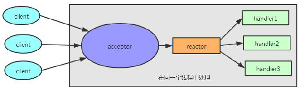
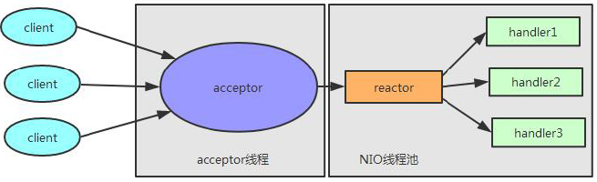
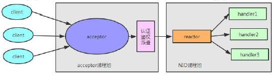

Reactor 的线程模型有三种:单线程模型、多线程模型、主从多线程模型。首先来看一下单线程模型，如下图所示：



所谓单线程, 即Acceptor 处理和andler 处理都在同一个线程中处理。这个模型的坏处显而易见：当其中某个Handler阻塞时, 会导致其他所有的Client 的Handler 都得不到执行，并且更严重的是，Handler 的阻塞也会导致整个服务不能接收新的Client 请求(因为Acceptor 也被阻塞了)。因为有这么多的缺陷，因此单线程Reactor 模型应用场景比较少

那么，什么是多线程模型呢? Reactor 的多线程模型与单线程模型的区别就是Acceptor 是一个单独的线程处理，并且有一组特定的NIO 线程来负责各个客户端连接的IO 操作。Reactor 多线程模型如下图所示：



Reactor 多线程模型有如下特点:

1. 有专门一个线程，即Acceptor 线程用于监听客户端的TCP 连接请求。
2. 客户端连接的IO 操作都由一个特定的NIO 线程池负责.每个客户端连接都与一个特定的NIO 线程绑定,因此在这个客户端连接中的所有IO 操作都是在同一个线程中完成的。
3. 客户端连接有很多，但是NIO 线程数是比较少的，因此一个NIO 线程可以同时绑定到多个客户端连接中。

接下来我们再来看一下Reactor 的主从多线程模型。一般情况下, Reactor 的多线程模式已经可以很好的工作了，但是我们想象一个这样的场景：如果我们的服务器需要同时处理大量的客户端连接请求或我们需要在客户端连接时，进行一些权限的校验，那么单线程的Acceptor 很有可能就处理不过来，造成了大量的客户端不能连接到服务器。Reactor 的主从多线程模型就是在这样的情况下提出来的，它的特点是：服务器端接收客户端的连接请求不再是一个线程，而是由一个独立的线程池组成。其线程模型如下图所示：



EventLoopGroup 与Reactor 关联:

那么它们和NioEventLoopGroup 又有什么关系呢? 其实， 不同的设置NioEventLoopGroup 的方式就对应了不同的Reactor 的线程模型。

1、单线程模型

```java
EventLoopGroup bossGroup = new NioEventLoopGroup(1);
ServerBootstrap server = new ServerBootstrap();
server.group(bossGroup);
```

因此当传入一个group 时，那么bossGroup 和workerGroup 就是同一个NioEventLoopGroup 了。这时，因为bossGroup 和workerGroup 就是同一个NioEventLoopGroup，并且这个NioEventLoopGroup 线程池数量只设置了1个线程，也就是说Netty 中的Acceptor 和后续的所有客户端连接的IO 操作都是在一个线程中处理的。那么对应到Reactor 的线程模型中，我们这样设置NioEventLoopGroup 时，就相当于Reactor 的单线程模型

2、多线程模型

```java
EventLoopGroup bossGroup = new NioEventLoopGroup(128);
ServerBootstrap server = new ServerBootstrap();
server.group(bossGroup);
```

从上面代码中可以看出，我们只需要将bossGroup 的参数就设置为大于1 的数，其实就是Reactor 多线程模型。

3、主从线程模型

```java
EventLoopGroup bossGroup = new NioEventLoopGroup();
EventLoopGroup workerGroup = new NioEventLoopGroup();
ServerBootstrap b = new ServerBootstrap();
b.group(bossGroup, workerGroup);
```

整体流程图

