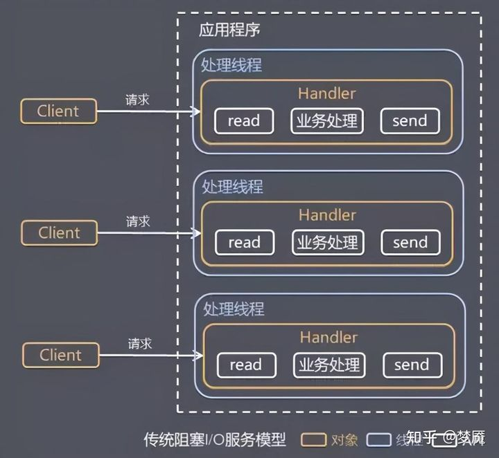
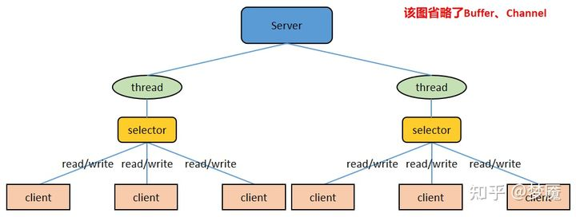
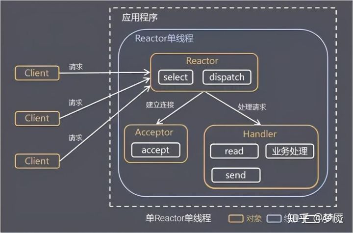
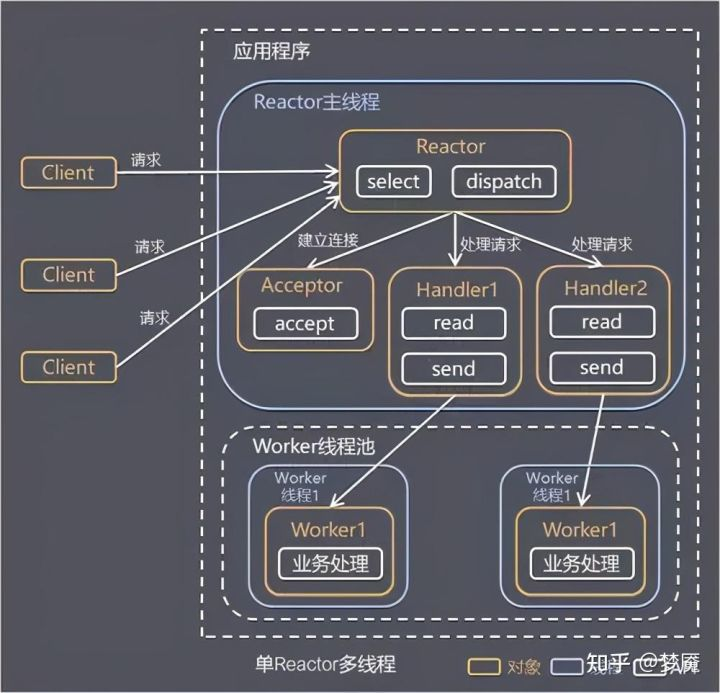
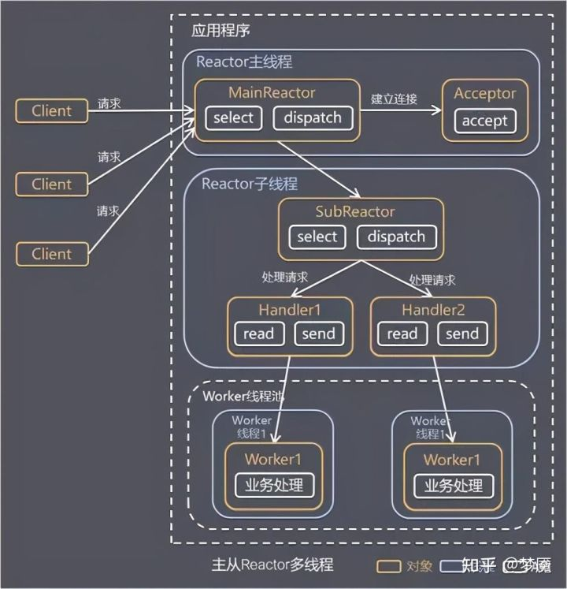
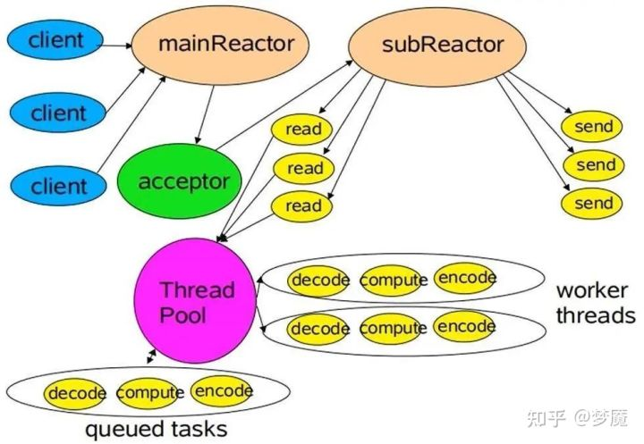
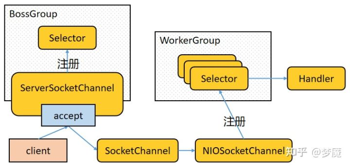
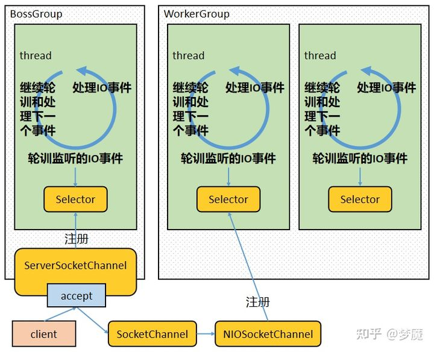
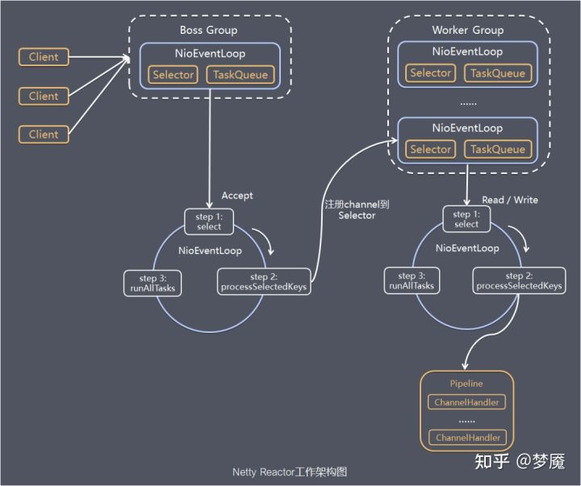
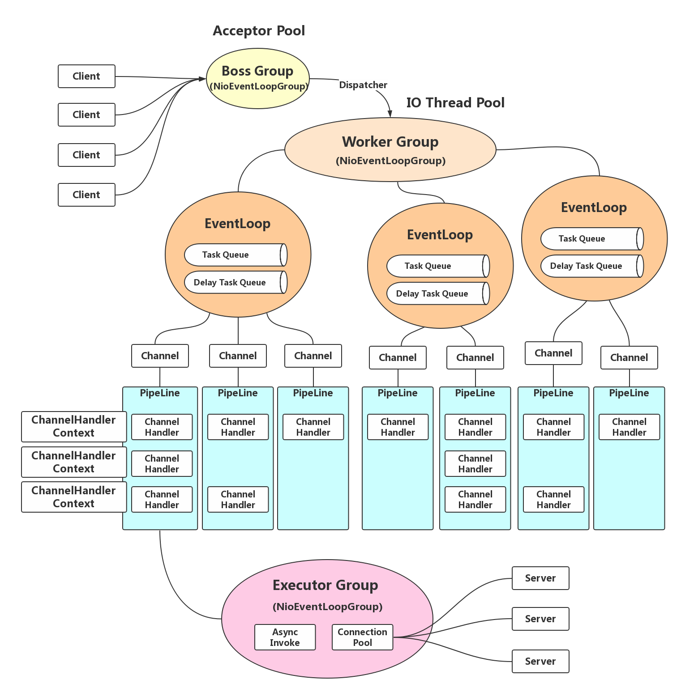

[TOC]

# why netty

netty底层基于jdk的NIO，我们为什么不直接基于jdk的nio或者其他nio框架？下面是我总结出来的原因

1. 使用jdk自带的nio需要了解太多的概念，编程复杂
2. netty底层IO模型随意切换，而这一切只需要做微小的改动
3. netty自带的拆包解包，异常检测等机制让你从nio的繁重细节中脱离出来，让你只需要关心业务逻辑
4. netty解决了jdk的很多包括空轮训在内的bug
5. netty底层对线程，selector做了很多细小的优化，精心设计的reactor线程做到非常高效的并发处理
6. 自带各种协议栈让你处理任何一种通用协议都几乎不用亲自动手
7. netty社区活跃，遇到问题随时邮件列表或者issue
8. netty已经历各大rpc框架，消息中间件，分布式通信中间件线上的广泛验证，健壮性无比强大

# Java 中的网络 IO 模型

## BIO

同步的、阻塞式 IO。在这种模型中，服务器上一个线程处理一次连接，即客户端每发起一个请求，服务端都要开启一个线程专门处理该请求。这种模型对线程量的耗费极大，且线程利用率低，难以承受请求的高并发。BIO 虽然可以使用线程池+等待队列进行优化，避免使用过多的线程，但是依然无法解决线程利用率低的问题

## NIO

同步的、非阻塞式 IO。在这种模型中，服务器上一个线程处理多个连接，即多个客户端请求都会被注册到多路复用器上，多路复用器会轮训这些连接，轮训到连接上有 IO 活动就进行处理。NIO 降低了线程的需求量，提高了线程的利用率。Netty 就是基于 NIO 的

NIO 是面向缓冲区编程的，从缓冲区读取数据的时候游标在缓冲区中是可以前后移动的，这就增加了数据处理的灵活性。这和面向流的 BIO 只能顺序读取流中数据有很大的不同。

Java NIO 的非阻塞模式，使得一个线程从某个通道读取数据的时候，若当前有可用数据，则该线程进行处理，若当前无可用数据，则该线程不会保持阻塞等待状态，而是可以去处理其他工作（比如处理其他通道的读写）；同样，一个线程向某个通道写入数据的时候，一旦开始写入，该线程无需等待写完即可去处理其他工作（比如处理其他通道的读写）。这种特性使得一个线程能够处理多个客户端请求，而不是像 BIO 那样，一个线程只能处理一个请求

## AIO

异步非阻塞式 IO。在这种模型中，由操作系统完成与客户端之间的 read/write，之后再由操作系统主动通知服务器线程去处理后面的工作，在这个过程中服务器线程不必同步等待 read/write 完成。由于不同的操作系统对 AIO 的支持程度不同，AIO 目前未得到广泛应用

# Reactor 线程模式

传统的 BIO 服务端编程采用“每线程每连接”的处理模型，弊端很明显，就是面对大量的客户端并发连接时，服务端的资源压力很大；并且线程的利用率很低，如果当前线程没有数据可读，它会阻塞在 read 操作上

## 单 Reactor 单线程模式

这种模式的基本工作流程为：

1）Reactor 通过 select 监听客户端请求事件，收到事件之后通过 dispatch 进行分发

2）如果事件是建立连接的请求事件，则由 Acceptor 通过 accept 处理连接请求，然后创建一个 Handler 对象处理连接建立后的后续业务处理。

3）如果事件不是建立连接的请求事件，则由 Reactor 对象分发给连接对应的 Handler 处理。

4）Handler 会完成 read–>业务处理–>send 的完整处理流程。

这种模式的优点是：模型简单，没有多线程、进程通信、竞争的问题，一个线程完成所有的事件响应和业务处理。当然缺点也很明显：

1）存在性能问题，只有一个线程，无法完全发挥多核 CPU 的性能。Handler 在处理某个连接上的业务时，整个进程无法处理其他连接事件，很容易导致性能瓶颈。

2）存在可靠性问题，若线程意外终止，或者进入死循环，会导致整个系统通信模块不可用，不能接收和处理外部消息，造成节点故障。

单 Reactor 单线程模式使用场景为：客户端的数量有限，业务处理非常快速，比如 Redis 在业务处理的时间复杂度为 O(1)的情况。

## 单 Reactor 多线程模式

这种模式的基本工作流程为：

1）Reactor 对象通过 select 监听客户端请求事件，收到事件后通过 dispatch 进行分发。

2）如果事件是建立连接的请求事件，则由 Acceptor 通过 accept 处理连接请求，然后创建一个 Handler 对象处理连接建立后的后续业务处理。

3）如果事件不是建立连接的请求事件，则由 Reactor 对象分发给连接对应的 Handler 处理。Handler 只负责响应事件，不做具体的业务处理，Handler 通过 read 读取到请求数据后，会分发给后面的 Worker 线程池来处理业务请求。

4）Worker 线程池会分配独立线程来完成真正的业务处理，并将处理结果返回给 Handler。Handler 通过 send 向客户端发送响应数据。

这种模式的优点是可以充分的利用多核 cpu 的处理能力，缺点是多线程数据共享和控制比较复杂，Reactor 处理所有的事件的监听和响应，在单线程中运行，面对高并发场景还是容易出现性能瓶颈。

## 主从 Reactor 多线程模式

针对单 Reactor 多线程模型中，Reactor 在单个线程中运行，面对高并发的场景易成为性能瓶颈的缺陷，主从 Reactor 多线程模式让 Reactor 在多个线程中运行（分成 MainReactor 线程与 SubReactor 线程）。这种模式的基本工作流程为：

1）Reactor 主线程 MainReactor 对象通过 select 监听客户端连接事件，收到事件后，通过 Acceptor 处理客户端连接事件。

2）当 Acceptor 处理完客户端连接事件之后（与客户端建立好 Socket 连接），MainReactor 将连接分配给 SubReactor。（即：MainReactor 只负责监听客户端连接请求，和客户端建立连接之后将连接交由 SubReactor 监听后面的 IO 事件。）

3）SubReactor 将连接加入到自己的连接队列进行监听，并创建 Handler 对各种事件进行处理。

4）当连接上有新事件发生的时候，SubReactor 就会调用对应的 Handler 处理。

5）Handler 通过 read 从连接上读取请求数据，将请求数据分发给 Worker 线程池进行业务处理。

6）Worker 线程池会分配独立线程来完成真正的业务处理，并将处理结果返回给 Handler。Handler 通过 send 向客户端发送响应数据。

7）一个 MainReactor 可以对应多个 SubReactor，即一个 MainReactor 线程可以对应多个 SubReactor 线程。

这种模式的优点是：

1）MainReactor 线程与 SubReactor 线程的数据交互简单职责明确，MainReactor 线程只需要接收新连接，SubReactor 线程完成后续的业务处理。

2）MainReactor 线程与 SubReactor 线程的数据交互简单， MainReactor 线程只需要把新连接传给 SubReactor 线程，SubReactor 线程无需返回数据。

3）多个 SubReactor 线程能够应对更高的并发请求。

这种模式的缺点是编程复杂度较高。但是由于其优点明显，在许多项目中被广泛使用，包括 Nginx、Memcached、Netty 等。

这种模式也被叫做服务器的 1+M+N 线程模式，即使用该模式开发的服务器包含一个（或多个，1 只是表示相对较少）连接建立线程+M 个 IO 线程+N 个业务处理线程。这是业界成熟的服务器程序设计模式。

# Netty 的网络模型

Netty 的设计主要基于主从 Reactor 多线程模式，并做了一定的改进

简单版本的 Netty 的模型如下：

1）BossGroup 线程维护 Selector，ServerSocketChannel 注册到这个 Selector 上，只关注连接建立请求事件（相当于主 Reactor）。

2）当接收到来自客户端的连接建立请求事件的时候，通过 ServerSocketChannel.accept 方法获得对应的 SocketChannel，并封装成 NioSocketChannel 注册到 WorkerGroup 线程中的 Selector，每个 Selector 运行在一个线程中（相当于从 Reactor）。

3）当 WorkerGroup 线程中的 Selector 监听到自己感兴趣的 IO 事件后，就调用 Handler 进行处理。

关于这张图，作以下几点说明：

1）有两组线程池：BossGroup 和 WorkerGroup，BossGroup 中的线程（可以有多个，图中只画了一个）专门负责和客户端建立连接，WorkerGroup 中的线程专门负责处理连接上的读写。

2）BossGroup 和 WorkerGroup 含有多个不断循环的执行事件处理的线程，每个线程都包含一个 Selector，用于监听注册在其上的 Channel。

3）每个 BossGroup 中的线程循环执行以下三个步骤：

3.1）轮训注册在其上的 ServerSocketChannel 的 accept 事件（OP_ACCEPT 事件）

3.2）处理 accept 事件，与客户端建立连接，生成一个 NioSocketChannel，并将其注册到 WorkerGroup 中某个线程上的 Selector 上

3.3）再去以此循环处理任务队列中的下一个事件

4）每个 WorkerGroup 中的线程循环执行以下三个步骤：

4.1）轮训注册在其上的 NioSocketChannel 的 read/write 事件（OP_READ/OP_WRITE 事件）

4.2）在对应的 NioSocketChannel 上处理 read/write 事件

4.3）再去以此循环处理任务队列中的下一个事件

我们再来看下终极版的 Netty 的模型

1）Netty 抽象出两组线程池：BossGroup 和 WorkerGroup，也可以叫做 BossNioEventLoopGroup 和 WorkerNioEventLoopGroup。每个线程池中都有 NioEventLoop 线程。BossGroup 中的线程专门负责和客户端建立连接，WorkerGroup 中的线程专门负责处理连接上的读写。BossGroup 和 WorkerGroup 的类型都是 NioEventLoopGroup。

2）NioEventLoopGroup 相当于一个事件循环组，这个组中含有多个事件循环，每个事件循环就是一个 NioEventLoop。

3）NioEventLoop 表示一个不断循环的执行事件处理的线程，每个 NioEventLoop 都包含一个 Selector，用于监听注册在其上的 Socket 网络连接（Channel）。

4）NioEventLoopGroup 可以含有多个线程，即可以含有多个 NioEventLoop。

5）每个 BossNioEventLoop 中循环执行以下三个步骤：

5.1）**select**：轮训注册在其上的 ServerSocketChannel 的 accept 事件（OP_ACCEPT 事件）

5.2）**processSelectedKeys**：处理 accept 事件，与客户端建立连接，生成一个 NioSocketChannel，并将其注册到某个 WorkerNioEventLoop 上的 Selector 上

5.3）**runAllTasks**：再去以此循环处理任务队列中的其他任务

6）每个 WorkerNioEventLoop 中循环执行以下三个步骤：

6.1）**select**：轮训注册在其上的 NioSocketChannel 的 read/write 事件（OP_READ/OP_WRITE 事件）

6.2）**processSelectedKeys**：在对应的 NioSocketChannel 上处理 read/write 事件

6.3）**runAllTasks**：再去以此循环处理任务队列中的其他任务

7）在以上两个**processSelectedKeys**步骤中，会使用 Pipeline（管道），Pipeline 中引用了 Channel，即通过 Pipeline 可以获取到对应的 Channel，Pipeline 中维护了很多的处理器（拦截处理器、过滤处理器、自定义处理器等）

整体流程图

