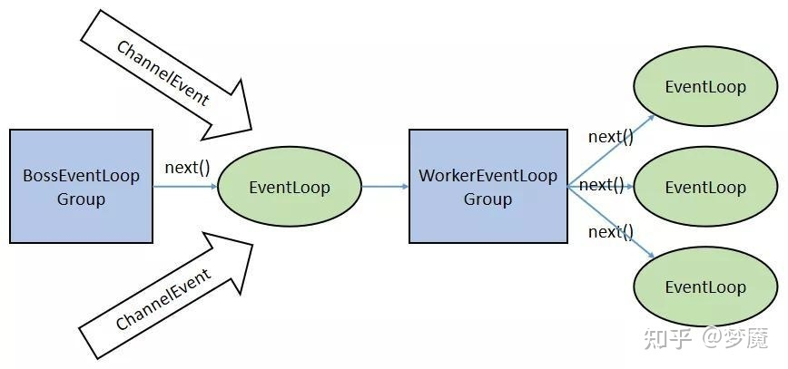

[TOC]

# NioEventLoopGroup构造流程

在基于 Netty 的 TCP Server 代码中，包含了两个 EventLoopGroup——bossGroup 和 workerGroup，EventLoopGroup 是一组 EventLoop 的抽象

追踪 Netty 的 EventLoop 的继承链，可以发现 EventLoop 最终继承于 JUC Executor，因此 EventLoop 本质就是一个 JUC Executor，即线程，JUC Executor 的源码为：

```java
public interface Executor {
    /**
     * Executes the given command at some time in the future.
     */
    void execute(Runnable command);
}
```

Netty 为了更好地利用多核 CPU 的性能，一般会有多个 EventLoop 同时工作，每个 EventLoop 维护着一个 Selector 实例，Selector 实例监听注册其上的 Channel 的 IO 事件

类图如下：


基本步骤如下：

1. EventLoopGroup(其实是MultithreadEventExecutorGroup)内部维护一个类为EventExecutor children 数组，其大小是nThreads，这样就初始化了一个线程池。
2. 如果我们在实例化NioEventLoopGroup 时，如果指定线程池大小，则nThreads 就是指定的值，否则是CPU核数* 2。
3. 在MultithreadEventExecutorGroup 中会调用newChild()抽象方法来初始化children 数组.
4. 抽象方法newChild()实际是在NioEventLoopGroup 中实现的，由它返回一个NioEventLoop 实例。
5. 初始化NioEventLoop 主要属性：
   1. provider：在NioEventLoopGroup 构造器中通过SelectorProvider 的provider()方法获取SelectorProvider。
   2. selector：在NioEventLoop 构造器中调用selector = provider.openSelector()方法获取Selector 对象。

调用NioEventLoopGroup对象的初始化，最终会调用到MultithreadEventExecutorGroup中的如下方法：

```java
protected MultithreadEventExecutorGroup(int nThreads, Executor executor, EventExecutorChooserFactory chooserFactory, Object... args) {
    if (nThreads <= 0) {
        throw new IllegalArgumentException(String.format("nThreads: %d (expected: > 0)", nThreads));
    }

    // 创建执行器
    if (executor == null) {
        executor = new ThreadPerTaskExecutor(newDefaultThreadFactory());
    }

    // 创建 EventExecutor 数组
    children = new EventExecutor[nThreads];

    for (int i = 0; i < nThreads; i ++) {
        boolean success = false; // 是否创建成功
        try {
            // 创建 EventExecutor 对象
            children[i] = newChild(executor, args);
            // 标记创建成功
            success = true;
        } catch (Exception e) {
            // 创建失败，抛出 IllegalStateException 异常
            // TODO: Think about if this is a good exception type
            throw new IllegalStateException("failed to create a child event loop", e);
        } finally {
            // 创建失败，关闭所有已创建的 EventExecutor
            if (!success) {
                // 关闭所有已创建的 EventExecutor
                for (int j = 0; j < i; j ++) {
                    children[j].shutdownGracefully();
                }
                // 确保所有已创建的 EventExecutor 已关闭
                for (int j = 0; j < i; j ++) {
                    EventExecutor e = children[j];
                    try {
                        while (!e.isTerminated()) {
                            e.awaitTermination(Integer.MAX_VALUE, TimeUnit.SECONDS);
                        }
                    } catch (InterruptedException interrupted) {
                        // Let the caller handle the interruption.
                        Thread.currentThread().interrupt();
                        break;
                    }
                }
            }
        }
    }

    // 创建 EventExecutor 选择器
    chooser = chooserFactory.newChooser(children);

    // 创建监听器，用于 EventExecutor 终止时的监听
    final FutureListener<Object> terminationListener = new FutureListener<Object>() {

        @Override
        public void operationComplete(Future<Object> future) throws Exception {
            if (terminatedChildren.incrementAndGet() == children.length) { // 全部关闭
                terminationFuture.setSuccess(null); // 设置结果，并通知监听器们。
            }
        }

    };
    // 设置监听器到每个 EventExecutor 上
    for (EventExecutor e: children) {
        e.terminationFuture().addListener(terminationListener);
    }

    // 创建不可变( 只读 )的 EventExecutor 数组
    Set<EventExecutor> childrenSet = new LinkedHashSet<EventExecutor>(children.length);
    Collections.addAll(childrenSet, children);
    readonlyChildren = Collections.unmodifiableSet(childrenSet);
}
```

## 多路复用器SelectorProvider的创建

需要注意的是NioEventLoopGroup的构造过程中，会通过```SelectorProvider.provider()```创建 SelectorProvider 组件，供后续来创建Selector组件

```java
public static SelectorProvider provider() {
    synchronized (lock) {
        if (provider != null)
            return provider;
        return AccessController.doPrivileged(
            new PrivilegedAction<SelectorProvider>() {
                public SelectorProvider run() {
                        if (loadProviderFromProperty())
                            return provider;
                        if (loadProviderAsService())
                            return provider;
                        provider = sun.nio.ch.DefaultSelectorProvider.create();
                        return provider;
                    }
                });
    }
}
```

不同平台的 jdk，这里会创建对应的 SelectorProvider

## 创建事件执行器EventExecutor

配置多少个线程，就创建多少个EventExecutor，也就是整个 Netty 只会创建一个SelectorProvider，而每个NioEventLoop都有自己的Selector多路复用器，那么就一定有一个线程来轮询这个 Selector，来处理 IO 事件

```java
NioEventLoop(NioEventLoopGroup parent, Executor executor, SelectorProvider selectorProvider,
             SelectStrategy strategy, RejectedExecutionHandler rejectedExecutionHandler) {
    super(parent, executor, false, DEFAULT_MAX_PENDING_TASKS, rejectedExecutionHandler);
    if (selectorProvider == null) {
        throw new NullPointerException("selectorProvider");
    }
    if (strategy == null) {
        throw new NullPointerException("selectStrategy");
    }
    provider = selectorProvider;
    // 创建 Selector 对象
    final SelectorTuple selectorTuple = openSelector();
    selector = selectorTuple.selector;
    unwrappedSelector = selectorTuple.unwrappedSelector;
    selectStrategy = strategy;
}
```

## 创建事件执行器选择器EventExecutorChooser

Netty 为了更好地利用多核 CPU 的性能，一般会有多个 EventLoop 同时工作，每个 EventLoop 维护着一个 Selector 实例，Selector 实例监听注册其上的 Channel 的 IO 事件。EventLoopGroup 含有一个 next 方法，它的作用是按照一定规则从 Group 中选取一个 EventLoop 处理 IO 事件

工厂模式，如果数组是2的次方，则进行位运算的优化。负责从多个EventExecutor中选出一个

```java
public final class DefaultEventExecutorChooserFactory implements EventExecutorChooserFactory {

    /**
     * 单例
     */
    public static final DefaultEventExecutorChooserFactory INSTANCE = new DefaultEventExecutorChooserFactory();

    private DefaultEventExecutorChooserFactory() { }

    @SuppressWarnings("unchecked")
    @Override
    public EventExecutorChooser newChooser(EventExecutor[] executors) {
        if (isPowerOfTwo(executors.length)) { // 是否为 2 的幂次方
            return new PowerOfTwoEventExecutorChooser(executors);
        } else {
            return new GenericEventExecutorChooser(executors);
        }
    }

    private static boolean isPowerOfTwo(int val) {
        return (val & -val) == val;
    }

    private static final class PowerOfTwoEventExecutorChooser implements EventExecutorChooser {

        /**
         * 自增序列
         */
        private final AtomicInteger idx = new AtomicInteger();
        /**
         * EventExecutor 数组
         */
        private final EventExecutor[] executors;

        PowerOfTwoEventExecutorChooser(EventExecutor[] executors) {
            this.executors = executors;
        }

        @Override
        public EventExecutor next() {
            return executors[idx.getAndIncrement() & executors.length - 1];
        }

    }

    private static final class GenericEventExecutorChooser implements EventExecutorChooser {

        /**
         * 自增序列
         */
        private final AtomicInteger idx = new AtomicInteger();
        /**
         * EventExecutor 数组
         */
        private final EventExecutor[] executors;

        GenericEventExecutorChooser(EventExecutor[] executors) {
            this.executors = executors;
        }

        @Override
        public EventExecutor next() {
            return executors[Math.abs(idx.getAndIncrement() % executors.length)];
        }

    }

}
```

在服务端，通常 Boss EventLoopGroup 只包含一个 Boss EventLoop（单线程），该 EventLoop 维护者一个注册了 ServerSocketChannel 的 Selector 实例。该 EventLoop 不断轮询 Selector 得到 OP_ACCEPT 事件（客户端连接事件），然后将接收到的 SocketChannel 交给 Worker EventLoopGroup，Worker EventLoopGroup 会通过 next()方法选取一个 Worker EventLoop 并将这个 SocketChannel 注册到其中的 Selector 上，由这个 Worker EventLoop 负责该 SocketChannel 上后续的 IO 事件处理



## NioEventLoopGroup 初始化时序图


# 任务执行者EventLoop

## NioEventLoop组件作用

NioEventLoop 继承自SingleThreadEventLoop，而SingleThreadEventLoop 又继承自SingleThreadEventExecutor。而SingleThreadEventExecutor 是Netty 中对本地线程的抽象，它内部有一个Thread thread 属性，存储了一个本地Java线程。因此我们可以简单地认为，一个NioEventLoop 其实就是和一个特定的线程绑定，并且在其生命周期内，绑定的线程都不会再改变

类图：


NioEventLoop 的类层次结构图还是有些复杂的，不过我们只需要关注几个重要点即可。首先来看NioEventLoop 的继承链：NioEventLoop->SingleThreadEventLoop->SingleThreadEventExecutor->AbstractScheduledEventExecutor。

在AbstractScheduledEventExecutor 中, Netty 实现了NioEventLoop 的schedule 功能，即我们可以通过调用一个NioEventLoop 实例的schedule 方法来运行一些定时任务。

而在SingleThreadEventLoop 中，又实现了任务队列的功能，通过它，我们可以调用一个NioEventLoop 实例的execute()方法来向任务队列中添加一个task,并由NioEventLoop进行调度执行。

通常来说，NioEventLoop 负责执行两个任务：

1. 第一个任务是作为IO 线程，执行与Channel 相关的IO 操作，包括调用Selector 等待就绪的IO 事件、读写数据与数据的处理等；
2. 而第二个任务是作为任务队列，执行taskQueue 中的任务，例如用户调用eventLoop.schedule 提交的定时任务也是这个线程执行的（对应scheduledTaskQueue队列）。

## NioEventLoop 的实例化过程

**当EventLoop 的execute()第一次被调用时，就会触发startThread()方法的调用，进而导致EventLoop所对应的Java 本地线程启动。并且线程会处理两种任务，一种是触发的 IO 事件，另一种是任务队列中的任务**

**重要结论：**

服务端的bossGroup 不断地监听是否有客户端的连接，当发现有一个新的客户端连接到来时，bossGroup 就会为此连接初始化各项资源，然后从workerGroup 中选出一个EventLoop 绑定到此客户端连接中。那么接下来的服务器与客户端的交互过程就全部在此分配的EventLoop 中完成。在执行逻辑操作时，通过inEventLoop判断，如果当前线程就是 EventLoop 对应的线程，则直接执行，否则放入 EventLoop 线程所在的队列中，在下一次轮询的时候执行

```java
@Override
public void execute(Runnable task) {
    if (task == null) {
        throw new NullPointerException("task");
    }

    // 获得当前是否在 EventLoop 的线程中
    boolean inEventLoop = inEventLoop();
    // 添加到任务队列
    addTask(task);
    if (!inEventLoop) {
        // 创建线程
        startThread();
        // 若已经关闭，移除任务，并进行拒绝
        if (isShutdown() && removeTask(task)) {
            reject();
        }
    }

    // 唤醒线程
    if (!addTaskWakesUp && wakesUpForTask(task)) {
        wakeup(inEventLoop);
    }
}
```

- inEventLoop：此方法及其重要，它直接确保了SingleThreadEventExecutor的execute方法始终以单线程的方式执行传入的Runnable任务。inEventLoop()方法会先判断当前线程与持有EventLoop线程引用是否相当，不相等则启动一个新的线程，然后更新EventLoop的引用为新的线程。**我们了解到一个信息：通过eventLoop().execute()执行的Runnable任务，一定是在EventLoop线程中执行了**
- addTask：将当前任务添加到队列

```java
private void startThread() {
    if (state == ST_NOT_STARTED) {
        if (STATE_UPDATER.compareAndSet(this, ST_NOT_STARTED, ST_STARTED)) {
            try {
                doStartThread();
            } catch (Throwable cause) {
                STATE_UPDATER.set(this, ST_NOT_STARTED);
                PlatformDependent.throwException(cause);
            }
        }
    }
}
```

状态改的原子更新与 state 标识字段一起确定线程只会被启动一次。在新建的Runnable中，调用了SingleThreadEventExecutor.this.run()方法，不同子类重写此run方法来实现任务的具体逻辑

```java
private void doStartThread() {
    assert thread == null;
    executor.execute(new Runnable() {

        @Override
        public void run() {
            // 记录当前线程
            thread = Thread.currentThread();

            // 如果当前线程已经被标记打断，则进行打断操作。
            if (interrupted) {
                thread.interrupt();
            }

            boolean success = false; // 是否执行成功

            // 更新最后执行时间
            updateLastExecutionTime();
            try {
                // 执行任务
                SingleThreadEventExecutor.this.run();
                success = true; // 标记执行成功
            } catch (Throwable t) {
                logger.warn("Unexpected exception from an event executor: ", t);
            } finally {
                // TODO 1006 EventLoop 优雅关闭
                for (;;) {
                    int oldState = state;
                    if (oldState >= ST_SHUTTING_DOWN || STATE_UPDATER.compareAndSet(
                            SingleThreadEventExecutor.this, oldState, ST_SHUTTING_DOWN)) {
                        break;
                    }
                }

                // TODO 1006 EventLoop 优雅关闭
                // Check if confirmShutdown() was called at the end of the loop.
                if (success && gracefulShutdownStartTime == 0) {
                    if (logger.isErrorEnabled()) {
                        logger.error("Buggy " + EventExecutor.class.getSimpleName() + " implementation; " +
                                SingleThreadEventExecutor.class.getSimpleName() + ".confirmShutdown() must " +
                                "be called before run() implementation terminates.");
                    }
                }

                // TODO 1006 EventLoop 优雅关闭
                try {
                    // Run all remaining tasks and shutdown hooks.
                    for (;;) {
                        if (confirmShutdown()) {
                            break;
                        }
                    }
                } finally {
                    try {
                        cleanup(); // 清理，释放资源
                    } finally {
                        STATE_UPDATER.set(SingleThreadEventExecutor.this, ST_TERMINATED);
                        threadLock.release();
                        if (!taskQueue.isEmpty()) {
                            if (logger.isWarnEnabled()) {
                                logger.warn("An event executor terminated with " +
                                        "non-empty task queue (" + taskQueue.size() + ')');
                            }
                        }

                        terminationFuture.setSuccess(null);
                    }
                }
            }

        }
    });
}
```

## Reactor 线程的执行

startThread()最终调用的是SingleThreadEventExecutor.this.run()方法，这个this 就是NioEventLoop 对象。该方法有一个无限循环，监听来自Channel的事件并将其转发到ChannelPipeline中。这段逻辑会保持EventLoop的持续运行

**这里有一个小问题，Netty是如何保证单线程持续运行的同时，还能不断处理队列中的任务呢？**

这个秘密在io.netty.channel.nio.NioEventLoop.run这个方法中，有两点：

1. select方法Netty使用的是有限等待：Selector.select(timeout)，且超时的时间是下一个定时任务的到期时间与当前时间的间隔
2. 退出状态机之后，在调用完processSelectedKeys方法后，我们会看到runAllTasks方法，并伴随一行注释：Ensure we always run tasks.

```java
@Override
protected void run() {
    for (;;) {
        try {
            switch (selectStrategy.calculateStrategy(selectNowSupplier, hasTasks())) {
                case SelectStrategy.CONTINUE: // 默认实现下，不存在这个情况。
                    continue;
                case SelectStrategy.SELECT:
                    // 重置 wakenUp 标记为 false
                    // 选择( 查询 )任务
                    select(wakenUp.getAndSet(false));

                    // 'wakenUp.compareAndSet(false, true)' is always evaluated
                    // before calling 'selector.wakeup()' to reduce the wake-up
                    // overhead. (Selector.wakeup() is an expensive operation.)
                    //
                    // However, there is a race condition in this approach.
                    // The race condition is triggered when 'wakenUp' is set to
                    // true too early.
                    //
                    // 'wakenUp' is set to true too early if:
                    // 1) Selector is waken up between 'wakenUp.set(false)' and
                    //    'selector.select(...)'. (BAD)
                    // 2) Selector is waken up between 'selector.select(...)' and
                    //    'if (wakenUp.get()) { ... }'. (OK)
                    //
                    // In the first case, 'wakenUp' is set to true and the
                    // following 'selector.select(...)' will wake up immediately.
                    // Until 'wakenUp' is set to false again in the next round,
                    // 'wakenUp.compareAndSet(false, true)' will fail, and therefore
                    // any attempt to wake up the Selector will fail, too, causing
                    // the following 'selector.select(...)' call to block
                    // unnecessarily.
                    //
                    // To fix this problem, we wake up the selector again if wakenUp
                    // is true immediately after selector.select(...).
                    // It is inefficient in that it wakes up the selector for both
                    // the first case (BAD - wake-up required) and the second case
                    // (OK - no wake-up required).

                    // 唤醒。原因，见上面中文注释
                    if (wakenUp.get()) {
                        selector.wakeup();
                    }
                    // fall through
                default:
            }

            // TODO 1007 NioEventLoop cancel 方法
            cancelledKeys = 0;
            needsToSelectAgain = false;

            final int ioRatio = this.ioRatio;
            if (ioRatio == 100) {
                try {
                    // 处理 Channel 感兴趣的就绪 IO 事件
                    processSelectedKeys();
                } finally {
                    // 运行所有普通任务和定时任务，不限制时间
                    // Ensure we always run tasks.
                    runAllTasks();
                }
            } else {
                final long ioStartTime = System.nanoTime();
                try {
                    // 处理 Channel 感兴趣的就绪 IO 事件
                    processSelectedKeys();
                } finally {
                    // 运行所有普通任务和定时任务，限制时间
                    // Ensure we always run tasks.
                    final long ioTime = System.nanoTime() - ioStartTime;
                    runAllTasks(ioTime * (100 - ioRatio) / ioRatio);
                }
            }
        } catch (Throwable t) {
            handleLoopException(t);
        }
        // TODO 1006 EventLoop 优雅关闭
        // Always handle shutdown even if the loop processing threw an exception.
        try {
            if (isShuttingDown()) {
                closeAll();
                if (confirmShutdown()) {
                    return;
                }
            }
        } catch (Throwable t) {
            handleLoopException(t);
        }
    }
}
```

##  Select轮询注册在 Selector 上的 IO 事件

```java
select(wakenUp.getAndSet(false));
if (wakenUp.get()) {
      selector.wakeup();
}
```

wakenUp 表示是否应该唤醒正在阻塞的select操作，可以看到netty在进行一次新的loop之前，都会将wakeUp 被设置成false，标志新的一轮loop的开始，具体的select操作我们也拆分开来看

### 终止Select轮询场景

1. 定时任务截止事时间快到了，中断本次轮询

```java
int selectCnt = 0;
long currentTimeNanos = System.nanoTime();
long selectDeadLineNanos = currentTimeNanos + delayNanos(currentTimeNanos);

for (;;) {
    long timeoutMillis = (selectDeadLineNanos - currentTimeNanos + 500000L) / 1000000L;
    if (timeoutMillis <= 0) {
        if (selectCnt == 0) {
            selector.selectNow();
            selectCnt = 1;
        }
        break;
    }
    ....
}
```

我们可以看到，NioEventLoop中reactor线程的select操作也是一个for循环，在for循环第一步中，如果发现当前的定时任务队列中有任务的截止事件快到了(<=0.5ms)，就跳出循环。此外，跳出之前如果发现目前为止还没有进行过select操作（`if (selectCnt == 0)`），那么就调用一次`selectNow()`，该方法会立即返回，不会阻塞

netty里面定时任务队列是按照延迟时间从小到大进行排序， `delayNanos(currentTimeNanos)`方法即取出第一个定时任务的延迟时间

2. 轮询过程中发现有任务加入，中断本次轮询

   ```java
   for (;;) {
       // 1.定时任务截至事时间快到了，中断本次轮询
       ...
       // 2.轮询过程中发现有任务加入，中断本次轮询
       if (hasTasks() && wakenUp.compareAndSet(false, true)) {
           selector.selectNow();
           selectCnt = 1;
           break;
       }
       ....
   }
   ```

netty为了保证任务队列能够及时执行，在进行阻塞select操作的时候会判断任务队列是否为空，如果不为空，就执行一次非阻塞select操作，跳出循环

3. 阻塞式select操作

   ```java
   for (;;) {
       // 1.定时任务截至事时间快到了，中断本次轮询
       ...
       // 2.轮询过程中发现有任务加入，中断本次轮询
       ...
       // 3.阻塞式select操作
       int selectedKeys = selector.select(timeoutMillis);
       selectCnt ++;
       if (selectedKeys != 0 || oldWakenUp || wakenUp.get() || hasTasks() || hasScheduledTasks()) {
           break;
       }
       ....
   }
   ```

执行到这一步，说明netty任务队列里面队列为空，并且所有定时任务延迟时间还未到(大于0.5ms)，于是，在这里进行一次阻塞select操作，截止到第一个定时任务的截止时间

这里，我们可以问自己一个问题，如果第一个定时任务的延迟非常长，比如一个小时，那么有没有可能线程一直阻塞在select操作，当然有可能！But，只要在这段时间内，有新任务加入，该阻塞就会被释放

外部线程调用execute方法添加任务

```java
@Override
public void execute(Runnable task) { 
    ...
    wakeup(inEventLoop); // inEventLoop为false
    ...
}
```

调用wakeup方法唤醒selector阻塞

```java
protected void wakeup(boolean inEventLoop) {
    if (!inEventLoop && wakenUp.compareAndSet(false, true)) {
        selector.wakeup();
    }
}
```

可以看到，在外部线程添加任务的时候，会调用wakeup方法来唤醒 `selector.select(timeoutMillis)`

阻塞select操作结束之后，netty又做了一系列的状态判断来决定是否中断本次轮询，中断本次轮询的条件有

- 轮询到IO事件 （`selectedKeys != 0`）
- oldWakenUp 参数为true
- 任务队列里面有任务（`hasTasks`）
- 第一个定时任务即将要被执行 （`hasScheduledTasks（）`）
- 用户主动唤醒（`wakenUp.get()`）

### 解决jdk的nio bug

该bug会导致Selector一直空轮询，最终导致cpu 100%，nio server不可用，严格意义上来说，netty没有解决jdk的bug，而是通过一种方式来巧妙地避开了这个bug，具体做法如下

```java
long currentTimeNanos = System.nanoTime();
for (;;) {
    // 1.定时任务截止事时间快到了，中断本次轮询
    ...
    // 2.轮询过程中发现有任务加入，中断本次轮询
    ...
    // 3.阻塞式select操作
    selector.select(timeoutMillis);
    // 4.解决jdk的nio bug
    long time = System.nanoTime();
    if (time - TimeUnit.MILLISECONDS.toNanos(timeoutMillis) >= currentTimeNanos) {
        selectCnt = 1;
    } else if (SELECTOR_AUTO_REBUILD_THRESHOLD > 0 &&
            selectCnt >= SELECTOR_AUTO_REBUILD_THRESHOLD) {

        rebuildSelector();
        selector = this.selector;
        selector.selectNow();
        selectCnt = 1;
        break;
    }
    currentTimeNanos = time; 
    ...
 }
```

netty 会在每次进行 `selector.select(timeoutMillis)` 之前记录一下开始时间`currentTimeNanos`，在select之后记录一下结束时间，判断select操作是否至少持续了`timeoutMillis`秒（这里将`time - TimeUnit.MILLISECONDS.toNanos(timeoutMillis) >= currentTimeNanos`改成`time - currentTimeNanos >= TimeUnit.MILLISECONDS.toNanos(timeoutMillis)`或许更好理解一些）,如果持续的时间大于等于timeoutMillis，说明就是一次有效的轮询，重置`selectCnt`标志，否则，表明该阻塞方法并没有阻塞这么长时间，可能触发了jdk的空轮询bug，当空轮询的次数超过一个阀值的时候，默认是512，就开始重建selector

netty 通过`rebuildSelector`来fix空轮询bug的过程，`rebuildSelector`的操作其实很简单：new一个新的selector，将之前注册到老的selector上的的channel重新转移到新的selector上

```java
public void rebuildSelector() {
    final Selector oldSelector = selector;
    final Selector newSelector;
    newSelector = openSelector();

    int nChannels = 0;
     try {
        for (;;) {
                for (SelectionKey key: oldSelector.keys()) {
                    Object a = key.attachment();
                     if (!key.isValid() || key.channel().keyFor(newSelector) != null) {
                         continue;
                     }
                     int interestOps = key.interestOps();
                     key.cancel();
                     SelectionKey newKey = key.channel().register(newSelector, interestOps, a);
                     if (a instanceof AbstractNioChannel) {
                         ((AbstractNioChannel) a).selectionKey = newKey;
                      }
                     nChannels ++;
                }
                break;
        }
    } catch (ConcurrentModificationException e) {
        // Probably due to concurrent modification of the key set.
        continue;
    }
    selector = newSelector;
    oldSelector.close();
}
```

首先，通过`openSelector()`方法创建一个新的selector，然后执行一个死循环，只要执行过程中出现过一次并发修改selectionKeys异常，就重新开始转移

具体的转移步骤为

1. 拿到有效的key
2. 取消该key在旧的selector上的事件注册
3. 将该key对应的channel注册到新的selector上
4. 重新绑定channel和新的key的关系

转移完成之后，就可以将原有的selector废弃，后面所有的轮询都是在新的selector进行

### 总结

最后，我们总结reactor线程select步骤做的事情：不断地轮询是否有IO事件发生，并且在轮询的过程中不断检查是否有定时任务和普通任务，保证了netty的任务队列中的任务得到有效执行，轮询过程顺带用一个计数器避开了了jdk空轮询的bug，过程清晰明了

## ProcessSelectedKey处理 IO 事件

netty reactor线程的第一步是轮询出注册在selector上面的IO事件（select），那么接下来就要处理这些IO事件（process selected keys）

```java
private void processSelectedKeys() {
    if (selectedKeys != null) {
        //处理有过的selectedKeys
        processSelectedKeysOptimized();
    } else {
        //正常处理
        processSelectedKeysPlain(selector.selectedKeys());
    }
}
```

netty有两种选择，从名字上看，一种是处理优化过的selectedKeys，一种是正常的处理

### netty对SelectionKeySet的优化

首先，selectedKeys是一个 `SelectedSelectionKeySet` 类对象，在`NioEventLoop` 的 `openSelector` 方法中创建，之后就通过反射将selectedKeys与 `sun.nio.ch.SelectorImpl` 中的两个field绑定

```java
private SelectorTuple openSelector() {
   
    ...
    // selectorImplClass -> sun.nio.ch.SelectorImpl
    // 创建 SelectedSelectionKeySet 对象
    final SelectedSelectionKeySet selectedKeySet = new SelectedSelectionKeySet();

    // 设置 SelectedSelectionKeySet 对象到 unwrappedSelector 中
    Object maybeException = AccessController.doPrivileged(new PrivilegedAction<Object>() {
        @Override
        public Object run() {
            try {
                // 获得 "selectedKeys" "publicSelectedKeys" 的 Field
                Field selectedKeysField = selectorImplClass.getDeclaredField("selectedKeys");
                Field publicSelectedKeysField = selectorImplClass.getDeclaredField("publicSelectedKeys");

                // 设置 Field 可访问
                Throwable cause = ReflectionUtil.trySetAccessible(selectedKeysField, true);
                if (cause != null) {
                    return cause;
                }
                cause = ReflectionUtil.trySetAccessible(publicSelectedKeysField, true);
                if (cause != null) {
                    return cause;
                }

                // 设置 SelectedSelectionKeySet 对象到 unwrappedSelector 的 Field 中
                selectedKeysField.set(unwrappedSelector, selectedKeySet);
                publicSelectedKeysField.set(unwrappedSelector, selectedKeySet);
                return null;
            } catch (NoSuchFieldException e) {
                return e; // 失败，则返回该异常
            } catch (IllegalAccessException e) {
                return e; // 失败，则返回该异常
            }
        }
    });

    // 设置 SelectedSelectionKeySet 对象到 unwrappedSelector 中失败，则直接返回 SelectorTuple 对象。即，selector 也使用 unwrappedSelector 。
    if (maybeException instanceof Exception) {
        selectedKeys = null;
        Exception e = (Exception) maybeException;
        logger.trace("failed to instrument a special java.util.Set into: {}", unwrappedSelector, e);
        return new SelectorTuple(unwrappedSelector);
    }

    // 设置 SelectedSelectionKeySet 对象到 selectedKeys 中
    selectedKeys = selectedKeySet;
    logger.trace("instrumented a special java.util.Set into: {}", unwrappedSelector);

    // 创建 SelectedSelectionKeySetSelector 对象
    // 创建 SelectorTuple 对象。即，selector 也使用 SelectedSelectionKeySetSelector 对象。
    return new SelectorTuple(unwrappedSelector, new SelectedSelectionKeySetSelector(unwrappedSelector, selectedKeySet));
}
```

`sun.nio.ch.SelectorImpl` 中我们可以看到，这两个field其实是两个HashSet

```java
// Public views of the key sets
private Set<SelectionKey> publicKeys;             // Immutable
private Set<SelectionKey> publicSelectedKeys;     // Removal allowed, but not addition
protected SelectorImpl(SelectorProvider sp) {
    super(sp);
    keys = new HashSet<SelectionKey>();
    selectedKeys = new HashSet<SelectionKey>();
    if (Util.atBugLevel("1.4")) {
        publicKeys = keys;
        publicSelectedKeys = selectedKeys;
    } else {
        publicKeys = Collections.unmodifiableSet(keys);
        publicSelectedKeys = Util.ungrowableSet(selectedKeys);
    }
}
```

selector在调用`select()`族方法的时候，如果有IO事件发生，就会往里面的两个field中塞相应的`selectionKey`(具体怎么塞有待研究)，即相当于往一个hashSet中add元素，既然netty通过反射将jdk中的两个field替换掉，那我们就应该意识到是不是netty自定义的`SelectedSelectionKeySet`在`add`方法做了某些优化呢？

```java
final class SelectedSelectionKeySet extends AbstractSet<SelectionKey> {

    /**
     * SelectionKey 数组
     */
    SelectionKey[] keys;
    /**
     * 数组可读大小
     */
    int size;

    SelectedSelectionKeySet() {
        keys = new SelectionKey[1024]; // 默认 1024 大小
    }

    @Override
    public boolean add(SelectionKey o) {
        if (o == null) {
            return false;
        }

        // 添加到数组
        keys[size++] = o;

        // 超过数组大小上限，进行扩容
        if (size == keys.length) {
            increaseCapacity();
        }

        return true;
    }

    @Override
    public int size() {
        return size;
    }

    @Override
    public boolean remove(Object o) {
        return false;
    }

    @Override
    public boolean contains(Object o) {
        return false;
    }

    @Override
    public Iterator<SelectionKey> iterator() {
        throw new UnsupportedOperationException();
    }

    void reset() {
        reset(0);
    }

    void reset(int start) {
        // 重置数组内容为空
        Arrays.fill(keys, start, size, null);
        // 重置可读大小为 0
        size = 0;
    }

    private void increaseCapacity() {
        // 两倍扩容
        SelectionKey[] newKeys = new SelectionKey[keys.length << 1];
        // 复制老数组到新数组
        System.arraycopy(keys, 0, newKeys, 0, size);
        // 赋值给老数组
        keys = newKeys;
    }

}
```

该类其实很简单，继承了 `AbstractSet`，说明该类可以当作一个set来用，但是底层使用数组，在`add`方法中
 1.将SelectionKey塞到该数组的逻辑尾部
 2.更新该数组的逻辑长度+1
 3.如果该数组的逻辑长度等于数组的物理长度，就将该数组扩容

待程序跑过一段时间，等数组的长度足够长，每次在轮询到nio事件的时候，netty只需要O(1)的时间复杂度就能将 `SelectionKey` 塞到 set中去，而jdk底层使用的hashSet需要O(lgn)的时间复杂度

### 处理processSelectedKeysOptimized

```java
private void processSelectedKeysOptimized() {
    // 遍历数组
    for (int i = 0; i < selectedKeys.size; ++i) {
        //取出IO事件以及对应的channel
        final SelectionKey k = selectedKeys.keys[i];
        // null out entry in the array to allow to have it GC'ed once the Channel close
        // See https://github.com/netty/netty/issues/2363
        selectedKeys.keys[i] = null;

        final Object a = k.attachment();

        // 处理一个 Channel 就绪的 IO 事件
        if (a instanceof AbstractNioChannel) {
            processSelectedKey(k, (AbstractNioChannel) a);
        // 使用 NioTask 处理一个 Channel 就绪的 IO 事件
        } else {
            @SuppressWarnings("unchecked")
            NioTask<SelectableChannel> task = (NioTask<SelectableChannel>) a;
            processSelectedKey(k, task);
        }

        // TODO 1007 NioEventLoop cancel 方法
        if (needsToSelectAgain) {
            // null out entries in the array to allow to have it GC'ed once the Channel close
            // See https://github.com/netty/netty/issues/2363
            selectedKeys.reset(i + 1);

            selectAgain();
            i = -1;
        }
    }
}
```

1. 取出IO事件以及对应的netty channel类

   拿到当前SelectionKey之后，将selectedKeys[i]置为null，这里简单解释一下这么做的理由：想象一下这种场景，假设一个NioEventLoop平均每次轮询出N个IO事件，高峰期轮询出3N个事件，那么selectedKeys的物理长度要大于等于3N，如果每次处理这些key，不置selectedKeys[i]为空，那么高峰期一过，这些保存在数组尾部的selectedKeys[i]对应的SelectionKey将一直无法被回收，SelectionKey对应的对象可能不大，但是要知道，它可是有attachment的，这里的attachment具体是什么下面会讲到，但是有一点我们必须清楚，attachment可能很大，这样一来，这些元素是GC root可达的，很容易造成gc不掉，内存泄漏就发生了

2. 处理该channel

   拿到对应的attachment之后，netty做了如下判断

```java
if (a instanceof AbstractNioChannel) {
    processSelectedKey(k, (AbstractNioChannel) a);
} 
```

源码读到这，我们需要思考为啥会有这么一条判断，凭什么说attachment可能会是 `AbstractNioChannel`对象？

我们的思路应该是找到底层selector, 然后在selector调用register方法的时候，看一下注册到selector上的对象到底是什么鬼，我们使用intellij的全局搜索引用功能，最终在 `AbstractNioChannel`中搜索到如下方法

```java
protected void doRegister() throws Exception {
    // ...
    selectionKey = javaChannel().register(eventLoop().selector, 0, this);
    // ...
}
```

`javaChannel()` 返回netty类`AbstractChannel`对应的jdk底层channel对象

```java
protected SelectableChannel javaChannel() {
    return ch;
}
```

我们查看到SelectableChannel方法，结合netty的 `doRegister()` 方法，我们不难推论出，netty的轮询注册机制其实是将`AbstractNioChannel`内部的jdk类`SelectableChannel`对象注册到jdk类`Selctor`对象上去，并且将`AbstractNioChannel`作为`SelectableChannel`对象的一个attachment附属上，这样再jdk轮询出某条`SelectableChannel`有IO事件发生时，就可以直接取出`AbstractNioChannel`进行后续操作

```java
private void processSelectedKey(SelectionKey k, AbstractNioChannel ch) {
    // 如果 SelectionKey 是不合法的，则关闭 Channel
    final AbstractNioChannel.NioUnsafe unsafe = ch.unsafe();
    if (!k.isValid()) {
        final EventLoop eventLoop;
        try {
            eventLoop = ch.eventLoop();
        } catch (Throwable ignored) {
            // If the channel implementation throws an exception because there is no event loop, we ignore this
            // because we are only trying to determine if ch is registered to this event loop and thus has authority
            // to close ch.
            return;
        }
        // Only close ch if ch is still registered to this EventLoop. ch could have deregistered from the event loop
        // and thus the SelectionKey could be cancelled as part of the deregistration process, but the channel is
        // still healthy and should not be closed.
        // See https://github.com/netty/netty/issues/5125
        if (eventLoop != this) {
            return;
        }
        // close the channel if the key is not valid anymore
        unsafe.close(unsafe.voidPromise());
        return;
    }

    try {
        // 获得就绪的 IO 事件的 ops
        int readyOps = k.readyOps();

        // OP_CONNECT 事件就绪
        // We first need to call finishConnect() before try to trigger a read(...) or write(...) as otherwise
        // the NIO JDK channel implementation may throw a NotYetConnectedException.
        if ((readyOps & SelectionKey.OP_CONNECT) != 0) {
            // 移除对 OP_CONNECT 感兴趣
            // remove OP_CONNECT as otherwise Selector.select(..) will always return without blocking
            // See https://github.com/netty/netty/issues/924
            int ops = k.interestOps();
            ops &= ~SelectionKey.OP_CONNECT;
            k.interestOps(ops);
            // 完成连接
            unsafe.finishConnect();
        }

        // OP_WRITE 事件就绪
        // Process OP_WRITE first as we may be able to write some queued buffers and so free memory.
        if ((readyOps & SelectionKey.OP_WRITE) != 0) {
            // Call forceFlush which will also take care of clear the OP_WRITE once there is nothing left to write
            // 向 Channel 写入数据
            ch.unsafe().forceFlush();
        }

        // SelectionKey.OP_READ 或 SelectionKey.OP_ACCEPT 就绪
        // readyOps == 0 是对 JDK Bug 的处理，防止空的死循环
        // Also check for readOps of 0 to workaround possible JDK bug which may otherwise lead
        // to a spin loop
        if ((readyOps & (SelectionKey.OP_READ | SelectionKey.OP_ACCEPT)) != 0 || readyOps == 0) {
            unsafe.read();
        }
    } catch (CancelledKeyException ignored) {
        // 发生异常，关闭 Channel
        unsafe.close(unsafe.voidPromise());
    }
}
```

### 总结

1. 对于boss NioEventLoop来说，轮询到的是基本上就是连接事件，后续的事情就通过他的pipeline将连接扔给一个worker NioEventLoop处理
2. 对于worker NioEventLoop来说，轮询到的基本上都是io读写事件，后续的事情就是通过他的pipeline将读取到的字节流传递给每个channelHandler来处理

netty的reactor线程第二步做的事情为处理IO事件，netty使用数组替换掉jdk原生的HashSet来保证IO事件的高效处理，每个SelectionKey上绑定了netty类`AbstractChannel`对象作为attachment，在处理每个SelectionKey的时候，就可以找到`AbstractChannel`，然后通过pipeline的方式将处理串行到ChannelHandler，回调到用户方法

## 处理任务队列


三种典型的task使用场景

### 一. 用户自定义普通任务

```java
ctx.channel().eventLoop().execute(new Runnable() {
    @Override
    public void run() {
        //...
    }
});
```

```java
@Override
public void execute(Runnable task) {
    if (task == null) {
        throw new NullPointerException("task");
    }

    // 获得当前是否在 EventLoop 的线程中
    boolean inEventLoop = inEventLoop();
    // 添加到任务队列
    addTask(task);
    if (!inEventLoop) {
        // 创建线程
        startThread();
        // 若已经关闭，移除任务，并进行拒绝
        if (isShutdown() && removeTask(task)) {
            reject();
        }
    }

    // 唤醒线程
    if (!addTaskWakesUp && wakesUpForTask(task)) {
        wakeup(inEventLoop);
    }
}
```

```java
protected void addTask(Runnable task) {
    // ...
    if (!offerTask(task)) {
        reject(task);
    }
}
```

```java
final boolean offerTask(Runnable task) {
    // ...
    return taskQueue.offer(task);
}
```

netty内部使用一个`taskQueue`将task保存起来

`taskQueue` 定义的地方和被初始化的地方

```java
private final Queue<Runnable> taskQueue;


taskQueue = newTaskQueue(this.maxPendingTasks);

@Override
protected Queue<Runnable> newTaskQueue(int maxPendingTasks) {
    // This event loop never calls takeTask()
    return PlatformDependent.newMpscQueue(maxPendingTasks);
}
```

`taskQueue`在NioEventLoop中默认是mpsc队列，mpsc队列，即多生产者单消费者队列，netty使用mpsc，方便的将外部线程的task聚集，在reactor线程内部用单线程来串行执行，我们可以借鉴netty的任务执行模式来处理类似多线程数据上报，定时聚合的应用

在本节讨论的任务场景中，所有代码的执行都是在reactor线程中的，所以，所有调用 `inEventLoop()` 的地方都返回true，既然都是在reactor线程中执行，那么其实这里的mpsc队列其实没有发挥真正的作用，mpsc大显身手的地方其实在第二种场景

### 二. 非当前reactor线程调用channel的各种方法

```java
// non reactor thread
channel.write(...)
```

上面一种情况在push系统中比较常见，一般在业务线程里面，根据用户的标识，找到对应的channel引用，然后调用write类方法向该用户推送消息，就会进入到这种场景

channel.write()类方法最终会调用AbstractChannelHandlerContext中的方法

```java
private void write(Object msg, boolean flush, ChannelPromise promise) {
    // 获得下一个 Outbound 节点
    AbstractChannelHandlerContext next = findContextOutbound();
    // 记录 Record 记录
    final Object m = pipeline.touch(msg, next);
    EventExecutor executor = next.executor();
    // 在 EventLoop 的线程中
    if (executor.inEventLoop()) {
        // 执行 writeAndFlush 事件到下一个节点
        if (flush) {
            next.invokeWriteAndFlush(m, promise);
        // 执行 write 事件到下一个节点
        } else {
            next.invokeWrite(m, promise);
        }
    } else {
        AbstractWriteTask task;
        // 创建 writeAndFlush 任务
        if (flush) {
            task = WriteAndFlushTask.newInstance(next, m, promise);
        // 创建 write 任务
        }  else {
            task = WriteTask.newInstance(next, m, promise);
        }
        // 提交到 EventLoop 的线程中，执行该任务
        safeExecute(executor, task, promise, m);
    }
}
```

外部线程在调用`write`的时候，`executor.inEventLoop()`会返回false，直接进入到else分支，将write封装成一个`WriteTask`（这里仅仅是write而没有flush，因此`flush`参数为false）, 然后调用 `safeExecute`方法

```java
private static void safeExecute(EventExecutor executor, Runnable runnable, ChannelPromise promise, Object msg) {
    try {
        // 提交 EventLoop 的线程中，进行执行任务
        executor.execute(runnable);
    } catch (Throwable cause) {
        try {
            // 发生异常，回调通知 promise 相关的异常
            promise.setFailure(cause);
        } finally {
            // 释放 msg 相关的资源
            if (msg != null) {
                ReferenceCountUtil.release(msg);
            }
        }
    }
}
```

接下来的调用链就进入到第一种场景了，但是和第一种场景有个明显的区别就是，第一种场景的调用链的发起线程是reactor线程，第二种场景的调用链的发起线程是用户线程，用户线程可能会有很多个，显然多个线程并发写`taskQueue`可能出现线程同步问题，于是，这种场景下，netty的mpsc queue就有了用武之地

### 三. 用户自定义定时任务

```java
ctx.channel().eventLoop().schedule(new Runnable() {
    @Override
    public void run() {

    }
}, 60, TimeUnit.SECONDS);
```

第三种场景就是定时任务逻辑了，用的最多的便是如上方法：在一定时间之后执行任务

```java
@Override
public ScheduledFuture<?> schedule(Runnable command, long delay, TimeUnit unit) {
    ObjectUtil.checkNotNull(command, "command");
    ObjectUtil.checkNotNull(unit, "unit");
    if (delay < 0) {
        delay = 0;
    }
    // 无视，已经废弃
    validateScheduled0(delay, unit);

    return schedule(new ScheduledFutureTask<Void>(
            this, command, null, ScheduledFutureTask.deadlineNanos(unit.toNanos(delay))));
}
```

```java
<V> ScheduledFuture<V> schedule(final ScheduledFutureTask<V> task) {
    if (inEventLoop()) {
        // 添加到定时任务队列
        scheduledTaskQueue().add(task);
    } else {
        // 通过 EventLoop 的线程，添加到定时任务队列
        execute(new Runnable() {
            @Override
            public void run() {
                scheduledTaskQueue().add(task);
            }
        });
    }
    return task;
}
```

```java
PriorityQueue<ScheduledFutureTask<?>> scheduledTaskQueue() {
    if (scheduledTaskQueue == null) {
        scheduledTaskQueue = new DefaultPriorityQueue<ScheduledFutureTask<?>>(
                SCHEDULED_FUTURE_TASK_COMPARATOR,
                // Use same initial capacity as java.util.PriorityQueue
                11);
    }
    return scheduledTaskQueue;
}
```

果不其然，`scheduledTaskQueue()` 方法，会返回一个优先级队列，然后调用 `add` 方法将定时任务加入到队列中去，但是，这里为什么要使用优先级队列，而不需要考虑多线程的并发？

因为我们现在讨论的场景，调用链的发起方是reactor线程，不会存在多线程并发这些问题

但是，万一有的用户在reactor之外执行定时任务呢？虽然这类场景很少见，但是netty作为一个无比健壮的高性能io框架，必须要考虑到这种情况。

对此，netty的处理是，如果是在外部线程调用schedule，netty将添加定时任务的逻辑封装成一个普通的task，这个task的任务是添加[添加定时任务]的任务，而不是添加定时任务，其实也就是第二种场景，这样，对 `PriorityQueue`的访问就变成单线程，即只有reactor线程

### Netty 处理定时任务的执行

netty里面的定时任务分以下三种

1.若干时间后执行一次
2.每隔一段时间执行一次
3.每次执行结束，隔一定时间再执行一次

netty使用一个 `periodNanos` 来区分这三种情况，正如netty的注释那样

```java
/* 0 - no repeat, >0 - repeat at fixed rate, <0 - repeat with fixed delay */
private final long periodNanos;
```

### reactor线程task的调度

```java
runAllTasks(long timeoutNanos);
```

顾名思义，这行代码表示了尽量在一定的时间内，将所有的任务都取出来run一遍。`timeoutNanos` 表示该方法最多执行这么长时间，netty为什么要这么做？我们可以想一想，reactor线程如果在此停留的时间过长，那么将积攒许多的IO事件无法处理(见reactor线程的前面两个步骤)，最终导致大量客户端请求阻塞，因此，默认情况下，netty将控制内部队列的执行时间

```java
protected boolean runAllTasks(long timeoutNanos) {
    // 从定时任务获得到时间的任务
    fetchFromScheduledTaskQueue();
    // 获得队头的任务
    Runnable task = pollTask();
    // 获取不到，结束执行
    if (task == null) {
        // 执行所有任务完成的后续方法
        afterRunningAllTasks();
        return false;
    }

    // 计算执行任务截止时间
    final long deadline = ScheduledFutureTask.nanoTime() + timeoutNanos;
    long runTasks = 0; // 执行任务计数
    long lastExecutionTime;
    // 循环执行任务
    for (;;) {
        // 执行任务
        safeExecute(task);

        // 计数 +1
        runTasks ++;

        // 每隔 64 个任务检查一次时间，因为 nanoTime() 是相对费时的操作
        // 64 这个值当前是硬编码的，无法配置，可能会成为一个问题。
        // Check timeout every 64 tasks because nanoTime() is relatively expensive.
        // XXX: Hard-coded value - will make it configurable if it is really a problem.
        if ((runTasks & 0x3F) == 0) {
            // 重新获得时间
            lastExecutionTime = ScheduledFutureTask.nanoTime();
            // 超过任务截止时间，结束
            if (lastExecutionTime >= deadline) {
                break;
            }
        }

        // 获得队头的任务
        task = pollTask();
        // 获取不到，结束执行
        if (task == null) {
            // 重新获得时间
            lastExecutionTime = ScheduledFutureTask.nanoTime();
            break;
        }
    }

    // 执行所有任务完成的后续方法
    afterRunningAllTasks();

    // 设置最后执行时间
    this.lastExecutionTime = lastExecutionTime;
    return true;
}
```

这段代码便是reactor执行task的所有逻辑，可以拆解成下面几个步骤

1. 从scheduledTaskQueue转移定时任务到taskQueue(mpsc queue)

   首先调用 `fetchFromScheduledTaskQueue()`方法，将到期的定时任务转移到mpsc queue里面。netty在把任务从scheduledTaskQueue转移到taskQueue的时候还是非常小心的，当taskQueue无法offer的时候，需要把从scheduledTaskQueue里面取出来的任务重新添加回去

2. 计算本次任务循环的截止时间

   用reactor线程传入的超时时间 `timeoutNanos` 来计算出当前任务循环的deadline，并且使用了`runTasks`，`lastExecutionTime`来时刻记录任务的状态

3. 执行任务

   调用`safeExecute`来确保任务安全执行，忽略任何异常。然后将已运行任务 `runTasks` 加一，每隔`0x3F`任务，即每执行完64个任务之后，判断当前时间是否超过本次reactor任务循环的截止时间了，如果超过，那就break掉，如果没有超过，那就继续执行。可以看到，netty对性能的优化考虑地相当的周到，假设netty任务队列里面如果有海量小任务，如果每次都要执行完任务都要判断一下是否到截止时间，那么效率是比较低下的

4. 收尾

### 总结

- 当前reactor线程调用当前eventLoop执行任务，直接执行，否则，添加到任务队列稍后执行
- netty内部的任务分为普通任务和定时任务，分别落地到MpscQueue和PriorityQueue
- netty每次执行任务循环之前，会将已经到期的定时任务从PriorityQueue转移到MpscQueue
- netty每隔64个任务检查一下是否该退出任务循环

## 线程的优雅关闭

优雅关闭包括：

1. 关闭线程
2. 优雅停止任务对了中的任务（其实是取消定时任务，同步执行普通任务队列）

shutdownGracefully的逻辑：io.netty.util.concurrent.SingleThreadEventExecutor#shutdownGracefully

```java
@Override
public Future<?> shutdownGracefully(long quietPeriod, long timeout, TimeUnit unit) {
    if (quietPeriod < 0) {
        throw new IllegalArgumentException("quietPeriod: " + quietPeriod + " (expected >= 0)");
    }
    if (timeout < quietPeriod) {
        throw new IllegalArgumentException(
                "timeout: " + timeout + " (expected >= quietPeriod (" + quietPeriod + "))");
    }
    if (unit == null) {
        throw new NullPointerException("unit");
    }

    if (isShuttingDown()) {
        return terminationFuture();
    }

    boolean inEventLoop = inEventLoop();
    boolean wakeup;
    int oldState;
    for (;;) {
        if (isShuttingDown()) {
            return terminationFuture();
        }
        int newState;
        wakeup = true;
        oldState = state;
        if (inEventLoop) {
            newState = ST_SHUTTING_DOWN;
        } else {
            switch (oldState) {
                case ST_NOT_STARTED:
                case ST_STARTED:
                    newState = ST_SHUTTING_DOWN;
                    break;
                default:
                    newState = oldState;
                    wakeup = false;
            }
        }
        if (STATE_UPDATER.compareAndSet(this, oldState, newState)) {
            break;
        }
    }
    gracefulShutdownQuietPeriod = unit.toNanos(quietPeriod);
    gracefulShutdownTimeout = unit.toNanos(timeout);

    if (oldState == ST_NOT_STARTED) {
        try {
            doStartThread();
        } catch (Throwable cause) {
            STATE_UPDATER.set(this, ST_TERMINATED);
            terminationFuture.tryFailure(cause);

            if (!(cause instanceof Exception)) {
                // Also rethrow as it may be an OOME for example
                PlatformDependent.throwException(cause);
            }
            return terminationFuture;
        }
    }

    if (wakeup) {
        wakeup(inEventLoop);
    }

    return terminationFuture();
}
```

这个函数最核心的逻辑之一是对SingleThreadEventExecutor持有的变量state的改变。该变量有下面四个值：

- ST_NOT_STARTED：初始状态。类实例化，但为调用doStartThread之前的值
- ST_STARTED：线程启动。调用startThread方法会更新state到该状态
- ST_SHUTTING_DOWN：调用shutdownGracefully，首先会将state置为此状态
- ST_SHUTDOWN：该状态在shutdown方法中用到，但是shutdown已经被标记为Deprecated，因此我们应该更多关注ST_SHUTTING_DOWN状态
- ST_TERMINATED：这是一个当队列中所有任务执行结束之后的一个状态。可以看到，当线程进入ST_SHUTTING_DOWN之后，Netty会先等待所有任务执行结束，才将状态更改为ST_TERMINATED

这个shutdown动作是谁触发的呢？当然是用户程序了：

```java
workerGroup.shutdownGracefully();
bossGroup.shutdownGracefully();
```

当调用shutdownGracefully之后，state状态会被更改为ST_SHUTTING_DOWN，接着在我们上面提到的保持EventLoop线程持续运行的io.netty.channel.nio.NioEventLoop#run方法中：

```java
try {
    if (isShuttingDown()) {
        closeAll();
        if (confirmShutdown()) {
            return;
        }
    }
} catch (Throwable t) {
    handleLoopException(t);
}
```

调用isShuttingDown()方法会返回true，最终退出这个run()方法，在进行一系列扫尾工作之后，EventLoop线程停止。

## 优雅停止任务队列

在SingleThreadEventExecutor中，持有两个队列：

- Queue<Runnable> taskQueue：所有通过eventLoop().execute()方法提交的任务都会追加到此队列
- PriorityQueue<ScheduledFutureTask<?>> scheduledTaskQueue：用于一些需要定时执行任务的场景，例如Socket连接超时之后的任务、Channel发生异常后的新事件接收等待定时等

当调用shutdownGracefully()方法之后，在随后的逻辑中，confirmShutdown()方法会被调用，紧接着会调用两个方法：

cancelScheduledTasks方法取消所有定时任务

```java
protected void cancelScheduledTasks() {
    assert inEventLoop();

    // 若队列为空，直接返回
    PriorityQueue<ScheduledFutureTask<?>> scheduledTaskQueue = this.scheduledTaskQueue;
    if (isNullOrEmpty(scheduledTaskQueue)) {
        return;
    }

    // 循环，取消所有任务
    final ScheduledFutureTask<?>[] scheduledTasks = scheduledTaskQueue.toArray(new ScheduledFutureTask<?>[0]);
    for (ScheduledFutureTask<?> task : scheduledTasks) {
        task.cancelWithoutRemove(false);
    }

    scheduledTaskQueue.clearIgnoringIndexes();
}
```

runAllTasks方法从定时队列获取可以执行的任务放到 taskQueue 队列，并同步执行所有的 taskQueue 中的普通任务

```java
protected boolean runAllTasks() {
    assert inEventLoop();
    boolean fetchedAll;
    boolean ranAtLeastOne = false; // 是否执行过任务

    do {
        // 从定时任务获得到时间的任务
        fetchedAll = fetchFromScheduledTaskQueue();
        // 执行任务队列中的所有任务
        if (runAllTasksFrom(taskQueue)) {
            // 若有任务执行，则标记为 true
            ranAtLeastOne = true;
        }
    } while (!fetchedAll); // keep on processing until we fetched all scheduled tasks.

    // 如果执行过任务，则设置最后执行时间
    if (ranAtLeastOne) {
        lastExecutionTime = ScheduledFutureTask.nanoTime();
    }

    // 执行所有任务完成的后续方法
    afterRunningAllTasks();
    return ranAtLeastOne;
}
```

执行 taskQueue 队列中的所有普通任务

```java
protected final boolean runAllTasksFrom(Queue<Runnable> taskQueue) {
    // 获得队头的任务
    Runnable task = pollTaskFrom(taskQueue);
    // 获取不到，结束执行，返回 false
    if (task == null) {
        return false;
    }
    for (;;) {
        // 执行任务
        safeExecute(task);
        // 获得队头的任务
        task = pollTaskFrom(taskQueue);
        // 获取不到，结束执行，返回 true
        if (task == null) {
            return true;
        }
    }
}
```

# Reactor 线程工作原理图


# EventLoop 执行任务流程图


