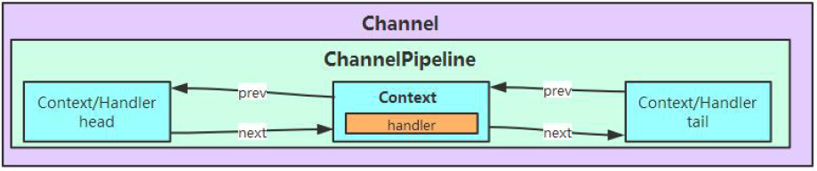
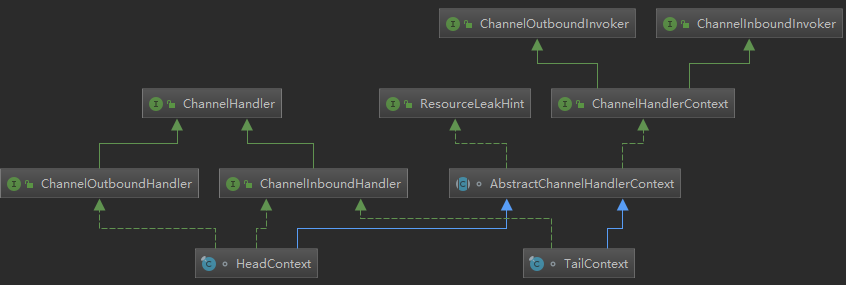
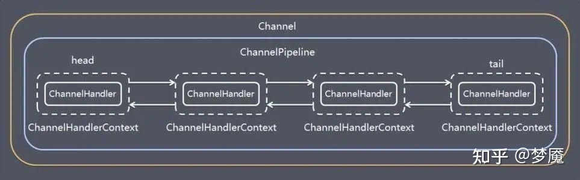
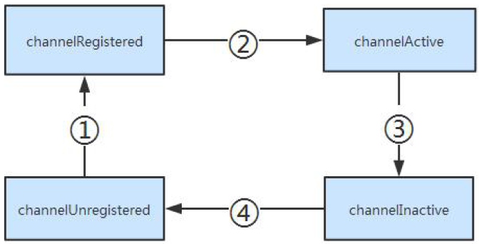
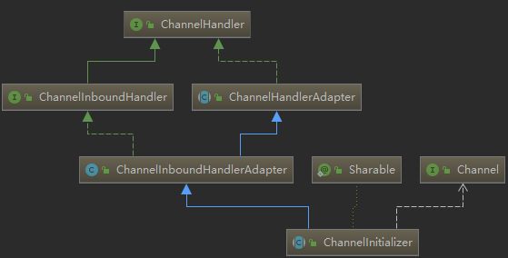
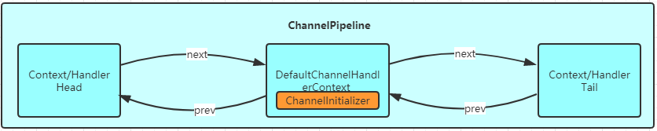
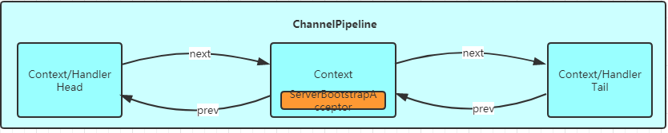
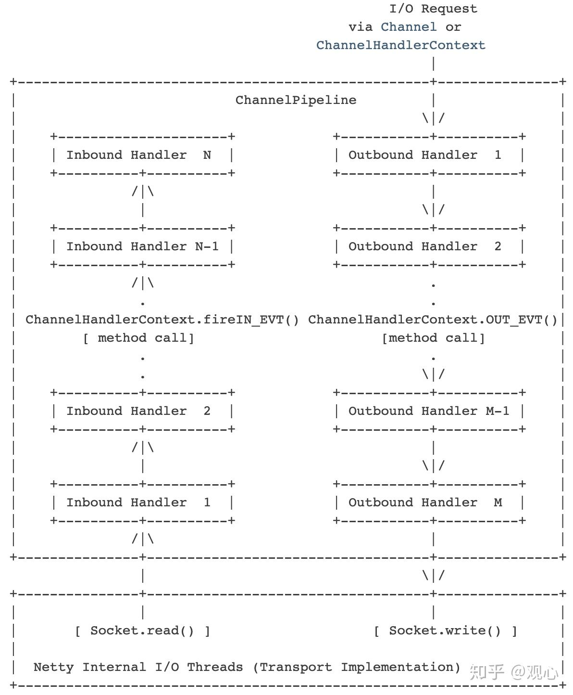
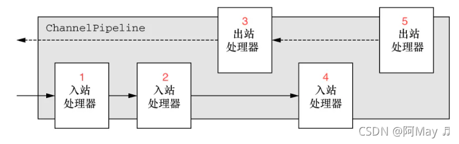
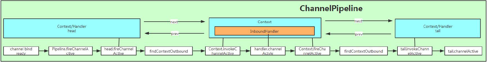

[TOC]

# ChannelPipeline的初始化

Netty有Main Reactor（Boss EventLoopGroup）和Sub Reactor（Sub EventLoopGroup）两组线程，前者负责ServerSocketChannel的管理，后者则负责与处理与各个客户端SocketChannel的交互

NioServerSocketChannel的父类AbstractChannel中，直接持有了pipeline成员变量，并且是在其**构造函数中**完成了初始化。最终通过调用newChannelPipeline方法，创建了一个DefaultChannelPipeline类型的ChannelPipeline实例

**此Channel 会与这个ChannelPipeline相互关联**

```java
public NioServerSocketChannel() {
    this(newSocket(DEFAULT_SELECTOR_PROVIDER));
}
```

```java
public NioServerSocketChannel(ServerSocketChannel channel) {
    //传入了默认感兴趣的事件OP_ACCEPT
    super(null, channel, SelectionKey.OP_ACCEPT);
    config = new NioServerSocketChannelConfig(this, javaChannel().socket());
}
```

最终在父类AbstractChannel中创建了 pipeline

```java
protected AbstractChannel(Channel parent) {
    this.parent = parent;
    // 创建 ChannelId 对象
    id = newId();
    // 创建 Unsafe 对象
    unsafe = newUnsafe();
    // 创建 DefaultChannelPipeline 对象
    pipeline = newChannelPipeline();
}

protected DefaultChannelPipeline newChannelPipeline() {
    return new DefaultChannelPipeline(this);
}
```

在DefaultChannelPipeline 构造器中， 首先将与之关联的Channel 保存到字段channel 中。然后实例化两个ChannelHandlerContext：一个是HeadContext 实例head，另一个是TailContext 实例tail。接着将head 和tail 互相指向， 构成一个双向链表

```java
protected DefaultChannelPipeline(Channel channel) {
    this.channel = ObjectUtil.checkNotNull(channel, "channel");
    // succeededFuture 的创建
    succeededFuture = new SucceededChannelFuture(channel, null);
    // voidPromise 的创建
    voidPromise =  new VoidChannelPromise(channel, true);

    // 创建 Tail 及诶点
    tail = new TailContext(this);
    // 创建 Head 节点
    head = new HeadContext(this);

    // 相互指向
    head.next = tail;
    tail.prev = head;
}
```

一个Channel 包含了一个ChannelPipeline ， 而ChannelPipeline 中又维护了一个由ChannelHandlerContext 组成的双向链表。这个链表的头是HeadContext，链表的尾是TailContext，并且每个ChannelHandlerContext 中又关联着一个ChannelHandler。head和tail是两个特殊的AbstractChannelHandlerContext元素，对于整个“链表”的改动只会在这两个指针中间的元素做改动



特殊的head和tail 的类层次结构



从类层次结构图中可以很清楚地看到，head 实现了ChannelInboundHandler与ChannelOutboundHandler，而tail 实现了ChannelOutboundHandler 接口，并且它们都实现了ChannelHandlerContext 接口, 因此可以说head 和tail 即是一个ChannelHandler，又是一个ChannelHandlerContext。接着看HeadContext与TailContext 构造器中的代码：

```java
HeadContext(DefaultChannelPipeline pipeline) {
            super(pipeline, (EventExecutor)null, DefaultChannelPipeline.HEAD_NAME, false, true);
            this.unsafe = pipeline.channel().unsafe();
            this.setAddComplete();
}
TailContext(DefaultChannelPipeline pipeline) {
            super(pipeline, (EventExecutor)null, DefaultChannelPipeline.TAIL_NAME, true, false);
            this.setAddComplete();
}
```

**由参数类型可知header 是一个OutBoundHandler，而tail 是一个InBoundHandler**

# ChannelHandlerContext

每个ChannelHandler 被添加到ChannelPipeline 后，都会创建一个ChannelHandlerContext 并与之创建的ChannelHandler 关联绑定。ChannelHandlerContext 允许ChannelHandler 与其他的ChannelHandler 实现进行交互。ChannelHandlerContext 不会改变添加到其中的ChannelHandler，因此它是安全的。下图描述了ChannelHandlerContext、ChannelHandler、ChannelPipeline 的关系



# Channel 的生命周期

Netty 有一个简单但强大的状态模型，并完美映射到ChannelInboundHandler 的各个方法。下面是Channel 生命周期中四个不同的状态：

1. channelUnregistered() Channel已创建，还未注册到一个EventLoop上
2. channelRegistered() Channel已经注册到一个EventLoop上
3. channelActive() Channel是活跃状态（连接到某个远端），可以收发数据
4. channelInactive() Channel未连接到远端

一个Channel 正常的生命周期如下图所示。随着状态发生变化相应的事件产生。这些事件被转发到ChannelPipeline中的ChannelHandler 来触发相应的操作。



# ChannelInitializer 的处理逻辑

ChannelInitializer的主要目的是为程序员提供了一个简单的工具，用于在某个Channel注册到EventLoop后，对这个Channel执行一些初始化操作。ChannelInitializer虽然会在一开始会被注册到Channel相关的pipeline里，但是在初始化完成之后，ChannelInitializer会将自己从pipeline中移除，不会影响后续的操作。

使用场景：

​	a. 在ServerBootstrap初始化时，为监听端口accept事件的Channel添加ServerBootstrapAcceptor

​	b. 在有新链接进入时，为监听客户端read/write事件的Channel添加用户自定义的ChannelHandler

核心流程：

1. 在 Bootstrap 构造时传入ChannelInitializer 
2. 在启动过程中，初始化 Channel 时，将ChannelInitializer添加到 ChannelPipeline
3. 注册PendingHandlerAddedTask回调
4. 在 Channel 注册到 EventLoop 上时，触发ChannelInitializer 的回调
5. 执行回调进行一些自定义的初始化逻辑
6. 从ChannelPipeline移除ChannelInitializer

最开始的时候ChannelPipeline 中含有两个ChannelHandlerContext（同时也是ChannelHandler），但是这个ChannelPipeline 并不能实现什么特殊的功能，因为我们还没有给它添加自定义的ChannelHandler。通常来说，我们在初始化Bootstrap，会添加我们自定义的ChannelHandler

handler和childHandler的参数都可以给 Pipeline 添加ChannelHandler

```java
Bootstrap bootstrap = new Bootstrap();
bootstrap.group(group)
.channel(NioSocketChannel.class)
.handler(new ChannelInitializer<SocketChannel>() {
　　@Override
　　protected void initChannel(Channel ch) throws Exception {
　　　　ChannelPipeline pipeline = ch.pipeline();
　　　　pipeline.addLast(new ChatClientHandler(nickName));
　　}
})
.childHandler(new ChannelInitializer<SocketChannel>() {
                 @Override
                 public void initChannel(SocketChannel ch) throws Exception { // 设置连入服务端的 Client 的 SocketChannel 的处理器
                     ChannelPipeline p = ch.pipeline();
                     if (sslCtx != null) {
                         p.addLast(sslCtx.newHandler(ch.alloc()));
                     }
                     p.addLast(new LineBasedFrameDecoder(Integer.MAX_VALUE));
                     p.addLast(serverHandler);
                 }
             })
.childOption(ChannelOption.SO_SNDBUF, 5)
.childOption(ChannelOption.SO_LINGER, 100)
```

ChannelInitializer 实现了ChannelHandler，是在Bootstrap 启动过程中，会调用init()方法初始化 Channel，此时会将ChannelInitializer添加到ChannelPipeline 中的。以下是服务端启动的 init 方法，客户端类似

```java
@Override
void init(Channel channel) throws Exception {
    // 初始化 Channel 的可选项集合
    final Map<ChannelOption<?>, Object> options = options0();
    synchronized (options) {
        setChannelOptions(channel, options, logger);
    }

    // 初始化 Channel 的属性集合
    final Map<AttributeKey<?>, Object> attrs = attrs0();
    synchronized (attrs) {
        for (Entry<AttributeKey<?>, Object> e: attrs.entrySet()) {
            @SuppressWarnings("unchecked")
            AttributeKey<Object> key = (AttributeKey<Object>) e.getKey();
            channel.attr(key).set(e.getValue());
        }
    }

    ChannelPipeline p = channel.pipeline();

    // 记录当前的属性
    final EventLoopGroup currentChildGroup = childGroup;
    final ChannelHandler currentChildHandler = childHandler;
    final Entry<ChannelOption<?>, Object>[] currentChildOptions;
    final Entry<AttributeKey<?>, Object>[] currentChildAttrs;
    synchronized (childOptions) {
        currentChildOptions = childOptions.entrySet().toArray(newOptionArray(0));
    }
    synchronized (childAttrs) {
        currentChildAttrs = childAttrs.entrySet().toArray(newAttrArray(0));
    }

    // 添加 ChannelInitializer 对象到 pipeline 中，用于后续初始化 ChannelHandler 到 pipeline 中。
    p.addLast(new ChannelInitializer<Channel>() {

        @Override
        public void initChannel(final Channel ch) throws Exception {
            System.out.println(Thread.currentThread() + ": user handler");
            final ChannelPipeline pipeline = ch.pipeline();

            // 添加配置的 ChannelHandler 到 pipeline 中
            // 也就是.handle 传入的ChannelHandler
            ChannelHandler handler = config.handler();
            if (handler != null) {
                pipeline.addLast(handler);
            }

            // 添加 ServerBootstrapAcceptor 到 pipeline 中。
            // 使用 EventLoop 执行的原因，参见 https://github.com/lightningMan/netty/commit/4638df20628a8987c8709f0f8e5f3679a914ce1a
            ch.eventLoop().execute(new Runnable() {
                @Override
                public void run() {
                    System.out.println(Thread.currentThread() + ": ServerBootstrapAcceptor");
                    pipeline.addLast(new ServerBootstrapAcceptor(
                            ch, currentChildGroup, currentChildHandler, currentChildOptions, currentChildAttrs));
                }
            });
        }

    });
}
```

## ChannelHandler封装为ChannelHandlerContext

为了添加一个ChannelHandler到ChannelPipeline 中，必须把此ChannelHandler包装成ChannelHandlerContext。因此在上面的代码中我们可以看到新实例化了一个newCtx 对象，并将ChannelHandler 作为参数传递到构造方法中

```java
@Override
@SuppressWarnings("Duplicates")
public final ChannelPipeline addLast(EventExecutorGroup group, String name, ChannelHandler handler) {
    final AbstractChannelHandlerContext newCtx;
    synchronized (this) { // 同步，为了防止多线程并发操作 pipeline 底层的双向链表
        // 检查是否有重复 handler
        checkMultiplicity(handler);

        // 创建节点名
        // 创建节点
        newCtx = newContext(group, filterName(name, handler), handler);

        // 添加节点
        addLast0(newCtx);

        ...
}
```

构造的DefaultChannelHandlerContext逻辑如下：

```java
final class DefaultChannelHandlerContext extends AbstractChannelHandlerContext {

    private final ChannelHandler handler;

    DefaultChannelHandlerContext(
            DefaultChannelPipeline pipeline, EventExecutor executor, String name, ChannelHandler handler) {
        super(pipeline, executor, name, isInbound(handler), isOutbound(handler));
        if (handler == null) {
            throw new NullPointerException("handler");
        }
        this.handler = handler;
    }

    @Override
    public ChannelHandler handler() {
        return handler;
    }

    /**
     * 当一个handler 实现了ChannelInboundHandler 接口，则isInbound 返回true
     * @param handler
     * @return
     */
    private static boolean isInbound(ChannelHandler handler) {
        return handler instanceof ChannelInboundHandler;
    }

    /**
     * 当一个handler 实现了ChannelOutboundHandler 接口，则isOutbound 就返回true
     * @param handler
     * @return
     */
    private static boolean isOutbound(ChannelHandler handler) {
        return handler instanceof ChannelOutboundHandler;
    }

}
```

ChannelInitializer的类层次结构图



从类图中可以清楚地看到，ChannelInitializer 仅仅实现了ChannelInboundHandler 接口，因此这里实例化的DefaultChannelHandlerContext 的inbound = true，outbound = false

## ChannelHandlerContext添加到ChannelPipeline双向链表中

当创建好ChannelHandlerContext 之后，通过addLast0方法将这个ChannelHandlerContext 插入到ChannelPipeline 的双向链表中

```java
private void addLast0(AbstractChannelHandlerContext newCtx) {
    // 获得 tail 节点的前一个节点
    AbstractChannelHandlerContext prev = tail.prev;
    // 新节点，指向 prev 和 tail 节点
    newCtx.prev = prev;
    newCtx.next = tail;
    // 在 prev 和 tail ，指向新节点
    prev.next = newCtx;
    tail.prev = newCtx;
}
```

添加完ChannelInitializer的Pipeline现在是长这样的：



## 添加PendingHandlerCallback回调

由于此时这个Channel还没有被register到EventLoop，于是在addLast方法的调用链中，会给pipeline添加一个PendingHandlerAddedTask，其目的是在Channel被register到EventLoop的时候，触发一个handlerAdded回调事件

然后在AbstractBootstrap.initAndRegister()方法中，这个Channel会被register到boss EventLoopGoup，接着会被register到boss EventLoopGoup中的某一个具体的EventLoop。在AbstractChannel.register0()方法中，之前注册的PendingHandlerAddedTask会被调用，经过一系列调用之后，ChannelInitializer.handleAdded()方法会被触发

```java
@Override
@SuppressWarnings("Duplicates")
public final ChannelPipeline addLast(EventExecutorGroup group, String name, ChannelHandler handler) {
    final AbstractChannelHandlerContext newCtx;
    synchronized (this) { // 同步，为了防止多线程并发操作 pipeline 底层的双向链表
        // 检查是否有重复 handler
        checkMultiplicity(handler);

        // 创建节点名
        // 创建节点
        newCtx = newContext(group, filterName(name, handler), handler);

        // 添加节点
        addLast0(newCtx);

        // pipeline 暂未注册，添加回调。再注册完成后，执行回调。详细解析，见 {@link #invokeHandlerAddedIfNeeded} 方法。
        // If the registered is false it means that the channel was not registered on an eventloop yet.
        // In this case we add the context to the pipeline and add a task that will call
        // ChannelHandler.handlerAdded(...) once the channel is registered.
        if (!registered) {
            // 设置 AbstractChannelHandlerContext 准备添加中
            newCtx.setAddPending();
            // 添加 PendingHandlerCallback 回调
            callHandlerCallbackLater(newCtx, true);
            return this;
        }

        // 不再 EventLoop 的线程中，提交 EventLoop 中，执行回调用户方法
        EventExecutor executor = newCtx.executor();
        if (!executor.inEventLoop()) {
            // 设置 AbstractChannelHandlerContext 准备添加中
            newCtx.setAddPending();
            // 提交 EventLoop 中，执行回调 ChannelHandler added 事件
            executor.execute(new Runnable() {
                @Override
                public void run() {
                    callHandlerAdded0(newCtx);
                }
            });
            return this;
        }
    }

    // 回调 ChannelHandler added 事件
    callHandlerAdded0(newCtx);
    return this;
}
```

## HeadContext

```java
final class HeadContext extends AbstractChannelHandlerContext
        implements ChannelOutboundHandler, ChannelInboundHandler {

    private final Unsafe unsafe;

    HeadContext(DefaultChannelPipeline pipeline) {
        super(pipeline, null, HEAD_NAME, false, true);
        unsafe = pipeline.channel().unsafe();
        setAddComplete();
    }

    @Override
    public ChannelHandler handler() {
        return this;
    }

    @Override
    public void handlerAdded(ChannelHandlerContext ctx) throws Exception {
        // NOOP
    }

    @Override
    public void handlerRemoved(ChannelHandlerContext ctx) throws Exception {
        // NOOP
    }

    @Override
    public void bind(
            ChannelHandlerContext ctx, SocketAddress localAddress, ChannelPromise promise)
            throws Exception {
        unsafe.bind(localAddress, promise);
    }

    @Override
    public void connect(
            ChannelHandlerContext ctx,
            SocketAddress remoteAddress, SocketAddress localAddress,
            ChannelPromise promise) throws Exception {
        unsafe.connect(remoteAddress, localAddress, promise);
    }

    @Override
    public void disconnect(ChannelHandlerContext ctx, ChannelPromise promise) throws Exception {
        unsafe.disconnect(promise);
    }

    @Override
    public void close(ChannelHandlerContext ctx, ChannelPromise promise) throws Exception {
        unsafe.close(promise);
    }

    @Override
    public void deregister(ChannelHandlerContext ctx, ChannelPromise promise) throws Exception {
        unsafe.deregister(promise);
    }

    @Override
    public void read(ChannelHandlerContext ctx) {
        unsafe.beginRead();
    }

    @Override
    public void write(ChannelHandlerContext ctx, Object msg, ChannelPromise promise) throws Exception {
        unsafe.write(msg, promise);
    }

    @Override
    public void flush(ChannelHandlerContext ctx) throws Exception {
        unsafe.flush();
    }

    @Override
    public void exceptionCaught(ChannelHandlerContext ctx, Throwable cause) throws Exception {
        ctx.fireExceptionCaught(cause);
    }

    @Override
    public void channelRegistered(ChannelHandlerContext ctx) throws Exception {
        invokeHandlerAddedIfNeeded();
        ctx.fireChannelRegistered();
    }

    @Override
    public void channelUnregistered(ChannelHandlerContext ctx) throws Exception {
        ctx.fireChannelUnregistered();

        // Remove all handlers sequentially if channel is closed and unregistered.
        if (!channel.isOpen()) {
            destroy();
        }
    }

    @Override
    public void channelActive(ChannelHandlerContext ctx) throws Exception {
        ctx.fireChannelActive();

        readIfIsAutoRead();
    }

    @Override
    public void channelInactive(ChannelHandlerContext ctx) throws Exception {
        ctx.fireChannelInactive();
    }

    @Override
    public void channelRead(ChannelHandlerContext ctx, Object msg) throws Exception {
        ctx.fireChannelRead(msg);
    }

    @Override
    public void channelReadComplete(ChannelHandlerContext ctx) throws Exception {
        ctx.fireChannelReadComplete();

        readIfIsAutoRead();
    }

    private void readIfIsAutoRead() {
        if (channel.config().isAutoRead()) {
            channel.read();
        }
    }

    @Override
    public void userEventTriggered(ChannelHandlerContext ctx, Object evt) throws Exception {
        ctx.fireUserEventTriggered(evt);
    }

    @Override
    public void channelWritabilityChanged(ChannelHandlerContext ctx) throws Exception {
        ctx.fireChannelWritabilityChanged();
    }
}
```

## TailContext

```java
final class TailContext extends AbstractChannelHandlerContext implements ChannelInboundHandler {

    TailContext(DefaultChannelPipeline pipeline) {
        super(pipeline, null, TAIL_NAME, true, false);
        setAddComplete();
    }

    @Override
    public ChannelHandler handler() {
        return this;
    }

    @Override
    public void channelRegistered(ChannelHandlerContext ctx) throws Exception { }

    @Override
    public void channelUnregistered(ChannelHandlerContext ctx) throws Exception { }

    @Override
    public void channelActive(ChannelHandlerContext ctx) throws Exception { }

    @Override
    public void channelInactive(ChannelHandlerContext ctx) throws Exception { }

    @Override
    public void channelWritabilityChanged(ChannelHandlerContext ctx) throws Exception { }

    @Override
    public void handlerAdded(ChannelHandlerContext ctx) throws Exception { }

    @Override
    public void handlerRemoved(ChannelHandlerContext ctx) throws Exception { }

    @Override
    public void userEventTriggered(ChannelHandlerContext ctx, Object evt) throws Exception {
        // This may not be a configuration error and so don't log anything.
        // The event may be superfluous for the current pipeline configuration.
        ReferenceCountUtil.release(evt);
    }

    @Override
    public void exceptionCaught(ChannelHandlerContext ctx, Throwable cause) throws Exception {
        onUnhandledInboundException(cause);
    }

    @Override
    public void channelRead(ChannelHandlerContext ctx, Object msg) throws Exception {
        onUnhandledInboundMessage(msg);
    }

    @Override
    public void channelReadComplete(ChannelHandlerContext ctx) throws Exception { }
}
```

```java
protected void onUnhandledInboundMessage(Object msg) {
    try {
        logger.debug("Discarded inbound message {} that reached at the tail of the pipeline. " + "Please check your pipeline configuration.", msg);
    } finally {
        ReferenceCountUtil.release(msg);
    }
}
```

需要注意的是， TailContext 中的channelRead方法会释放掉请求的数据

# Channel 注册流程触发回调

在  Bootstrap 启动过程中，上述 init 初始化 Channel 执行完成后，会将Channel 注册到 EventLoop 的 Selector 中，此时会调用AbstractUnsafe 的register0()方法中

```java
private void register0(ChannelPromise promise) {
    try {
        // check if the channel is still open as it could be closed in the mean time when the register
        // call was outside of the eventLoop
        if (!promise.setUncancellable() // TODO 1001 Promise
                || !ensureOpen(promise)) { // 确保 Channel 是打开的
            return;
        }
        // 记录是否为首次注册
        boolean firstRegistration = neverRegistered;

        // 执行注册逻辑
        doRegister();

        // 标记首次注册为 false
        neverRegistered = false;
        // 标记 Channel 为已注册
        registered = true;

        // Ensure we call handlerAdded(...) before we actually notify the promise. This is needed as the
        // user may already fire events through the pipeline in the ChannelFutureListener.
        pipeline.invokeHandlerAddedIfNeeded();

        // 回调通知 `promise` 执行成功
        safeSetSuccess(promise);

        // 触发通知已注册事件
        pipeline.fireChannelRegistered();

        // TODO 芋艿
        // Only fire a channelActive if the channel has never been registered. This prevents firing
        // multiple channel actives if the channel is deregistered and re-registered.
        if (isActive()) {
            if (firstRegistration) {
                pipeline.fireChannelActive();
            } else if (config().isAutoRead()) {
                // This channel was registered before and autoRead() is set. This means we need to begin read
                // again so that we process inbound data.
                //
                // See https://github.com/netty/netty/issues/4805
                beginRead();
            }
        }
    } catch (Throwable t) {
        // Close the channel directly to avoid FD leak.
        closeForcibly();
        closeFuture.setClosed();
        safeSetFailure(promise, t);
    }
}
```

这里在将 Channel 注册到 EventLoop 上时，会先执行invokeHandlerAddedIfNeeded，并且以下逻辑只会在首次注册的时候执行

```java
final void invokeHandlerAddedIfNeeded() {
    assert channel.eventLoop().inEventLoop(); // 必须在 EventLoop 的线程中
    // 仅有首次注册有效
    if (firstRegistration) {
        // 标记非首次注册
        firstRegistration = false;

        // 执行在 PendingHandlerCallback 中的 ChannelHandler 添加完成( added )事件
        // We are now registered to the EventLoop. It's time to call the callbacks for the ChannelHandlers,
        // that were added before the registration was done.
        callHandlerAddedForAllHandlers();
    }
}
```

这里会将registered标志改成 true，后续通过 addLast 添加 ChannelHandler 的时候，直接执行其callHandlerAdded0回调

```java
private void callHandlerAddedForAllHandlers() {
    final PendingHandlerCallback pendingHandlerCallbackHead;
    // 获得 pendingHandlerCallbackHead
    synchronized (this) {
        assert !registered;

        // This Channel itself was registered.
        registered = true; // 标记已注册

        pendingHandlerCallbackHead = this.pendingHandlerCallbackHead;
        // Null out so it can be GC'ed.
        this.pendingHandlerCallbackHead = null; // 置空，help gc
    }

    // 顺序向下，执行 PendingHandlerCallback 的回调
    // This must happen outside of the synchronized(...) block as otherwise handlerAdded(...) may be called while
    // holding the lock and so produce a deadlock if handlerAdded(...) will try to add another handler from outside
    // the EventLoop.
    PendingHandlerCallback task = pendingHandlerCallbackHead;
    while (task != null) {
        task.execute();
        task = task.next;
    }
}
```

## 触发handlerAdded回调

上述PendingHandlerCallback的执行是之前添加的ChannelInitializer的handlerAdded回调

```java
@Override
public void handlerAdded(ChannelHandlerContext ctx) throws Exception {
    if (ctx.channel().isRegistered()) { // 已注册
        // This should always be true with our current DefaultChannelPipeline implementation.
        // The good thing about calling initChannel(...) in handlerAdded(...) is that there will be no ordering
        // surprises if a ChannelInitializer will add another ChannelInitializer. This is as all handlers
        // will be added in the expected order.
        initChannel(ctx);
    }
}
```

这里的 ctx.channel 返回的是注册的 Channel 对象，服务端的话就是 NioServerSocketChannel，调用initChannel方法执行初始化 BootStrap 时自定义的逻辑，并且执行完成后，将该ChannelHandlerContext从链表中移除。因为该ChannelHandlerContext主要是初始化一些逻辑，执行完初始化后，并不需要继续存在于pipeline 链表中

```java
private boolean initChannel(ChannelHandlerContext ctx) throws Exception {
    if (initMap.putIfAbsent(ctx, Boolean.TRUE) == null) { // Guard against re-entrance. 解决并发问题
        try {
            // 初始化通道
            initChannel((C) ctx.channel());
        } catch (Throwable cause) {
            // 发生异常时，执行异常处理
            // Explicitly call exceptionCaught(...) as we removed the handler before calling initChannel(...).
            // We do so to prevent multiple calls to initChannel(...).
            exceptionCaught(ctx, cause);
        } finally {
            // 从 pipeline 移除 ChannelInitializer
            remove(ctx);
        }
        return true; // 初始化成功
    }
    return false; // 初始化失败
}
```

服务端的initChannel方法如下：

1. 如果BootStrap 有配置handle对应的 ChannelHandler 则添加到 ChannelPipeline中
2. 将ServerBootstrapAcceptor添加到ChannelPipeline中，用于处理接收客户端的连接

```java
@Override
void init(Channel channel) throws Exception {
    ...

    // 添加 ChannelInitializer 对象到 pipeline 中，用于后续初始化 ChannelHandler 到 pipeline 中。
    p.addLast(new ChannelInitializer<Channel>() {

        @Override
        public void initChannel(final Channel ch) throws Exception {
            System.out.println(Thread.currentThread() + ": user handler");
            final ChannelPipeline pipeline = ch.pipeline();

            // 添加配置的 ChannelHandler 到 pipeline 中
            // 也就是.handle 传入的ChannelHandler
            ChannelHandler handler = config.handler();
            if (handler != null) {
                pipeline.addLast(handler);
            }

            // 添加 ServerBootstrapAcceptor 到 pipeline 中。
            // 使用 EventLoop 执行的原因，参见 https://github.com/lightningMan/netty/commit/4638df20628a8987c8709f0f8e5f3679a914ce1a
            ch.eventLoop().execute(new Runnable() {
                @Override
                public void run() {
                    System.out.println(Thread.currentThread() + ": ServerBootstrapAcceptor");
                    pipeline.addLast(new ServerBootstrapAcceptor(
                            ch, currentChildGroup, currentChildHandler, currentChildOptions, currentChildAttrs));
                }
            });
        }

    });
}
```



**并且通过服务端的ChannelInitializer是 Netty 内置的，添加到ChannelPipeline的优先级比较高，再处理其initChannel方法时，会再去处理 BootStrap 参数中.handle 和.childHandle中的 ChannelHandler，此时在添加到 ChannelPipeline的时候就会触发handlerAdded**

## 触发fireChannelRegistered事件

在register0注册完成后，除了执行invokeHandlerAddedIfNeeded回调，还会触发fireChannelRegistered事件，通过该事件来跟踪 ChannelPipeline 的工作原理

```java
private void register0(ChannelPromise promise) {
    try {
        ...
        pipeline.invokeHandlerAddedIfNeeded();

        // 回调通知 `promise` 执行成功
        safeSetSuccess(promise);

        // 触发通知已注册事件
        pipeline.fireChannelRegistered();

        ...
}
```

触发事件逻辑：

1. 执行当前ChannelHandlerContext的channelRegistered回调
2. 继续调用ctx.fireChannelRegistered();方法将事件传递给后续节点
3. 获取当前节点下一个Inbound 类型节点
4. 再次出发channelRegistered回调
5. 如果需要再次传递事件，则继续

```java
@Override
public final ChannelPipeline fireChannelRegistered() {
    AbstractChannelHandlerContext.invokeChannelRegistered(head);
    return this;
}
```

AbstractChannelHandlerContext 的invokeChannelRegistered()方法

```java
static void invokeChannelRegistered(final AbstractChannelHandlerContext next) {
    EventExecutor executor = next.executor();
    if (executor.inEventLoop()) {
        next.invokeChannelRegistered();
    } else {
        executor.execute(new Runnable() {
            @Override
            public void run() {
                next.invokeChannelRegistered();
            }
        });
    }
}
```

```java
private void invokeChannelRegistered() {
    if (invokeHandler()) {
        try {
            ((ChannelInboundHandler) handler()).channelRegistered(this);
        } catch (Throwable t) {
            notifyHandlerException(t); // 通知 Inbound 事件的传播，发生异常
        }
    } else {
        fireChannelRegistered();
    }
}
```

HeadContext 头节点会执行DefaultChannelPipeline的 channelRegistered 方法，这里并没有做特殊处理，只是将事件传递下午

```java
@Override
public void channelRegistered(ChannelHandlerContext ctx) throws Exception {
    invokeHandlerAddedIfNeeded();
    ctx.fireChannelRegistered();
}
```

```java
@Override
public ChannelHandlerContext fireChannelRegistered() {
    invokeChannelRegistered(findContextInbound());
    return this;
}
```

```java
private AbstractChannelHandlerContext findContextInbound() {
    // 循环，向后获得一个 Inbound 节点
    AbstractChannelHandlerContext ctx = this;
    do {
        ctx = ctx.next;
    } while (!ctx.inbound);
    return ctx;
}
```

从head 开始遍历Pipeline 的双向链表，然后 findContextInbound() 找到第一个属性inbound 为true 的ChannelHandlerContext 实例

找到之后再次执行invokeChannelRegistered方法

```java
private void invokeChannelRegistered() {
    if (invokeHandler()) {
        try {
            ((ChannelInboundHandler) handler()).channelRegistered(this);
        } catch (Throwable t) {
            notifyHandlerException(t); // 通知 Inbound 事件的传播，发生异常
        }
    } else {
        fireChannelRegistered();
    }
}
```

如果要在自定义的ChannelInboundHandler中继续往后传递事件，则需要调用```ctx.fireChannelRegistered();```

```java
@Override
public void channelRegistered(ChannelHandlerContext ctx) throws Exception {
    if (logger.isEnabled(internalLevel)) {
        logger.log(internalLevel, format(ctx, "REGISTERED"));
    }
    // 传递给下一个ChannelHandlerContext
    ctx.fireChannelRegistered();
}
```

## 触发fireChannelActive回调

触发fireChannelActive和fireChannelRegistered类似

```java
@Override
public final ChannelPipeline fireChannelActive() {
    AbstractChannelHandlerContext.invokeChannelActive(head);
    return this;
}
```

```java
static void invokeChannelActive(final AbstractChannelHandlerContext next) {
    // 获得下一个 Inbound 节点的执行器
    EventExecutor executor = next.executor();
    // 调用下一个 Inbound 节点的 Channel active 方法
    if (executor.inEventLoop()) {
        next.invokeChannelActive();
    } else {
        executor.execute(new Runnable() {
            @Override
            public void run() {
                next.invokeChannelActive();
            }
        });
    }
}
```

```java
private void invokeChannelActive() {
    if (invokeHandler()) { // 判断是否符合的 ChannelHandler
        try {
            // 调用该 ChannelHandler 的 Channel active 方法
            ((ChannelInboundHandler) handler()).channelActive(this);
        } catch (Throwable t) {
            notifyHandlerException(t);  // 通知 Inbound 事件的传播，发生异常
        }
    } else {
        // 跳过，传播 Inbound 事件给下一个节点
        fireChannelActive();
    }
}
```

在HeadContext节点中，除了传递事件，如果开启了自动去读数据，则会触发 read 操作

```java
//默认开启
private volatile int autoRead = 1;
```

```java
@Override
public void channelActive(ChannelHandlerContext ctx) throws Exception {
    // 传播 Channel active 事件给下一个 Inbound 节点
    ctx.fireChannelActive();

    // 执行 read 逻辑
    readIfIsAutoRead();
}
```

```java
private void readIfIsAutoRead() {
    if (channel.config().isAutoRead()) {
        channel.read();
    }
}
```

```java
@Override
public Channel read() {
    pipeline.read();
    return this;
}
```

```java
@Override
public final ChannelPipeline read() {
    tail.read();
    return this;
}
```

AutoRead默认配置的是 true，会从 TailContext 开始传递 read 事件，最终会传递到 HeadContext

```java
@Override
public void read(ChannelHandlerContext ctx) {
    unsafe.beginRead();
}
```

```java
@Override
public final void beginRead() {
    // 判断是否在 EventLoop 的线程中。
    assertEventLoop();

    // Channel 必须激活
    if (!isActive()) {
        return;
    }

    // 执行开始读取
    try {
        doBeginRead();
    } catch (final Exception e) {
        invokeLater(new Runnable() {
            @Override
            public void run() {
                pipeline.fireExceptionCaught(e);
            }
        });
        close(voidPromise());
    }
}
```

最终起始就是对感兴趣的事件进行关注，服务端Channel是 OP_ACCEPT，客户端Channel 是 OP_READ

```java
@Override
protected void doBeginRead() throws Exception {
    // Channel.read() or ChannelHandlerContext.read() was called
    final SelectionKey selectionKey = this.selectionKey;
    if (!selectionKey.isValid()) {
        return;
    }

    readPending = true;

    final int interestOps = selectionKey.interestOps();
    if ((interestOps & readInterestOp) == 0) {
        selectionKey.interestOps(interestOps | readInterestOp);
    }
}
```

# Pipeline 的事件传播机制

我们已经知道AbstractChannelHandlerContext 中有inbound 和outbound 两个boolean 变量，分别用于标识Context 所对应的handler 的类型，即：

1. inbound 为true 是,表示其对应的ChannelHandler 是ChannelInboundHandler 的子类。
2. outbound 为true 时，表示对应的ChannelHandler 是ChannelOutboundHandler 的子类





从上图可以看出，inbound 事件和outbound 事件的流向是不一样的，inbound 事件的流行是从下至上，而outbound刚好相反，是从上到下。并且inbound 的传递方式是通过调用相应的ChannelHandlerContext.fireIN_EVT()方法，而outbound 方法的的传递方式是通过调用ChannelHandlerContext.OUT_EVT()方法。例如：ChannelHandlerContext的fireChannelRegistered()调用会发送一个ChannelRegistered 的inbound 给下一个ChannelHandlerContext，而ChannelHandlerContext 的bind()方法调用时会发送一个bind 的outbound 事件给下一个ChannelHandlerContext

inbound 类似于是事件回调（响应请求的事件），而outbound 类似于主动触发（发起请求的事件）。注意，如果我们捕获了一个事件，并且想让这个事件继续传递下去，那么需要调用Context 对应的传播方法 fireXXX

## Outbound 事件传播方式

Outbound 事件都是请求事件(request event)，即请求某件事情的发生，然后通过Outbound 事件进行通知。Outbound 事件的传播方向是tail -> customContext -> head。我们接下来以connect 事件为例，分析一下Outbound 事件的传播机制。首先，当用户调用了Bootstrap 的connect()方法时，就会触发一个Connect 请求事件，我们就发现AbstractChannel 的connect()其实由调用了DefaultChannelPipeline 的connect()方法：

```java
private static void doConnect(final SocketAddress remoteAddress, final SocketAddress localAddress, final ChannelPromise connectPromise) {

    // This method is invoked before channelRegistered() is triggered.  Give user handlers a chance to set up
    // the pipeline in its channelRegistered() implementation.
    final Channel channel = connectPromise.channel();
    channel.eventLoop().execute(new Runnable() {

        @Override
        public void run() {
            if (localAddress == null) {
                channel.connect(remoteAddress, connectPromise);
            } else {
                channel.connect(remoteAddress, localAddress, connectPromise);
            }
            connectPromise.addListener(ChannelFutureListener.CLOSE_ON_FAILURE);
        }

    });
}
```

```java
@Override
public ChannelFuture connect(SocketAddress remoteAddress, SocketAddress localAddress, ChannelPromise promise) {
    return pipeline.connect(remoteAddress, localAddress, promise);
}
```

```java
@Override
public final ChannelFuture connect(
        SocketAddress remoteAddress, SocketAddress localAddress, ChannelPromise promise) {
    return tail.connect(remoteAddress, localAddress, promise);
}
```

可以看到，当outbound 事件(这里是connect 事件)传递到Pipeline 后，它其实是以tail 为起点开始传播的。而tail.connect()其实调用的是AbstractChannelHandlerContext 的connect()方法：

```java
@Override
public ChannelFuture connect(final SocketAddress remoteAddress, final SocketAddress localAddress, final ChannelPromise promise) {

    if (remoteAddress == null) {
        throw new NullPointerException("remoteAddress");
    }
    if (isNotValidPromise(promise, false)) {
        // cancelled
        return promise;
    }

    // 获取下一个Outbound类型节点
    final AbstractChannelHandlerContext next = findContextOutbound();
    EventExecutor executor = next.executor();
    if (executor.inEventLoop()) {
        next.invokeConnect(remoteAddress, localAddress, promise);
    } else {
        safeExecute(executor, new Runnable() {
            @Override
            public void run() {
                next.invokeConnect(remoteAddress, localAddress, promise);
            }
        }, promise, null);
    }
    return promise;
}
```

findContextOutbound()方法顾名思义，它的作用是以当前Context 为起点，向Pipeline 中的Context 双向链表的前端寻找第一个outbound 属性为true 的Context（即关联ChannelOutboundHandler 的Context），然后返回

```java
private AbstractChannelHandlerContext findContextOutbound() {
    // 循环，向前获得一个 Outbound 节点
    AbstractChannelHandlerContext ctx = this;
    do {
        ctx = ctx.prev;
    } while (!ctx.outbound);
    return ctx;
}
```

需要注意的是，这里是 prev 往前找

当我们找到了一个outbound 的Context 后，就调用它的invokeConnect()方法，这个方法中会调用Context 其关联的ChannelHandler 的connect()方法

```java
private void invokeConnect(SocketAddress remoteAddress, SocketAddress localAddress, ChannelPromise promise) {
    if (invokeHandler()) {
        try {
            ((ChannelOutboundHandler) handler()).connect(this, remoteAddress, localAddress, promise);
        } catch (Throwable t) {
            notifyOutboundHandlerException(t, promise); // 通知 Outbound 事件的传播，发生异常
        }
    } else {
        connect(remoteAddress, localAddress, promise);
    }
}
```

如果用户没有重写ChannelHandler 的connect()方法，那么会调用ChannelOutboundHandlerAdapter 的connect()实现：

```java
@Override
public void connect(ChannelHandlerContext ctx, SocketAddress remoteAddress, SocketAddress localAddress, ChannelPromise promise) throws Exception {
    ctx.connect(remoteAddress, localAddress, promise);
}
```

我们看到，ChannelOutboundHandlerAdapter 的connect()仅仅调用了ctx.connect()，而这个调用又回到了：Context.connect -> Connect.findContextOutbound -> next.invokeConnect -> handler.connect -> Context.connect这样的循环中，直到connect 事件传递到DefaultChannelPipeline 的双向链表的头节点，即head 中

回想一下，head 实现了ChannelOutboundHandler，因此它的outbound 属性是true。因为head 本身既是一个ChannelHandlerContext，又实现了ChannelOutboundHandler 接口，因此当connect()消息传递到head 后，会将消息转递到对应的ChannelHandler 中处理，而head 的handler()方法返回的就是head 本身：

```java
public ChannelHandler handler() {
      return this;
}
```

```java
@Override
public void connect(ChannelHandlerContext ctx, SocketAddress remoteAddress, SocketAddress localAddress, ChannelPromise promise) throws Exception {
    unsafe.connect(remoteAddress, localAddress, promise);
}
```

请求流程.png)

## Inbound 事件传播方式

Inbound 事件和Outbound 事件的处理过程是类似的，只是传播方向不同。Inbound 事件是一个通知事件，即某件事已经发生了，然后通过Inbound 事件进行通知。Inbound 通常发生在Channel的状态的改变或IO 事件就绪。Inbound 的特点是它传播方向是head -> customContext -> tail。上面我们分析了connect()这个Outbound 事件,那么接着分析connect()事件后会发生什么Inbound 事件，并最终找到Outbound 和Inbound 事件之间的联系。当connect()这个Outbound 传播到unsafe 后，其实是在AbstractNioUnsafe的connect()方法中进行处理的

```java
@Override
public final void connect(final SocketAddress remoteAddress, final SocketAddress localAddress, final ChannelPromise promise) {
    if (!promise.setUncancellable() || !ensureOpen(promise)) {
        return;
    }

    try {
        // 目前有正在连接远程地址的 ChannelPromise ，则直接抛出异常，禁止同时发起多个连接。
        if (connectPromise != null) {
            // Already a connect in process.
            throw new ConnectionPendingException();
        }

        // 记录 Channel 是否激活
        boolean wasActive = isActive();

        // 执行连接远程地址
        if (doConnect(remoteAddress, localAddress)) {
            fulfillConnectPromise(promise, wasActive);
        } 
      ...
}
```

在AbstractNioUnsafe 的connect()方法中，首先调用doConnect()方法进行实际上的Socket 连接，当连接上后会调用fulfillConnectPromise()方法

```java
private void fulfillConnectPromise(ChannelPromise promise, boolean wasActive) {
    if (promise == null) {
        // Closed via cancellation and the promise has been notified already.
        return;
    }

    // 获得 Channel 是否激活
    // Get the state as trySuccess() may trigger an ChannelFutureListener that will close the Channel.
    // We still need to ensure we call fireChannelActive() in this case.
    boolean active = isActive();

    // 回调通知 promise 执行成功
    // trySuccess() will return false if a user cancelled the connection attempt.
    boolean promiseSet = promise.trySuccess();

    // 若 Channel 是新激活的，触发通知 Channel 已激活的事件。
    // Regardless if the connection attempt was cancelled, channelActive() event should be triggered,
    // because what happened is what happened.
    if (!wasActive && active) {
        pipeline().fireChannelActive();
    }

    // If a user cancelled the connection attempt, close the channel, which is followed by channelInactive().
    // TODO 芋艿
    if (!promiseSet) {
        close(voidPromise());
    }
}
```

在fulfillConnectPromise()中，会通过调用pipeline().fireChannelActive()方法将通道激活的消息(即Socket 连接成功)发送出去

在DefaultChannelPipeline中

```java
@Override
public final ChannelPipeline fireChannelActive() {
    AbstractChannelHandlerContext.invokeChannelActive(head);
    return this;
}
```

在fireChannelActive()方法中，调用的是head.invokeChannelActive()，因此可以证明Inbound 事件在Pipeline中传输的起点是head

```java
static void invokeChannelActive(final AbstractChannelHandlerContext next) {
    // 获得下一个 Inbound 节点的执行器
    EventExecutor executor = next.executor();
    // 调用下一个 Inbound 节点的 Channel active 方法
    if (executor.inEventLoop()) {
        next.invokeChannelActive();
    } else {
        executor.execute(new Runnable() {
            @Override
            public void run() {
                next.invokeChannelActive();
            }
        });
    }
}
```

```java
private void invokeChannelActive() {
    if (invokeHandler()) { // 判断是否符合的 ChannelHandler
        try {
            // 调用该 ChannelHandler 的 Channel active 方法
            ((ChannelInboundHandler) handler()).channelActive(this);
        } catch (Throwable t) {
            notifyHandlerException(t);  // 通知 Inbound 事件的传播，发生异常
        }
    } else {
        // 跳过，传播 Inbound 事件给下一个节点
        fireChannelActive();
    }
}
```

最终调用的是HeadContext中的channelActive

```java
@Override
public void channelActive(ChannelHandlerContext ctx) throws Exception {
    // 传播 Channel active 事件给下一个 Inbound 节点
    ctx.fireChannelActive();

    // 执行 read 逻辑
    readIfIsAutoRead();
}
```

1. 首先调用findContextInbound()，从Pipeline 的双向链表中中找到第一个属性inbound 为true 的Context，然后将其返回。
2. 调用Context 的invokeChannelActive()方法.

这个方法和Outbound 的对应方法(如：invokeConnect()方法)如出一辙。与Outbound 一样，如果用户没有重写channelActive() 方法，那就会调用ChannelInboundHandlerAdapter 的channelActive()方法

```java
public void channelActive(ChannelHandlerContext ctx) throws Exception {
  ctx.fireChannelActive();
}
```

```java
@Override
public ChannelHandlerContext fireChannelActive() {
    // 获得下一个 Inbound 节点的执行器
    // 调用下一个 Inbound 节点的 Channel active 方法
    invokeChannelActive(findContextInbound());
    return this;
}
```

```java
private AbstractChannelHandlerContext findContextInbound() {
    // 循环，向后获得一个 Inbound 节点
    AbstractChannelHandlerContext ctx = this;
    do {
        ctx = ctx.next;
    } while (!ctx.inbound);
    return ctx;
}
```

需要注意的是，这里同 outBound 不一样，是 next 往后找

同样地, 在ChannelInboundHandlerAdapter 的channelActive()中，仅仅调用了ctx.fireChannelActive()方法，因此就会进入Context.fireChannelActive() -> Connect.findContextInbound() -> nextContext.invokeChannelActive() ->nextHandler.channelActive() -> nextContext.fireChannelActive()这样的循环中。同理，tail 本身既实现了ChannelInboundHandler 接口，又实现了ChannelHandlerContext 接口，因此当channelActive()消息传递到tail 后，会将消息转递到对应的ChannelHandler 中处理，而tail 的handler()返回的就是tail 本身

最终传递到TailContext的channelActive方法

```java
@Override
public void channelActive(ChannelHandlerContext ctx) throws Exception {
    onUnhandledInboundChannelActive();
}
```

```java
protected void onUnhandledInboundChannelActive() {
}
```

TailContext 的channelActive()方法是空的。如果大家自行查看TailContext 的Inbound 处理方法时就会发现，它们的实现都是空的。可见，如果是Inbound,当用户没有实现自定义的处理器时，那么默认是不处理的


