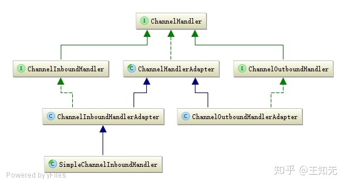

[TOC]

# ChannelHandler是什么

ChannelHandler是Netty和用户代码的主要扩展和定制点，所以它的子类种类繁多、功能各异，主要用于处理I/O事件或拦截I/O操作，并将其转发到其ChannelPipeline中的下一个handler。

在分析ChannelPipeline源码时我们提到了入站和出战事件，对应的处理器就是ChannelHandler的子接口ChannelInboundHandler和ChannelOutboundHandler，Netty提供了ChannelHandlerAdapter、ChannelInboundHandlerAdapter、ChannelOutboundHandlerAdapter三个默认的实现类来提供这些事件的默认处理，避免子类实现过多的接口方法

ChannelHandler核心类图



inbound 类似于是事件回调（响应请求的事件），而outbound 类似于主动触发（发起请求的事件）

# ChannelHandler接口

ChannaleHandler 作为最顶层的接口，并不处理入站和出站事件，所以接口中只包含最基本的方法

```java
public interface ChannelHandler {

    /**
     * ChannelHandler 已经成功被添加到 ChannelPipeline 中，可以进行处理事件。
     *
     * 该方法，一般用于 ChannelHandler 的初始化的逻辑
     */
    void handlerAdded(ChannelHandlerContext ctx) throws Exception;

    /**
     * ChannelHandler 已经成功从 ChannelPipeline 中被移除，不再进行处理事件。
     *
     * 该方法，一般用于 ChannelHandler 的销毁的逻辑
     */
    void handlerRemoved(ChannelHandlerContext ctx) throws Exception;

    /**
     * 抓取到异常。目前被废弃，移到 ChannelInboundHandler 接口中，作为对 Exception Inbound 事件的处理
     *
     * @deprecated is part of {@link ChannelInboundHandler}
     */
    @Deprecated
    void exceptionCaught(ChannelHandlerContext ctx, Throwable cause) throws Exception;

    @Inherited
    @Documented
    @Target(ElementType.TYPE)
    @Retention(RetentionPolicy.RUNTIME)
    @interface Sharable {
        // no value
    }

}
```

# ChannelInboundHandler接口

ChannelInboundHandler处理入站事件，以及用户自定义事件

```java
public interface ChannelInboundHandler extends ChannelHandler {

    /**
     * The {@link Channel} of the {@link ChannelHandlerContext} was registered with its {@link EventLoop}
     */
    void channelRegistered(ChannelHandlerContext ctx) throws Exception;

    /**
     * The {@link Channel} of the {@link ChannelHandlerContext} was unregistered from its {@link EventLoop}
     */
    void channelUnregistered(ChannelHandlerContext ctx) throws Exception;

    /**
     * The {@link Channel} of the {@link ChannelHandlerContext} is now active
     */
    void channelActive(ChannelHandlerContext ctx) throws Exception;

    /**
     * The {@link Channel} of the {@link ChannelHandlerContext} was registered is now inactive and reached its
     * end of lifetime.
     */
    void channelInactive(ChannelHandlerContext ctx) throws Exception;

    /**
     * Invoked when the current {@link Channel} has read a message from the peer.
     */
    void channelRead(ChannelHandlerContext ctx, Object msg) throws Exception;

    /**
     * Invoked when the last message read by the current read operation has been consumed by
     * {@link #channelRead(ChannelHandlerContext, Object)}.  If {@link ChannelOption#AUTO_READ} is off, no further
     * attempt to read an inbound data from the current {@link Channel} will be made until
     * {@link ChannelHandlerContext#read()} is called.
     */
    void channelReadComplete(ChannelHandlerContext ctx) throws Exception;

    /**
     * Gets called if an user event was triggered.
     */
    void userEventTriggered(ChannelHandlerContext ctx, Object evt) throws Exception;

    /**
     * Gets called once the writable state of a {@link Channel} changed. You can check the state with
     * {@link Channel#isWritable()}.
     */
    void channelWritabilityChanged(ChannelHandlerContext ctx) throws Exception;

    /**
     * Gets called if a {@link Throwable} was thrown.
     */
    @Override
    @SuppressWarnings("deprecation")
    void exceptionCaught(ChannelHandlerContext ctx, Throwable cause) throws Exception;
}
```

# ChannelInboundHandlerAdapter实现类

ChannelInboundHandlerAdapter作为ChannelInboundHandler的实现，默认将入站事件自动传播到下一个入站处理器

```java
public class ChannelInboundHandlerAdapter extends ChannelHandlerAdapter implements ChannelInboundHandler {

    /**
     * Calls {@link ChannelHandlerContext#fireChannelRegistered()} to forward
     * to the next {@link ChannelInboundHandler} in the {@link ChannelPipeline}.
     *
     * Sub-classes may override this method to change behavior.
     */
    @Override
    public void channelRegistered(ChannelHandlerContext ctx) throws Exception {
        ctx.fireChannelRegistered();
    }

    /**
     * Calls {@link ChannelHandlerContext#fireChannelUnregistered()} to forward
     * to the next {@link ChannelInboundHandler} in the {@link ChannelPipeline}.
     *
     * Sub-classes may override this method to change behavior.
     */
    @Override
    public void channelUnregistered(ChannelHandlerContext ctx) throws Exception {
        ctx.fireChannelUnregistered();
    }

    /**
     * Calls {@link ChannelHandlerContext#fireChannelActive()} to forward
     * to the next {@link ChannelInboundHandler} in the {@link ChannelPipeline}.
     *
     * Sub-classes may override this method to change behavior.
     */
    @Override
    public void channelActive(ChannelHandlerContext ctx) throws Exception {
        ctx.fireChannelActive();
    }

    /**
     * Calls {@link ChannelHandlerContext#fireChannelInactive()} to forward
     * to the next {@link ChannelInboundHandler} in the {@link ChannelPipeline}.
     *
     * Sub-classes may override this method to change behavior.
     */
    @Override
    public void channelInactive(ChannelHandlerContext ctx) throws Exception {
        ctx.fireChannelInactive();
    }

    /**
     * Calls {@link ChannelHandlerContext#fireChannelRead(Object)} to forward
     * to the next {@link ChannelInboundHandler} in the {@link ChannelPipeline}.
     *
     * Sub-classes may override this method to change behavior.
     */
    @Override
    public void channelRead(ChannelHandlerContext ctx, Object msg) throws Exception {
        ctx.fireChannelRead(msg);
    }

    /**
     * Calls {@link ChannelHandlerContext#fireChannelReadComplete()} to forward
     * to the next {@link ChannelInboundHandler} in the {@link ChannelPipeline}.
     *
     * Sub-classes may override this method to change behavior.
     */
    @Override
    public void channelReadComplete(ChannelHandlerContext ctx) throws Exception {
        ctx.fireChannelReadComplete();
    }

    /**
     * Calls {@link ChannelHandlerContext#fireUserEventTriggered(Object)} to forward
     * to the next {@link ChannelInboundHandler} in the {@link ChannelPipeline}.
     *
     * Sub-classes may override this method to change behavior.
     */
    @Override
    public void userEventTriggered(ChannelHandlerContext ctx, Object evt) throws Exception {
        ctx.fireUserEventTriggered(evt);
    }

    /**
     * Calls {@link ChannelHandlerContext#fireChannelWritabilityChanged()} to forward
     * to the next {@link ChannelInboundHandler} in the {@link ChannelPipeline}.
     *
     * Sub-classes may override this method to change behavior.
     */
    @Override
    public void channelWritabilityChanged(ChannelHandlerContext ctx) throws Exception {
        ctx.fireChannelWritabilityChanged();
    }

    /**
     * Calls {@link ChannelHandlerContext#fireExceptionCaught(Throwable)} to forward
     * to the next {@link ChannelHandler} in the {@link ChannelPipeline}.
     *
     * Sub-classes may override this method to change behavior.
     */
    @Override
    public void exceptionCaught(ChannelHandlerContext ctx, Throwable cause)
            throws Exception {
        ctx.fireExceptionCaught(cause);
    }

}
```

# SimpleChannelInboundHandler实现类

```java
public abstract class SimpleChannelInboundHandler<I> extends ChannelInboundHandlerAdapter {

    /**
     * 类型匹配器
     */
    private final TypeParameterMatcher matcher;
    /**
     * 使用完消息，是否自动释放
     *
     * @see #channelRead(ChannelHandlerContext, Object)
     */
    private final boolean autoRelease;

    protected SimpleChannelInboundHandler() {
        this(true);
    }

    protected SimpleChannelInboundHandler(boolean autoRelease) {
        // 获得 matcher
        matcher = TypeParameterMatcher.find(this, SimpleChannelInboundHandler.class, "I");
        this.autoRelease = autoRelease;
    }

    protected SimpleChannelInboundHandler(Class<? extends I> inboundMessageType) {
        this(inboundMessageType, true);
    }

    protected SimpleChannelInboundHandler(Class<? extends I> inboundMessageType, boolean autoRelease) {
        matcher = TypeParameterMatcher.get(inboundMessageType);
        this.autoRelease = autoRelease;
    }

    public boolean acceptInboundMessage(Object msg) {
        return matcher.match(msg);
    }

    @Override
    public void channelRead(ChannelHandlerContext ctx, Object msg) throws Exception {
        // 是否要释放消息
        boolean release = true;
        try {
            // 判断是否为匹配的消息
            if (acceptInboundMessage(msg)) {
                @SuppressWarnings("unchecked")
                I imsg = (I) msg;
                // 处理消息
                channelRead0(ctx, imsg);
            } else {
                // 不需要释放消息
                release = false;
                // 触发 Channel Read 到下一个节点
                ctx.fireChannelRead(msg);
            }
        } finally {
            // 判断，是否要释放消息
            if (autoRelease && release) {
                ReferenceCountUtil.release(msg);
            }
        }
    }

    protected abstract void channelRead0(ChannelHandlerContext ctx, I msg) throws Exception;
}
```

SimpleChannelInboundHandler是对ChannelInboundHandlerAdapter的封装：

1. 如果有传入泛型，会自动转换类型后传入给子类的channelRead0方法使用
2. 如果类型不匹配，无法转换，直接传递给下一个节点
3. 如果是子类channelRead0方法处理了消息，处理完后会自动释放对象

# ChannelInboundHandlerAdapter 或 SimpleChannelInboundHandler 区别

继承 SimpleChannelInboundHandler 类之后，会在接收到数据后会⾃动 release 掉数据占⽤的 Bytebuffer 资源。并且继承该类需要指定数据格式。

⽽继承ChannelInboundHandlerAdapter 则不会⾃动释放，需要⼿动调⽤ReferenceCountUtil.release() 等⽅法进⾏释放。继承该类不需要指定数据格式。 所以在这⾥，个⼈推荐服务端继承 ChannelInboundHandlerAdapter ，⼿动进⾏释放，防⽌数据未处理完就⾃动释放了。⽽且服务端可能有多个客户端进⾏连接，并且每⼀个客户端请求的数据格式都不⼀致，这时便可以进⾏相应的处理。

客户端根据情况可以继承 SimpleChannelInboundHandler 类。好处是直接指定好传输的数据格式，就不需要再进⾏格式的转换了

# ChannelOutboundHandler接口

```java
public interface ChannelOutboundHandler extends ChannelHandler {

    void bind(ChannelHandlerContext ctx, SocketAddress localAddress, ChannelPromise promise) throws Exception;

    void connect(
            ChannelHandlerContext ctx, SocketAddress remoteAddress,
            SocketAddress localAddress, ChannelPromise promise) throws Exception;
   
    void disconnect(ChannelHandlerContext ctx, ChannelPromise promise) throws Exception;

    void close(ChannelHandlerContext ctx, ChannelPromise promise) throws Exception;

    void deregister(ChannelHandlerContext ctx, ChannelPromise promise) throws Exception;

    void read(ChannelHandlerContext ctx) throws Exception;

    void write(ChannelHandlerContext ctx, Object msg, ChannelPromise promise) throws Exception;

    void flush(ChannelHandlerContext ctx) throws Exception;
}
```

# ChannelOutboundHandlerAdapter实现类

同理，ChannelOutboundHandlerAdapter作为ChannelOutboundHandler的事件，默认将出站事件传播到下一个出站处理器

```java
public class ChannelOutboundHandlerAdapter extends ChannelHandlerAdapter implements ChannelOutboundHandler {

    @Override
    public void bind(ChannelHandlerContext ctx, SocketAddress localAddress, ChannelPromise promise) throws Exception {
        ctx.bind(localAddress, promise);
    }

    @Override
    public void connect(ChannelHandlerContext ctx, SocketAddress remoteAddress, SocketAddress localAddress, ChannelPromise promise) throws Exception {
        ctx.connect(remoteAddress, localAddress, promise);
    }

    @Override
    public void disconnect(ChannelHandlerContext ctx, ChannelPromise promise) throws Exception {
        ctx.disconnect(promise);
    }

    @Override
    public void close(ChannelHandlerContext ctx, ChannelPromise promise) throws Exception {
        ctx.close(promise);
    }

    @Override
    public void deregister(ChannelHandlerContext ctx, ChannelPromise promise) throws Exception {
        ctx.deregister(promise);
    }

    @Override
    public void read(ChannelHandlerContext ctx) throws Exception {
        ctx.read();
    }

    @Override
    public void write(ChannelHandlerContext ctx, Object msg, ChannelPromise promise) throws Exception {
        ctx.write(msg, promise);
    }

    @Override
    public void flush(ChannelHandlerContext ctx) throws Exception {
        ctx.flush();
    }

}
```

# ChannelDuplexHandler实现类

ChannelDuplexHandler则同时实现了ChannelInboundHandler和ChannelOutboundHandler接口。如果一个所需的ChannelHandler既要处理入站事件又要处理出站事件，推荐继承此类

```java
public class ChannelDuplexHandler extends ChannelInboundHandlerAdapter implements ChannelOutboundHandler {

    @Override
    public void bind(ChannelHandlerContext ctx, SocketAddress localAddress, ChannelPromise promise) throws Exception {
        ctx.bind(localAddress, promise);
    }

    @Override
    public void connect(ChannelHandlerContext ctx, SocketAddress remoteAddress, SocketAddress localAddress, ChannelPromise promise) throws Exception {
        ctx.connect(remoteAddress, localAddress, promise);
    }

    @Override
    public void disconnect(ChannelHandlerContext ctx, ChannelPromise promise) throws Exception {
        ctx.disconnect(promise);
    }

    @Override
    public void close(ChannelHandlerContext ctx, ChannelPromise promise) throws Exception {
        ctx.close(promise);
    }

    @Override
    public void deregister(ChannelHandlerContext ctx, ChannelPromise promise) throws Exception {
        ctx.deregister(promise);
    }

    @Override
    public void read(ChannelHandlerContext ctx) throws Exception {
        ctx.read();
    }

    @Override
    public void write(ChannelHandlerContext ctx, Object msg, ChannelPromise promise) throws Exception {
        ctx.write(msg, promise);
    }

    @Override
    public void flush(ChannelHandlerContext ctx) throws Exception {
        ctx.flush();
    }

}
```

# ChannelHandler的生命周期

本质上ChannelHandler并没有生命周期的概念，因为ChannelHandler的方法调用都是被动的，都是Channel的生命周期状态发生变化被动调用造成的。

但是为了便于分析，我们便使用生命周期这个概念来说明

## Channel新连接建立相关事件

handlerAdded -> channelRegistered -> channelActive

当新的客户端连接到服务端之后，会依次调用上面三个ChannelHandler的方法，完成ChannelPipeline对ChannelHandler的添加；当前channel注册到EventLoop；激活当前channel；

## EventLoop监听Channel read事件

channelRead -> channelReadComplete

当客户端发送请求信息到服务端时，会调用channelRead()方法完成请求信息读取；读取完成后则调用channelReadComplete()方法，表示此次读事件完成；

## channel关闭

channelInactive -> channelUnregistered -> handlerRemoved

客户端完成请求后，会关闭连接（或者长时间没有请求被服务端主动close掉），关闭连接时，服务端检测到该channel的关闭，则依次调用上述三个方法来完成channel的注销删除。

## channel读取信息异常

exceptionCaught

当channel在读取数据时发生异常，则抛出，此时会调用ChannelPipeline.fireExceptionCaught()方法，后续依次调用ChannelHandler.exceptionCaught()方法来完成异常处理