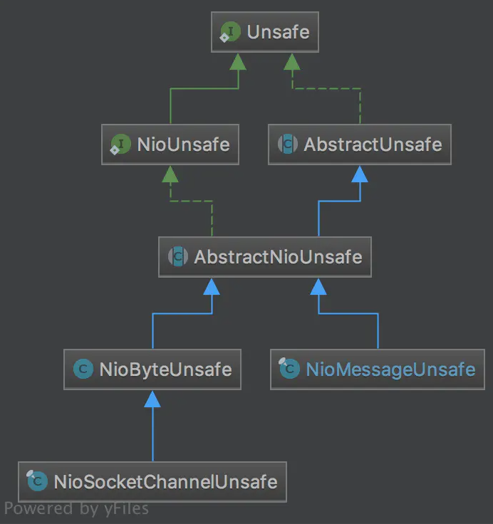
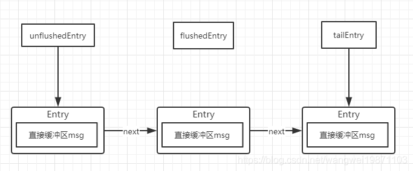

# Unsafe到底是干什么的

pipeline中的有关io的操作最终都是落地到unsafe。顾名思义，unsafe是不安全的意思，就是告诉你不要在应用程序里面直接使用Unsafe以及他的衍生类对象

Unsafe 在Channel定义，属于Channel的内部类，表明Unsafe和Channel密切相关

```java
interface Unsafe {

  // 接受数据的时候用于分配字节缓冲区的处理器

  RecvByteBufAllocator.Handle recvBufAllocHandle();

  // 本地地址

  SocketAddress localAddress();

  // 远程地址

  SocketAddress remoteAddress();

  //向事件循环注册通道，完成后回调

  void register(EventLoop eventLoop, ChannelPromise promise);

  // 绑定本地地址，完成后回调

  void bind(SocketAddress localAddress, ChannelPromise promise);

  // 连接

  void connect(SocketAddress remoteAddress, SocketAddress localAddress, ChannelPromise promise);

  // 断开连接，完成回调

  void disconnect(ChannelPromise promise);

  // 关闭连接，完成回调

  void close(ChannelPromise promise);

  // 立即关闭，不触发任何事件

  void closeForcibly();

  // 注销，完成回调

  void deregister(ChannelPromise promise);

  // 开始读操作

  void beginRead();

  // 写操作

  void write(Object msg, ChannelPromise promise);

  // 冲刷所有的出站数据

  void flush();

  // 特殊的占位符，不接受通知

  ChannelPromise voidPromise();

  //写操作的出站缓冲区

  ChannelOutboundBuffer outboundBuffer();
}
```


按功能可以分为分配内存，Socket四元组信息，注册事件循环，绑定网卡端口，Socket的连接和关闭，Socket的读写，看的出来，这些操作都是和jdk底层相关

继承结构



`NioUnsafe` 在 `Unsafe`基础上增加了以下几个接口

```java
public interface NioUnsafe extends Unsafe {

  // 返回潜在的SelectableChannel 
  SelectableChannel ch();
  // 完成连接
  void finishConnect();
  //从潜在的SelectableChannel中读数据
  void read();
  //强制刷新
  void forceFlush();
}
```

从以上继承结构来看，我们可以总结出两种类型的Unsafe分类，一个是与连接的字节数据读写相关的`NioByteUnsafe`，一个是与新连接建立操作相关的`NioMessageUnsafe`

# NioByteUnsafe读操作

用于NioSocketChannel，NioByteUnsafe中的read 读取数据方法

```java
@Override
@SuppressWarnings("Duplicates")
public final void read() {
    final ChannelConfig config = config();
    // 若 inputClosedSeenErrorOnRead = true ，移除对 SelectionKey.OP_READ 事件的感兴趣。
    if (shouldBreakReadReady(config)) {
        clearReadPending();
        return;
    }
    final ChannelPipeline pipeline = pipeline();
    // 用来处理内存的分配:池化或者非池化 UnpooledByteBufAllocator
    final ByteBufAllocator allocator = config.getAllocator();
    // 用来计算此次读循环应该分配多少内存 AdaptiveRecvByteBufAllocator 自适应计算缓冲分配
    final RecvByteBufAllocator.Handle allocHandle = recvBufAllocHandle();
    // 重置 RecvByteBufAllocator.Handle 对象
    allocHandle.reset(config);

    ByteBuf byteBuf = null;
    boolean close = false; // 是否关闭连接
    try {
        do {
            // 申请 ByteBuf 对象
            // 默认申请的是缓冲的直接内存，并且初始大小为1024
            byteBuf = allocHandle.allocate(allocator);
            // 读取数据到 byteBuf，读取多少字节数据，然后设置最后读取字节数字段
            allocHandle.lastBytesRead(doReadBytes(byteBuf));
            // 如果上一次读到的字节数小于等于0，清理引用和跳出循环
            if (allocHandle.lastBytesRead() <= 0) {
                // 释放 ByteBuf 对象
                // nothing was read. release the buffer.
                byteBuf.release();
                // 置空 ByteBuf 对象
                byteBuf = null;
                // 如果最后读取的字节为小于 0 ，说明对端已经关闭
                close = allocHandle.lastBytesRead() < 0;
                // TODO
                if (close) {
                    // There is nothing left to read as we received an EOF.
                    readPending = false;
                }
                // 结束循环
                break;
            }

            // 读取到数据

            // 读取消息数量 + localRead
            allocHandle.incMessagesRead(1);
            // TODO 芋艿 readPending
            readPending = false;
            // 触发 ChannelRead事件到 pipeline 中
            pipeline.fireChannelRead(byteBuf);
            // 置空 ByteBuf 对象
            byteBuf = null;
        } while (allocHandle.continueReading()); // 循环判断是否继续读取

        // 读取完成，调整下一次读取需要分配的缓冲区大小
        allocHandle.readComplete();
        // 触发 Channel readComplete 事件到 pipeline 中
        pipeline.fireChannelReadComplete();

        // 如果需要关闭，则执行关闭操作
        if (close) {
            closeOnRead(pipeline);
        }
    } catch (Throwable t) {
        handleReadException(pipeline, byteBuf, t, close, allocHandle);
    } finally {
        // TODO 芋艿 readPending
        // Check if there is a readPending which was not processed yet.
        // This could be for two reasons:
        // * The user called Channel.read() or ChannelHandlerContext.read() in channelRead(...) method
        // * The user called Channel.read() or ChannelHandlerContext.read() in channelReadComplete(...) method
        //
        // See https://github.com/netty/netty/issues/2254
        if (!readPending && !config.isAutoRead()) {
            removeReadOp();
        }
    }
}
```

ByteBufAllocator实现负责分配缓冲区，主要作用是创建 ByteBuf，这个 ByteBuf 是 Netty 用来替代 NIO 的 ByteBuffer 的，是存储数据的缓存区。默认实现如下：

```java
private volatile ByteBufAllocator allocator = ByteBufAllocator.DEFAULT;
```

```java
ByteBufAllocator DEFAULT = ByteBufUtil.DEFAULT_ALLOCATOR;
```

```java
static {
    // 读取 ByteBufAllocator 配置
    // 默认就是 polled
    String allocType = SystemPropertyUtil.get("io.netty.allocator.type", PlatformDependent.isAndroid() ? "unpooled" : "pooled");
    allocType = allocType.toLowerCase(Locale.US).trim();

    // 读取 ByteBufAllocator 对象
    ByteBufAllocator alloc;
    if ("unpooled".equals(allocType)) {
        alloc = UnpooledByteBufAllocator.DEFAULT;
        logger.debug("-Dio.netty.allocator.type: {}", allocType);
    } else if ("pooled".equals(allocType)) {
        //默认创建的是池化缓冲区
        alloc = PooledByteBufAllocator.DEFAULT;
        logger.debug("-Dio.netty.allocator.type: {}", allocType);
    } else {
        alloc = PooledByteBufAllocator.DEFAULT;
        logger.debug("-Dio.netty.allocator.type: pooled (unknown: {})", allocType);
    }

    DEFAULT_ALLOCATOR = alloc;

    THREAD_LOCAL_BUFFER_SIZE = SystemPropertyUtil.getInt("io.netty.threadLocalDirectBufferSize", 0);
    logger.debug("-Dio.netty.threadLocalDirectBufferSize: {}", THREAD_LOCAL_BUFFER_SIZE);

    MAX_CHAR_BUFFER_SIZE = SystemPropertyUtil.getInt("io.netty.maxThreadLocalCharBufferSize", 16 * 1024);
    logger.debug("-Dio.netty.maxThreadLocalCharBufferSize: {}", MAX_CHAR_BUFFER_SIZE);
}
```

```java
public static final PooledByteBufAllocator DEFAULT = new PooledByteBufAllocator(PlatformDependent.directBufferPreferred());
```

也就是默认会分配池化堆内缓冲区用来接收数据

ioBuffer 方法，该方法默认返回直接内存缓冲区。而 guess() 方法返回一个猜测的大小，一个 nextReceiveBufferSize 属性，默认 1024，也就是说，默认创建一个 1024 大小的直接内存缓冲区。这个值的设定来自 HandleImpl 的构造方法，存储在一个 SIZE_TABLE 的数组中

```java
@Override
public ByteBuf allocate(ByteBufAllocator alloc) {
    return alloc.ioBuffer(guess());
}
```

使用 guess()推测需要申请的缓冲区大小，初始值为1024，并且分配策略是池化的堆外内存

```java
@Override
protected int doReadBytes(ByteBuf byteBuf) throws Exception {
    // 获得 RecvByteBufAllocator.Handle 对象
    final RecvByteBufAllocator.Handle allocHandle = unsafe().recvBufAllocHandle();
    // 设置最大可读取字节数量。因为 ByteBuf 目前最大写入的大小为 byteBuf.writableBytes()
    allocHandle.attemptedBytesRead(byteBuf.writableBytes());
    // 读取数据到 ByteBuf 中，并返回一个读取到的字节数
    return byteBuf.writeBytes(javaChannel(), allocHandle.attemptedBytesRead());
}
```

判断是否能够继续读取数据

```java
@Override
public boolean continueReading() {
    return continueReading(defaultMaybeMoreSupplier);
}
```

```java
private final UncheckedBooleanSupplier defaultMaybeMoreSupplier = new UncheckedBooleanSupplier() {
    @Override
    public boolean get() {
        return attemptBytesRead == lastBytesRead;
    }
};
```

```java
@Override
public boolean continueReading(UncheckedBooleanSupplier maybeMoreDataSupplier) {
    // Keep reading if we are allowed to read more bytes, and our last read filled up the buffer we provided.
    return bytesToRead > 0 && maybeMoreDataSupplier.get();
}
```

如果有更多的数据可以读取，并且这一次读取的字节数等于之前所猜测的可以读取字节数，则继续读取

几个条件：

1. 首先是否自动读取。
2. 且猜测是否还有更多数据，如果实际读取的和预估的一致，说明可能还有数据没读，需要再次循环。
3. 如果读取次数为达到 16 次，继续读取。
4. 如果读取到的总数大于0，说明有数据，继续读取

核心流程：

1. 获取到 Channel 的 config 对象，并从该对象中获取内存分配器，还有"计算内存分配器"。
2. 将 `计算内存分配器` 重置。
3. 进入一个循环，循环体的作用是：使用内存分配器获取数据容器-----ByteBuf，调用 doReadBytes 方法将数据读取到容器中，如果这次读取什么都没有或远程连接关闭，则跳出循环。还有，如果满足了跳出推荐，也要结束循环，不能无限循环，默认16 次，默认参数来自 AbstractNioByteChannel 的 属性 ChannelMetadata 类型的 METADATA 实例。每读取一次就调用 pipeline 的 channelRead 方法，为什么呢？因为由于 TCP 传输如果包过大的话，丢失的风险会更大，导致重传，所以，大的数据流会分成多次传输。而 channelRead 方法也会被调用多次，因此，使用 channelRead 方法的时候需要注意，如果数据量大，最好将数据放入到缓存中，读取完毕后，再进行处理。
4. 跳出循环后，调用 `allocHandle` 的 readComplete 方法，表示读取已完成，并记录读取记录，用于下次分配合理内存。
5. 调用 pipeline 的方法。

# NioByteUnsafe写操作

需要写出的数据最终会传递到HeadContext，通过 unsafe 完成操作

```java
@Override
public void write(ChannelHandlerContext ctx, Object msg, ChannelPromise promise) throws Exception {
    unsafe.write(msg, promise);
}
```

```java
@Override
public final void write(Object msg, ChannelPromise promise) {
    assertEventLoop();

    ChannelOutboundBuffer outboundBuffer = this.outboundBuffer;
    // 内存队列为空
    if (outboundBuffer == null) {
        // 内存队列为空，一般是 Channel 已经关闭，所以通知 Promise 异常结果
        // If the outboundBuffer is null we know the channel was closed and so
        // need to fail the future right away. If it is not null the handling of the rest
        // will be done in flush0()
        // See https://github.com/netty/netty/issues/2362
        safeSetFailure(promise, WRITE_CLOSED_CHANNEL_EXCEPTION);
        // 释放消息( 对象 )相关的资源
        // release message now to prevent resource-leak
        ReferenceCountUtil.release(msg);
        return;
    }

    int size;
    try {
        // 将待写入的对象过滤，把非ByteBuf对象和FileRegion过滤，把所有的非直接内存转换成直接内存DirectBuffer
        msg = filterOutboundMessage(msg);
        // 获取缓冲区大小
        size = pipeline.estimatorHandle().size(msg);
        if (size < 0) {
            size = 0;
        }
    } catch (Throwable t) {
        // 通知 Promise 异常结果
        safeSetFailure(promise, t);
        // 释放消息( 对象 )相关的资源
        ReferenceCountUtil.release(msg);
        return;
    }

    // 写入消息( 数据 )到内存队列
    outboundBuffer.addMessage(msg, size, promise);
}
```

包装消息为DirectBuffer

```java
@Override
protected final Object filterOutboundMessage(Object msg) {
    // ByteBuf 的情况
    if (msg instanceof ByteBuf) {
        ByteBuf buf = (ByteBuf) msg;
        // 已经是 Direct ByteBuf
        if (buf.isDirect()) {
            return msg;
        }

        // 非 Direct ByteBuf ，需要进行创建封装
        return newDirectBuffer(buf);
    }

    // FileRegion 的情况
    if (msg instanceof FileRegion) {
        return msg;
    }

    // 不支持其他类型
    throw new UnsupportedOperationException("unsupported message type: " + StringUtil.simpleClassName(msg) + EXPECTED_TYPES);
}
```

将直接缓冲区添加到出站缓冲区中，用一个单链表结构来存取的

```java
public void addMessage(Object msg, int size, ChannelPromise promise) {
    // 创建新 Entry 对象
    Entry entry = Entry.newInstance(msg, size, total(msg), promise);
    // 若 tailEntry 为空，将 flushedEntry 也设置为空。防御型编程，实际不会出现
    if (tailEntry == null) {
        flushedEntry = null;
    // 若 tailEntry 非空，将原 tailEntry 指向新 Entry
    } else {
        Entry tail = tailEntry;
        tail.next = entry;
    }
    // 更新 tailEntry 为新 Entry
    tailEntry = entry;
    // 若 unflushedEntry 为空，更新为新 Entry
    if (unflushedEntry == null) {
        unflushedEntry = entry;
    }

    // 增加 totalPendingSize 计数
    // increment pending bytes after adding message to the unflushed arrays.
    // See https://github.com/netty/netty/issues/1619
    incrementPendingOutboundBytes(entry.pendingSize, false);
}
```



至此，`write`写数据就完成了，其实就是写入出站缓冲区里面，并没有将数据冲刷到对端，要进行flush才会将数据发出去。

不管调用`channel.flush()`，还是`ctx.flush()`，最终都会落地到pipeline中的head节点

```java
@Override
public void flush(ChannelHandlerContext ctx) throws Exception {
    unsafe.flush();
}
```

先进行打标记，然后冲刷

```java
@Override
public final void flush() {
    assertEventLoop();

    // 内存队列为 null ，一般是 Channel 已经关闭，所以直接返回。
    ChannelOutboundBuffer outboundBuffer = this.outboundBuffer;
    if (outboundBuffer == null) {
        return;
    }

    // 标记内存队列开始 flush
    outboundBuffer.addFlush();
    // 执行 flush
    flush0();
}
```

这里会将`flushedEntry`设置为要冲刷的第一个`entry`，然后遍历链表，冲刷计数`flushed`+1，如果此时请求取消的话，就进行取消和出站字节数的减少，最后将为冲刷实体`unflushedEntry`设为空，表示这些都已经要冲刷的了，后续会根据`flushed`来进行冲刷

```java
public void addFlush() {
    // There is no need to process all entries if there was already a flush before and no new messages
    // where added in the meantime.
    //
    // See https://github.com/netty/netty/issues/2577
    Entry entry = unflushedEntry;
    if (entry != null) {
        // 若 flushedEntry 为空，赋值为 unflushedEntry ，用于记录第一个( 开始 ) flush 的 Entry 。
        if (flushedEntry == null) {
            // there is no flushedEntry yet, so start with the entry
            flushedEntry = entry;
        }
        // 计算 flush 的数量，并设置每个 Entry 对应的 Promise 不可取消
        do {
            // 增加 flushed
            flushed ++;
            // 如果取消的话需要回收内存
            if (!entry.promise.setUncancellable()) { // 设置失败
                // 减少 totalPending 计数
                // Was cancelled so make sure we free up memory and notify about the freed bytes
                int pending = entry.cancel();
                decrementPendingOutboundBytes(pending, false, true);
            }
            // 获得下一个 Entry
            entry = entry.next;
        } while (entry != null);

        // 设置 unflushedEntry 为空，表示所有都 flush
        // All flushed so reset unflushedEntry
        unflushedEntry = null;
    }
}
```

```java
@Override
protected final void flush0() {
    // Flush immediately only when there's no pending flush.
    // If there's a pending flush operation, event loop will call forceFlush() later,
    // and thus there's no need to call it now.
    if (!isFlushPending()) {
        super.flush0();
    }
}
```

```java
private boolean isFlushPending() {
    SelectionKey selectionKey = selectionKey();
    return selectionKey.isValid() // 合法
            && (selectionKey.interestOps() & SelectionKey.OP_WRITE) != 0; // 对 SelectionKey.OP_WRITE 事件不感兴趣。
}
```

```java
protected void flush0() {
    // 正在 flush 中，所以直接返回。
    if (inFlush0) {
        // Avoid re-entrance
        return;
    }

    // 内存队列为 null ，一般是 Channel 已经关闭，所以直接返回。
    // 内存队列为空，无需 flush ，所以直接返回
    final ChannelOutboundBuffer outboundBuffer = this.outboundBuffer;
    if (outboundBuffer == null || outboundBuffer.isEmpty()) {
        return;
    }

    // 标记正在 flush 中。
    inFlush0 = true;

    // 若未激活，通知 flush 失败
    // Mark all pending write requests as failure if the channel is inactive.
    if (!isActive()) {
        try {
            if (isOpen()) {
                outboundBuffer.failFlushed(FLUSH0_NOT_YET_CONNECTED_EXCEPTION, true);
            } else {
                // Do not trigger channelWritabilityChanged because the channel is closed already.
                outboundBuffer.failFlushed(FLUSH0_CLOSED_CHANNEL_EXCEPTION, false);
            }
        } finally {
            // 标记不在 flush 中。
            inFlush0 = false;
        }
        return;
    }

    // 执行真正的写入到对端
    try {
        doWrite(outboundBuffer);
    } catch (Throwable t) {
        // TODO 芋艿 细节
        if (t instanceof IOException && config().isAutoClose()) {
            /**
             * Just call {@link #close(ChannelPromise, Throwable, boolean)} here which will take care of
             * failing all flushed messages and also ensure the actual close of the underlying transport
             * will happen before the promises are notified.
             *
             * This is needed as otherwise {@link #isActive()} , {@link #isOpen()} and {@link #isWritable()}
             * may still return {@code true} even if the channel should be closed as result of the exception.
             */
            close(voidPromise(), t, FLUSH0_CLOSED_CHANNEL_EXCEPTION, false);
        } else {
            try {
                shutdownOutput(voidPromise(), t);
            } catch (Throwable t2) {
                close(voidPromise(), t2, FLUSH0_CLOSED_CHANNEL_EXCEPTION, false);
            }
        }
    } finally {
        // 标记不在 flush 中。
        inFlush0 = false;
    }
}
```

最终当然还是封装了`NIO`的`SocketChannel` 的`write`方法来进行写数据啦，他会进行`16`次自旋尝试，来写消息，直到出站缓冲区的数据全部写出去了，然后就`clearOpWrite`清除`OP_WRITE`设置，返回，否则要去设置任务是否写操作`incompleteWrite`

```java
@Override
protected void doWrite(ChannelOutboundBuffer in) throws Exception {
    SocketChannel ch = javaChannel();
    // 获得自旋写入次数
    int writeSpinCount = config().getWriteSpinCount();
    do {
        // 内存队列为空，结束循环，直接返回
        if (in.isEmpty()) {
            // 取消对 SelectionKey.OP_WRITE 的感兴趣
            // All written so clear OP_WRITE
            clearOpWrite();
            // Directly return here so incompleteWrite(...) is not called.
            return;
        }

        // 获得每次写入的最大字节数
        // Ensure the pending writes are made of ByteBufs only.
        int maxBytesPerGatheringWrite = ((NioSocketChannelConfig) config).getMaxBytesPerGatheringWrite();
        // 从内存队列中，获得要写入的 ByteBuffer 数组
        ByteBuffer[] nioBuffers = in.nioBuffers(1024, maxBytesPerGatheringWrite);
        // 写入的 ByteBuffer 数组的个数
        int nioBufferCnt = in.nioBufferCount();

        // 写入 ByteBuffer 数组，到对端
        // Always us nioBuffers() to workaround data-corruption.
        // See https://github.com/netty/netty/issues/2761
        switch (nioBufferCnt) {
            case 0:
                // 芋艿 TODO 1014 扣 doWrite0 的细节
                // We have something else beside ByteBuffers to write so fallback to normal writes.
                writeSpinCount -= doWrite0(in);
                break;
            case 1: {
                // Only one ByteBuf so use non-gathering write
                // Zero length buffers are not added to nioBuffers by ChannelOutboundBuffer, so there is no need
                // to check if the total size of all the buffers is non-zero.
                ByteBuffer buffer = nioBuffers[0];
                int attemptedBytes = buffer.remaining();
                // 执行 NIO write 调用，写入单个 ByteBuffer 对象到对端
                final int localWrittenBytes = ch.write(buffer);
                // 写入字节小于等于 0 ，说明 NIO Channel 不可写，所以注册 SelectionKey.OP_WRITE ，等待 NIO Channel 可写，并返回以结束循环
                if (localWrittenBytes <= 0) {
                    incompleteWrite(true);
                    return;
                }
                // TODO 芋艿 调整每次写入的最大字节数
                adjustMaxBytesPerGatheringWrite(attemptedBytes, localWrittenBytes, maxBytesPerGatheringWrite);
                // 从内存队列中，移除已经写入的数据( 消息 )
                in.removeBytes(localWrittenBytes);
                // 写入次数减一
                --writeSpinCount;
                break;
            }
            default: {
                // Zero length buffers are not added to nioBuffers by ChannelOutboundBuffer, so there is no need
                // to check if the total size of all the buffers is non-zero.
                // We limit the max amount to int above so cast is safe
                long attemptedBytes = in.nioBufferSize();
                // 执行 NIO write 调用，写入多个 ByteBuffer 到对端
                final long localWrittenBytes = ch.write(nioBuffers, 0, nioBufferCnt);
                // 写入字节小于等于 0 ，说明 NIO Channel 不可写，所以注册 SelectionKey.OP_WRITE ，等待 NIO Channel 可写，并返回以结束循环
                if (localWrittenBytes <= 0) {
                    incompleteWrite(true);
                    return;
                }
                // TODO 芋艿 调整每次写入的最大字节数
                // Casting to int is safe because we limit the total amount of data in the nioBuffers to int above.
                adjustMaxBytesPerGatheringWrite((int) attemptedBytes, (int) localWrittenBytes, maxBytesPerGatheringWrite);
                // 从内存队列中，移除已经写入的数据( 消息 )
                in.removeBytes(localWrittenBytes);
                // 写入次数减一
                --writeSpinCount;
                break;
            }
        }
    } while (writeSpinCount > 0); // 循环自旋写入

    // 内存队列中的数据未完全写入，说明 NIO Channel 不可写，所以注册 SelectionKey.OP_WRITE ，等待 NIO Channel 可写
    incompleteWrite(writeSpinCount < 0);
}
```

如果数据没有写完，继续关注 OP_WRITE，否则取消

```java
protected final void incompleteWrite(boolean setOpWrite) {
    // Did not write completely.
    // true ，注册对 SelectionKey.OP_WRITE 事件感兴趣
    if (setOpWrite) {
        setOpWrite();
    // false ，取消对 SelectionKey.OP_WRITE 事件感兴趣
    } else {
        // It is possible that we have set the write OP, woken up by NIO because the socket is writable, and then
        // use our write quantum. In this case we no longer want to set the write OP because the socket is still
        // writable (as far as we know). We will find out next time we attempt to write if the socket is writable
        // and set the write OP if necessary.
        clearOpWrite();

        // Schedule flush again later so other tasks can be picked up in the meantime
        // 立即发起下一次 flush 任务
        eventLoop().execute(flushTask);
    }
}
```

# NioMessageUnsafe读操作

是用于`NioServerSocketChannel`的`unsafe`类

```java
private final class NioMessageUnsafe extends AbstractNioUnsafe {

    /**
     * 新读取的客户端连接数组
     */
    private final List<Object> readBuf = new ArrayList<Object>();

    /**
     * 获取当前Channel绑定的ChannelPipeline
     * 读取数据到缓冲区
     * 调用ChannelPipeline.fireChannelRead()，并将缓冲区的数据传入
     * 数据全部传输完毕后，调用ChannelPipeline.fireChannelReadComplete()方法
     * 如果在上面读取数据到缓冲区过程中捕获到异常，则调用ChannelPipeline.fireExceptionCaught()方法并将异常传入
     */
    @SuppressWarnings("Duplicates")
    @Override
    public void read() {
        assert eventLoop().inEventLoop();
        final ChannelConfig config = config();
        final ChannelPipeline pipeline = pipeline();
        // 获得 RecvByteBufAllocator.Handle 对象
        final RecvByteBufAllocator.Handle allocHandle = unsafe().recvBufAllocHandle();
        // 重置 RecvByteBufAllocator.Handle 对象
        allocHandle.reset(config);

        boolean closed = false;
        Throwable exception = null;
        try {
            try {
                do {
                    // 接收客户端的连接请求，返回客户端SocketChannel，最终封装为NioSocketChannel
                    int localRead = doReadMessages(readBuf);
                    // 无可读取的客户端的连接，结束
                    if (localRead == 0) {
                        break;
                    }
                    // 读取出错
                    if (localRead < 0) {
                        closed = true; // 标记关闭
                        break;
                    }

                    // 读取消息数量 + localRead
                    allocHandle.incMessagesRead(localRead);
                } while (allocHandle.continueReading()); // 循环判断是否继续读取
            } catch (Throwable t) {
                // 记录异常
                exception = t;
            }

            // 如果获取到了SocketChannel，则通过pipeline的fireChannelRead将NioSocketChannel传入
            // 处理完readBuf后会清空

            // 循环 readBuf 数组，触发 Channel read 事件到 pipeline 中。
            int size = readBuf.size();
            for (int i = 0; i < size; i ++) {
                // TODO 芋艿
                readPending = false;
                // 在内部，会通过 ServerBootstrapAcceptor ，将客户端的 Netty NioSocketChannel 注册到 EventLoop 上
                pipeline.fireChannelRead(readBuf.get(i));
            }
            // 清空 readBuf 数组
            readBuf.clear();
            // 读取完成
            allocHandle.readComplete();
            // 触发 Channel readComplete 事件到 pipeline 中。
            pipeline.fireChannelReadComplete();

            // 发生异常
            if (exception != null) {
                // 判断是否要关闭 TODO 芋艿
                closed = closeOnReadError(exception);

                // 触发 exceptionCaught 事件到 pipeline 中。
                pipeline.fireExceptionCaught(exception);
            }

            if (closed) {
                // TODO 芋艿
                inputShutdown = true;
                // TODO 芋艿
                if (isOpen()) {
                    close(voidPromise());
                }
            }
        } finally {
            // Check if there is a readPending which was not processed yet.
            // This could be for two reasons:
            // * The user called Channel.read() or ChannelHandlerContext.read() in channelRead(...) method
            // * The user called Channel.read() or ChannelHandlerContext.read() in channelReadComplete(...) method
            //
            // See https://github.com/netty/netty/issues/2254
            // TODO 芋艿
            if (!readPending && !config.isAutoRead()) {
                removeReadOp();
            }
        }
    }
}
```

内部其实就是用`ServerSocketChannel`去接受一个`SocketChannel`

```java
@Override
protected int doReadMessages(List<Object> buf) throws Exception {
    // 接受客户端连接
    SocketChannel ch = SocketUtils.accept(javaChannel());

    try {
        // 创建 Netty NioSocketChannel 对象
        if (ch != null) {
            buf.add(new NioSocketChannel(this, ch));
            return 1;
        }
    } catch (Throwable t) {
        logger.warn("Failed to create a new channel from an accepted socket.", t);
        // 发生异常，关闭客户端的 SocketChannel 连接
        try {
            ch.close();
        } catch (Throwable t2) {
            logger.warn("Failed to close a socket.", t2);
        }
    }

    return 0;
}
```

同NioByteUnsafe的 read 不一样的是，continueReading会始终返回 false，也就是这里接收客户端的连接不会持续处理，每次处理一个

读取到的`SocketChannel`通过 pipeline 会传递到ServerBootstrapAcceptor中用来注册到 EventLoop 的 Selector 上

```java
@Override
@SuppressWarnings("unchecked")
public void channelRead(ChannelHandlerContext ctx, Object msg) {
    // 老艿艿：如下的注释，先暂时认为是接受的客户端的 NioSocketChannel

    // 接受的客户端的 NioSocketChannel 对象
    final Channel child = (Channel) msg;
    // 添加 NioSocketChannel 的处理器
    child.pipeline().addLast(childHandler);
    // 设置 NioSocketChannel 的配置项
    setChannelOptions(child, childOptions, logger);
    // 设置 NioSocketChannel 的属性
    for (Entry<AttributeKey<?>, Object> e: childAttrs) {
        child.attr((AttributeKey<Object>) e.getKey()).set(e.getValue());
    }

    try {
        // 注册客户端的 NioSocketChannel 到 work EventLoop 中。
        childGroup.register(child).addListener(new ChannelFutureListener() {

            @Override
            public void operationComplete(ChannelFuture future) throws Exception {
                // 注册失败，关闭客户端的 NioSocketChannel
                if (!future.isSuccess()) {
                    forceClose(child, future.cause());
                }
            }

        });
    } catch (Throwable t) {
        // 发生异常，强制关闭客户端的 NioSocketChannel
        forceClose(child, t);
    }
}
```