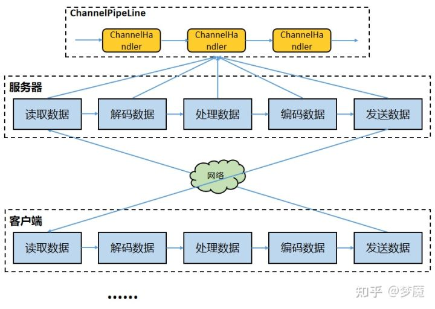
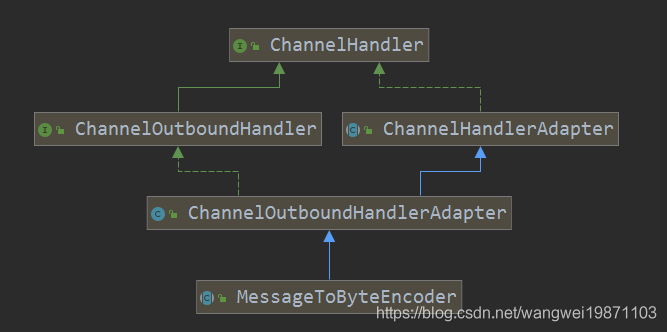

[TOC]

# 为什么要粘包

首先你得了解一下TCP/IP协议，在用户数据量非常小的情况下，极端情况下，一个字节，该TCP数据包的有效载荷非常低，传递100字节的数据，需要100次TCP传送，100次ACK，在应用及时性要求不高的情况下，将这100个有效数据拼接成一个数据包，那会缩短到一个TCP数据包，以及一个ack，有效载荷提高了，带宽也节省了

非极端情况，有可能两个数据包拼接成一个数据包，也有可能一个半的数据包拼接成一个数据包，也有可能两个半的数据包拼接成一个数据包

# 为什么要拆包

拆包和粘包是相对的，一端粘了包，另外一端就需要将粘过的包拆开，举个栗子，发送端将三个数据包粘成两个TCP数据包发送到接收端，接收端就需要根据应用协议将两个数据包重新组装成三个数据包

还有一种情况就是用户数据包超过了mss(最大报文长度)，那么这个数据包在发送的时候必须拆分成几个数据包，接收端收到之后需要将这些数据包粘合起来之后，再拆开

# 拆包的原理

在没有netty的情况下，用户如果自己需要拆包，基本原理就是不断从TCP缓冲区中读取数据，每次读取完都需要判断是否是一个完整的数据包

1. 如果当前读取的数据不足以拼接成一个完整的业务数据包，那就保留该数据，继续从tcp缓冲区中读取，直到得到一个完整的数据包
2. 如果当前读到的数据加上已经读取的数据足够拼接成一个数据包，那就将已经读取的数据拼接上本次读取的数据，够成一个完整的业务数据包传递到业务逻辑，多余的数据仍然保留，以便和下次读到的数据尝试拼接



# Netty中拆包的基类ByteToMessageDecoder

netty 中的拆包也是如上这个原理，内部会有一个累加器，每次读取到数据都会不断累加，然后尝试对累加到的数据进行拆包，拆成一个完整的业务数据包，这个基类叫做 `ByteToMessageDecoder`

## Cumulator累加器

Netty 中累加器接口定义为：

```java
/**
 * ByteBuf 累积器接口
 *
 * Cumulate {@link ByteBuf}s.
 */
public interface Cumulator {

    /**
     * Cumulate the given {@link ByteBuf}s and return the {@link ByteBuf} that holds the cumulated bytes.
     * The implementation is responsible to correctly handle the life-cycle of the given {@link ByteBuf}s and so
     * call {@link ByteBuf#release()} if a {@link ByteBuf} is fully consumed.
     *
     * @param alloc ByteBuf 分配器
     * @param cumulation ByteBuf 当前累积结果
     * @param in 当前读取( 输入 ) ByteBuf
     * @return ByteBuf 新的累积结果
     */
    ByteBuf cumulate(ByteBufAllocator alloc, ByteBuf cumulation, ByteBuf in);

}
```

实现了两个累加器

```java
/**
 * Cumulate {@link ByteBuf}s by merge them into one {@link ByteBuf}'s, using memory copies.
 */
public static final Cumulator MERGE_CUMULATOR = new Cumulator() {

    @Override
    public ByteBuf cumulate(ByteBufAllocator alloc, ByteBuf cumulation, ByteBuf in) {
        final ByteBuf buffer;
        if (cumulation.writerIndex() > cumulation.maxCapacity() - in.readableBytes() // 超过空间大小，需要扩容
                || cumulation.refCnt() > 1 // 引用大于 1 ，说明用户使用了 slice().retain() 或 duplicate().retain() 使refCnt增加并且大于 1 ，
                                           // 此时扩容返回一个新的累积区ByteBuf，方便用户对老的累积区ByteBuf进行后续处理。
                || cumulation.isReadOnly()) { // 只读，不可累加，所以需要改成可写
            // Expand cumulation (by replace it) when either there is not more room in the buffer
            // or if the refCnt is greater then 1 which may happen when the user use slice().retain() or
            // duplicate().retain() or if its read-only.
            //
            // See:
            // - https://github.com/netty/netty/issues/2327
            // - https://github.com/netty/netty/issues/1764
            // 扩容，返回新的 buffer
            buffer = expandCumulation(alloc, cumulation, in.readableBytes());
        } else {
            // 使用老的 buffer
            buffer = cumulation;
        }
        // 写入 in 到 buffer 中
        buffer.writeBytes(in);
        // 释放输入 in
        in.release();
        // 返回 buffer
        return buffer;
    }

};

/**
 * Cumulate {@link ByteBuf}s by add them to a {@link CompositeByteBuf} and so do no memory copy whenever possible.
 * Be aware that {@link CompositeByteBuf} use a more complex indexing implementation so depending on your use-case
 * and the decoder implementation this may be slower then just use the {@link #MERGE_CUMULATOR}.
 *
 * 相比 MERGE_CUMULATOR 来说：
 *
 * 好处是，内存零拷贝
 * 坏处是，因为维护复杂，所以某些使用场景下，慢于 MERGE_CUMULATOR
 */
public static final Cumulator COMPOSITE_CUMULATOR = new Cumulator() {

    @Override
    public ByteBuf cumulate(ByteBufAllocator alloc, ByteBuf cumulation, ByteBuf in) {
        ByteBuf buffer;
        // 和 MERGE_CUMULATOR 的情况类似
        if (cumulation.refCnt() > 1) {
            // Expand cumulation (by replace it) when the refCnt is greater then 1 which may happen when the user
            // use slice().retain() or duplicate().retain().
            //
            // See:
            // - https://github.com/netty/netty/issues/2327
            // - https://github.com/netty/netty/issues/1764
            buffer = expandCumulation(alloc, cumulation, in.readableBytes());
            buffer.writeBytes(in);
            in.release();
        } else {
            CompositeByteBuf composite;
            // 原来是 CompositeByteBuf 类型，直接使用
            if (cumulation instanceof CompositeByteBuf) {
                composite = (CompositeByteBuf) cumulation;
            // 原来不是 CompositeByteBuf 类型，创建，并添加到其中
            } else {
                composite = alloc.compositeBuffer(Integer.MAX_VALUE);
                composite.addComponent(true, cumulation);
            }
            // 添加 in 到 composite 中
            composite.addComponent(true, in);
            // 赋值给 buffer
            buffer = composite;
        }
        // 返回 buffer
        return buffer;
    }

};
```

默认情况下使用的是`MERGE_CUMULATOR` ，它的原理是每次都将读取到的数据通过内存拷贝的方式，拼接到一个大的字节容器中

```java
/**
 * 累计器
 */
private Cumulator cumulator = MERGE_CUMULATOR;
```

netty 中ByteBuf的抽象，使得累加非常简单，通过一个简单的api调用 `buffer.writeBytes(in);` 便将新数据累加到字节容器中，为了防止字节容器大小不够，在累加之前还进行了扩容处理

```java
static ByteBuf expandCumulation(ByteBufAllocator alloc, ByteBuf cumulation, int readable) {
    // 记录老的 ByteBuf 对象
    ByteBuf oldCumulation = cumulation;
    // 分配新的 ByteBuf 对象
    cumulation = alloc.buffer(oldCumulation.readableBytes() + readable);
    // 将老的数据，写入到新的 ByteBuf 对象
    cumulation.writeBytes(oldCumulation);
    // 释放老的 ByteBuf 对象
    oldCumulation.release();
    // 返回新的 ByteBuf 对象
    return cumulation;
}
```

扩容也是一个内存拷贝操作，新增的大小即是新读取数据的大小，需要注意的是对旧的缓冲数据的释放，避免内存泄露

## ChannelRead执行回调

在 NioEventLoop 的线程方法中，有可读事件触发后，会执行 read 方法，最终从 Channel 中读取到数据后，会触发fireChannelRead回调，数据读取完成后（或者读取最大16次）就会触发fireChannelReadComplete回调

数据会流转到ByteToMessageDecoder的 channelRead 方法中

```java
@Override
public void channelRead(ChannelHandlerContext ctx, Object msg) throws Exception {
    if (msg instanceof ByteBuf) {
        // 创建 CodecOutputList 对象
        CodecOutputList out = CodecOutputList.newInstance();
        try {
            ByteBuf data = (ByteBuf) msg;
            // 判断是否首次
            first = cumulation == null;
            // 若首次，直接使用读取的 data
            if (first) {
                cumulation = data;
            // 若非首次，将读取的 data ，累积到 cumulation 中
            } else {
                cumulation = cumulator.cumulate(ctx.alloc(), cumulation, data);
            }
            // 执行解码
            callDecode(ctx, cumulation, out);
        } catch (DecoderException e) {
            throw e; // 抛出异常
        } catch (Exception e) {
            throw new DecoderException(e); // 封装成 DecoderException 异常，抛出
        } finally {
            // cumulation 中所有数据被读取完，直接释放全部
            if (cumulation != null && !cumulation.isReadable()) {
                numReads = 0; // 重置 numReads 次数
                cumulation.release(); // 释放 cumulation
                cumulation = null; // 置空 cumulation
            // 读取次数到达 discardAfterReads 上限，释放部分的已读
            } else if (++ numReads >= discardAfterReads) {
                // We did enough reads already try to discard some bytes so we not risk to see a OOME.
                // See https://github.com/netty/netty/issues/4275
                numReads = 0; // 重置 numReads 次数
                discardSomeReadBytes(); // 释放部分的已读
            }

            // 解码消息的数量
            int size = out.size();
            // 是否解码到消息
            decodeWasNull = !out.insertSinceRecycled();

            // 触发 Channel Read 事件。可能是多条消息
            // 如果一条完整的数据也没有，则不行进行任何处理
            fireChannelRead(ctx, out, size);

            // 回收 CodecOutputList 对象
            out.recycle();
        }
    } else {
        // 触发 Channel Read 事件
        ctx.fireChannelRead(msg);
    }
}
```

核心处理：

1. ByteToMessageDecoder的 channelRead 方法只会处理 ByteBuf 类型的数据，否则直接传递下去
2. 如果当前累加器没有数据，就直接跳过内存拷贝，直接将字节容器的指针指向新读取的数据，否则，调用累加器累加数据至字节容器
3. 将累加到的数据通过callDecode方法传递给业务进行拆包，也就是读取到的数据每次都会进行拆包处理
4. 如果累加器没有剩余数据，则直接释放累加器，否则读取超过16次，也会进行数据的压缩
5. 如果拆包出了完整的数据，则进行传递下去

## CallDecode业务解码

`callDecode` 将尝试将字节容器的数据拆分成业务数据包塞到业务数据容器`out`中

```java
/**
 * Called once data should be decoded from the given {@link ByteBuf}. This method will call
 * {@link #decode(ChannelHandlerContext, ByteBuf, List)} as long as decoding should take place.
 *
 * @param ctx           the {@link ChannelHandlerContext} which this {@link ByteToMessageDecoder} belongs to
 * @param in            the {@link ByteBuf} from which to read data
 * @param out           the {@link List} to which decoded messages should be added
 */
@SuppressWarnings("Duplicates")
protected void callDecode(ChannelHandlerContext ctx, ByteBuf in, List<Object> out) {
    try {
        // 循环读取，直到不可读
        while (in.isReadable()) {
            // 记录
            int outSize = out.size();
            // out 非空，说明上一次解码有解码到消息
            if (outSize > 0) {
                // 触发 Channel Read 事件。可能是多条消息
                fireChannelRead(ctx, out, outSize);
                // 清空
                out.clear();

                // 用户主动删除该 Handler ，继续操作 in 是不安全的
                // Check if this handler was removed before continuing with decoding.
                // If it was removed, it is not safe to continue to operate on the buffer.
                //
                // See:
                // - https://github.com/netty/netty/issues/4635
                if (ctx.isRemoved()) {
                    break;
                }
                outSize = 0;
            }

            // 记录一下字节容器中有多少字节待拆
            int oldInputLength = in.readableBytes();

            // 执行解码。如果 Handler 准备移除，在解码完成后，进行移除。
            decodeRemovalReentryProtection(ctx, in, out);

            // 用户主动删除该 Handler ，继续操作 in 是不安全的
            // Check if this handler was removed before continuing the loop.
            // If it was removed, it is not safe to continue to operate on the buffer.
            //
            // See https://github.com/netty/netty/issues/1664
            if (ctx.isRemoved()) {
                break;
            }

            // 整列判断 `out.size() == 0` 比较合适。因为，如果 `outSize > 0` 那段，已经清理了 out 。
            if (outSize == out.size()) {
                // 拆包器未读取任何数据
                if (oldInputLength == in.readableBytes()) {
                    break;
                } else {
                    //拆包器已读取部分数据，还需要继续
                    continue;
                }
            }

            // 如果解码了消息，但是可读字节数未变，抛出 DecoderException 异常。说明，有问题。
            if (oldInputLength == in.readableBytes()) {
                throw new DecoderException(StringUtil.simpleClassName(getClass()) + ".decode() did not read anything but decoded a message.");
            }

            // 如果开启 singleDecode ，表示只解析一次，结束循环
            if (isSingleDecode()) {
                break;
            }
        }
    } catch (DecoderException e) {
        throw e;
    } catch (Exception cause) {
        throw new DecoderException(cause);
    }
}
```

```java
final void decodeRemovalReentryProtection(ChannelHandlerContext ctx, ByteBuf in, List<Object> out) throws Exception {
    // 设置状态为 STATE_CALLING_CHILD_DECODE
    decodeState = STATE_CALLING_CHILD_DECODE;
    try {
        // 执行解码
        decode(ctx, in, out);
    } finally {
        // 判断是否准备移除
        boolean removePending = decodeState == STATE_HANDLER_REMOVED_PENDING;
        // 设置状态为 STATE_INIT
        decodeState = STATE_INIT;
        // 移除当前 Handler
        if (removePending) {
            handlerRemoved(ctx);
        }
    }
}
```

最终会调用抽象函数 `decode` 进行拆包

```java
/**
 * Decode the from one {@link ByteBuf} to an other. This method will be called till either the input
 * {@link ByteBuf} has nothing to read when return from this method or till nothing was read from the input
 * {@link ByteBuf}.
 *
 * @param ctx           the {@link ChannelHandlerContext} which this {@link ByteToMessageDecoder} belongs to
 * @param in            the {@link ByteBuf} from which to read data
 * @param out           the {@link List} to which decoded messages should be added
 * @throws Exception    is thrown if an error occurs
 */
protected abstract void decode(ChannelHandlerContext ctx, ByteBuf in, List<Object> out) throws Exception;
```

netty中对各种用户协议的支持就体现在这个抽象函数中，传进去的是当前读取到的未被消费的所有的数据，以及业务协议包容器，所有的拆包器最终都实现了该抽象方法

业务拆包完成之后，如果发现并没有拆到一个完整的数据包，这个时候又分两种情况

1. 一个是拆包器什么数据也没读取，可能数据还不够业务拆包器处理，直接break等待新的数据
2. 拆包器已读取部分数据，说明解码器仍然在工作，继续解码

业务拆包完成之后，如果发现已经解到了数据包，但是，发现并没有读取任何数据，这个时候就会抛出一个Runtime异常 `DecoderException`，告诉你，你什么数据都没读取，却解析出一个业务数据包，这是有问题的

## 清理字节容器

业务拆包完成之后，只是从字节容器中取走了数据，但是这部分空间对于字节容器来说依然保留着，而字节容器每次累加字节数据的时候都是将字节数据追加到尾部，如果不对字节容器做清理，那么时间一长就会OOM

正常情况下，其实每次读取完数据，netty都会在下面这个方法中将字节容器清理，只不过，当发送端发送数据过快，`channelReadComplete`可能会很久才被调用一次

```java
@Override
public void channelReadComplete(ChannelHandlerContext ctx) throws Exception {
    // 重置 numReads
    numReads = 0;
    // 释放部分的已读
    discardSomeReadBytes();
    // 未解码到消息，并且未开启自动读取，则再次发起读取，期望读取到更多数据，以便解码到消息
    if (decodeWasNull) {
        decodeWasNull = false; // 重置 decodeWasNull
        if (!ctx.channel().config().isAutoRead()) {
            ctx.read();
        }
    }
    // 触发 Channel ReadComplete 事件到下一个节点
    ctx.fireChannelReadComplete();
}
```

如果一次数据读取完毕之后(可能接收端一边收，发送端一边发，这里的读取完毕指的是接收端在某个时间不再接受到数据为止），发现仍然没有拆到一个完整的用户数据包，即使该channel的设置为非自动读取，也会触发一次读取操作 `ctx.read()`，该操作会重新向selector注册op_read事件，以便于下一次能读到数据之后拼接成一个完整的数据包

所以为了防止发送端发送数据过快，netty会在每次读取到一次数据，业务拆包之后对字节字节容器做清理

```java
// cumulation 中所有数据被读取完，直接释放全部
if (cumulation != null && !cumulation.isReadable()) {
  numReads = 0; // 重置 numReads 次数
  cumulation.release(); // 释放 cumulation
  cumulation = null; // 置空 cumulation
  // 读取次数到达 discardAfterReads 上限，释放部分的已读
} else if (++ numReads >= discardAfterReads) {
  // We did enough reads already try to discard some bytes so we not risk to see a OOME.
  // See https://github.com/netty/netty/issues/4275
  numReads = 0; // 重置 numReads 次数
  discardSomeReadBytes(); // 释放部分的已读
}
```

如果字节容器当前已无数据可读取，直接销毁字节容器，并且标注一下当前字节容器一次数据也没读取

如果连续16次（`discardAfterReads`的默认值），字节容器中仍然有未被业务拆包器读取的数据，那就调用discardSomeReadBytes方法做一次压缩，有效数据段整体移到容器首部

## 传递业务数据包给业务解码器处理

最后就可以将拆成的包丢到业务解码器处理了

```java
// 解码消息的数量
int size = out.size();
// 是否解码到消息
decodeWasNull = !out.insertSinceRecycled();

// 触发 Channel Read 事件。可能是多条消息
fireChannelRead(ctx, out, size);

// 回收 CodecOutputList 对象
out.recycle();
```

期间用一个成员变量 `decodeWasNull` 来标识本次读取数据是否拆到一个业务数据包，然后调用 `fireChannelRead` 将拆到的业务数据包都传递到后续的handler

```java
static void fireChannelRead(ChannelHandlerContext ctx, CodecOutputList msgs, int numElements) {
    for (int i = 0; i < numElements; i ++) {
        ctx.fireChannelRead(msgs.getUnsafe(i)); // getUnsafe 是自定义的方法，减少越界判断，效率更高
    }
}
```

这样，就可以把一个个完整的业务数据包传递到后续的业务解码器进行解码，随后处理业务逻辑

# 行拆包器LineBasedFrameDecoder

基于行分隔符的拆包器，TA可以同时处理 `\n`以及`\r\n`两种类型的行分隔符，核心方法都在继承的 `decode` 方法中

```java
@Override
protected final void decode(ChannelHandlerContext ctx, ByteBuf in, List<Object> out) throws Exception {
    Object decoded = decode(ctx, in);
    if (decoded != null) {
        out.add(decoded);
    }
}
```

```java
protected Object decode(ChannelHandlerContext ctx, ByteBuf buffer) throws Exception {
    // 获得换行符的位置
    final int eol = findEndOfLine(buffer);
    if (!discarding) { // 未处于废弃模式
        if (eol >= 0) { // 找到
            final ByteBuf frame;
            final int length = eol - buffer.readerIndex(); // 读取长度
            final int delimLength = buffer.getByte(eol) == '\r' ? 2 : 1; // 分隔符的长度。2 为 `\r\n` ，1 为 `\n`

            // 超过最大长度
            if (length > maxLength) {
                // 设置新的读取位置
                buffer.readerIndex(eol + delimLength);
                // 触发 Exception 到下一个节点
                fail(ctx, length);
                // 返回 null ，即未解码到消息
                return null;
            }

            // 解码出一条消息。
            if (stripDelimiter) {
                frame = buffer.readRetainedSlice(length);
                buffer.skipBytes(delimLength); // 忽略换行符
            } else {
                frame = buffer.readRetainedSlice(length + delimLength);
            }

            // 返回解码的消息
            return frame;
        } else { // 未找到
            final int length = buffer.readableBytes();
            // 超过最大长度
            if (length > maxLength) {
                // 记录 discardedBytes
                discardedBytes = length;
                // 跳到写入位置
                buffer.readerIndex(buffer.writerIndex());
                // 标记 discarding 为废弃模式
                discarding = true;
                // 重置 offset
                offset = 0;
                // 如果快速失败，则触发 Exception 到下一个节点
                if (failFast) {
                    fail(ctx, "over " + discardedBytes);
                }
            }
            return null;
        }
    } else { // 处于废弃模式
        if (eol >= 0) { // 找到
            final int length = discardedBytes + eol - buffer.readerIndex(); // 读取长度
            final int delimLength = buffer.getByte(eol) == '\r' ? 2 : 1; // 分隔符的长度。2 为 `\r\n` ，1 为 `\n`
            // 设置新的读取位置
            buffer.readerIndex(eol + delimLength);
            // 重置 discardedBytes
            discardedBytes = 0;
            // 设置 discarding 不为废弃模式
            discarding = false;
            // 如果不为快速失败，则触发 Exception 到下一个节点
            if (!failFast) {
                fail(ctx, length);
            }
        } else { // 未找到
            // 增加 discardedBytes
            discardedBytes += buffer.readableBytes();
            // 跳到写入位置
            buffer.readerIndex(buffer.writerIndex());
        }
        return null;
    }
}
```

## 找到换行符位置

```java
private int findEndOfLine(final ByteBuf buffer) {
    int totalLength = buffer.readableBytes();
    int i = buffer.forEachByte(buffer.readerIndex() + offset, totalLength - offset, ByteProcessor.FIND_LF);
    // 找到
    if (i >= 0) {
        // 重置 offset
        offset = 0;
        // 如果前一个字节位 `\r` ，说明找到的是 `\n` ，所以需要 -1 ，因为寻找的是首个换行符的位置
        if (i > 0 && buffer.getByte(i - 1) == '\r') {
            i--;
        }
    // 未找到，记录 offset
    } else {
        offset = totalLength;
    }
    return i;
}
```

for循环遍历，找到第一个 `\n` 的位置,如果`\n`前面的字符为`\r`，那就返回`\r`的位置

## 非discarding模式的处理

非discarding模式下找到行分隔符的处理

```java
if (!discarding) { // 未处于废弃模式
    if (eol >= 0) { // 找到
        //计算分隔符和包长度
        final ByteBuf frame;
        final int length = eol - buffer.readerIndex(); // 读取长度
        final int delimLength = buffer.getByte(eol) == '\r' ? 2 : 1; // 分隔符的长度。2 为 `\r\n` ，1 为 `\n`

        // 丢弃异常数据
        if (length > maxLength) {
            // 设置新的读取位置
            buffer.readerIndex(eol + delimLength);
            // 触发 Exception 到下一个节点
            fail(ctx, length);
            // 返回 null ，即未解码到消息
            return null;
        }

        // 取包的时候是否包括分隔符
        if (stripDelimiter) {
            frame = buffer.readRetainedSlice(length);
            buffer.skipBytes(delimLength); // 忽略换行符
        } else {
            frame = buffer.readRetainedSlice(length + delimLength);
        }

        // 返回解码的消息
        return frame;
    } 
  ...
}
```

1. 首先，新建一个帧，计算一下当前包的长度和分隔符的长度（因为有两种分隔符）
2. 然后判断一下需要拆包的长度是否大于该拆包器允许的最大长度(`maxLength`)，这个参数在构造函数中被传递进来，如超出允许的最大长度，就将这段数据抛弃，返回null
3. 最后，将一个完整的数据包取出，如果构造本解包器的时候指定 `stripDelimiter`为false，即解析出来的包包含分隔符，默认为不包含分隔符

非discarding模式下未找到分隔符的处理

没有找到对应的行分隔符，说明字节容器没有足够的数据拼接成一个完整的业务数据包，进入如下流程处理

```java
// 未找到
final int length = buffer.readableBytes();
// 超过最大长度
if (length > maxLength) {
  // 记录 discardedBytes
  discardedBytes = length;
  // 跳到写入位置
  buffer.readerIndex(buffer.writerIndex());
  // 标记 discarding 为废弃模式
  discarding = true;
  // 重置 offset
  offset = 0;
  // 如果快速失败，则触发 Exception 到下一个节点
  if (failFast) {
    fail(ctx, "over " + discardedBytes);
  }
}
return null;
```

首先取得当前字节容器的可读字节个数，接着，判断一下是否已经超过可允许的最大长度，如果没有超过，直接返回null，字节容器中的数据没有任何改变，否则，就需要进入丢弃模式

使用一个成员变量 `discardedBytes` 来表示已经丢弃了多少数据，然后将字节容器的读指针移到写指针，意味着丢弃这一部分数据，设置成员变量`discarding`为true表示当前处于丢弃模式。如果设置了`failFast`，那么直接抛出异常，默认情况下`failFast`为false，即安静得丢弃数据

## discarding模式

在discarding模式下，如果找到分隔符，那可以将分隔符之前的都丢弃掉

计算出分隔符的长度之后，直接把分隔符之前的数据全部丢弃，当然丢弃的字符也包括分隔符，经过这么一次丢弃，后面就有可能是正常的数据包，下一次解包的时候就会进入正常的解包流程

```java
if (eol >= 0) { // 找到
    final int length = discardedBytes + eol - buffer.readerIndex(); // 读取长度
    final int delimLength = buffer.getByte(eol) == '\r' ? 2 : 1; // 分隔符的长度。2 为 `\r\n` ，1 为 `\n`
    // 设置新的读取位置
    buffer.readerIndex(eol + delimLength);
    // 重置 discardedBytes
    discardedBytes = 0;
    // 设置 discarding 不为废弃模式
    discarding = false;
    // 如果不为快速失败，则触发 Exception 到下一个节点
    if (!failFast) {
        fail(ctx, length);
    }
}
```

discarding模式下未找到行分隔符

这种情况比较简单，因为当前还在丢弃模式，没有找到行分隔符意味着当前一个完整的数据包还没丢弃完，当前读取的数据是丢弃的一部分，所以直接丢弃

```java
// 增加 discardedBytes
discardedBytes += buffer.readableBytes();
// 跳到写入位置
buffer.readerIndex(buffer.writerIndex());
```

# 通用拆包器LengthFieldBasedFrameDecoder

官方文档如下：

```java
/**
 * A decoder that splits the received {@link ByteBuf}s dynamically by the
 * value of the length field in the message.  It is particularly useful when you
 * decode a binary message which has an integer header field that represents the
 * length of the message body or the whole message.
 * <p>
 * {@link LengthFieldBasedFrameDecoder} has many configuration parameters so
 * that it can decode any message with a length field, which is often seen in
 * proprietary client-server protocols. Here are some example that will give
 * you the basic idea on which option does what.
 *
 * <h3>2 bytes length field at offset 0, do not strip header</h3>
 *
 * The value of the length field in this example is <tt>12 (0x0C)</tt> which
 * represents the length of "HELLO, WORLD".  By default, the decoder assumes
 * that the length field represents the number of the bytes that follows the
 * length field.  Therefore, it can be decoded with the simplistic parameter
 * combination.
 * <pre>
 * <b>lengthFieldOffset</b>   = <b>0</b>
 * <b>lengthFieldLength</b>   = <b>2</b>
 * lengthAdjustment    = 0
 * initialBytesToStrip = 0 (= do not strip header)
 *
 * BEFORE DECODE (14 bytes)         AFTER DECODE (14 bytes)
 * +--------+----------------+      +--------+----------------+
 * | Length | Actual Content |----->| Length | Actual Content |
 * | 0x000C | "HELLO, WORLD" |      | 0x000C | "HELLO, WORLD" |
 * +--------+----------------+      +--------+----------------+
 * </pre>
 *
 * <h3>2 bytes length field at offset 0, strip header</h3>
 *
 * Because we can get the length of the content by calling
 * {@link ByteBuf#readableBytes()}, you might want to strip the length
 * field by specifying <tt>initialBytesToStrip</tt>.  In this example, we
 * specified <tt>2</tt>, that is same with the length of the length field, to
 * strip the first two bytes.
 * <pre>
 * lengthFieldOffset   = 0
 * lengthFieldLength   = 2
 * lengthAdjustment    = 0
 * <b>initialBytesToStrip</b> = <b>2</b> (= the length of the Length field)
 *
 * BEFORE DECODE (14 bytes)         AFTER DECODE (12 bytes)
 * +--------+----------------+      +----------------+
 * | Length | Actual Content |----->| Actual Content |
 * | 0x000C | "HELLO, WORLD" |      | "HELLO, WORLD" |
 * +--------+----------------+      +----------------+
 * </pre>
 *
 * <h3>2 bytes length field at offset 0, do not strip header, the length field
 *     represents the length of the whole message</h3>
 *
 * In most cases, the length field represents the length of the message body
 * only, as shown in the previous examples.  However, in some protocols, the
 * length field represents the length of the whole message, including the
 * message header.  In such a case, we specify a non-zero
 * <tt>lengthAdjustment</tt>.  Because the length value in this example message
 * is always greater than the body length by <tt>2</tt>, we specify <tt>-2</tt>
 * as <tt>lengthAdjustment</tt> for compensation.
 * <pre>
 * lengthFieldOffset   =  0
 * lengthFieldLength   =  2
 * <b>lengthAdjustment</b>    = <b>-2</b> (= the length of the Length field)
 * initialBytesToStrip =  0
 *
 * BEFORE DECODE (14 bytes)         AFTER DECODE (14 bytes)
 * +--------+----------------+      +--------+----------------+
 * | Length | Actual Content |----->| Length | Actual Content |
 * | 0x000E | "HELLO, WORLD" |      | 0x000E | "HELLO, WORLD" |
 * +--------+----------------+      +--------+----------------+
 * </pre>
 *
 * <h3>3 bytes length field at the end of 5 bytes header, do not strip header</h3>
 *
 * The following message is a simple variation of the first example.  An extra
 * header value is prepended to the message.  <tt>lengthAdjustment</tt> is zero
 * again because the decoder always takes the length of the prepended data into
 * account during frame length calculation.
 * <pre>
 * <b>lengthFieldOffset</b>   = <b>2</b> (= the length of Header 1)
 * <b>lengthFieldLength</b>   = <b>3</b>
 * lengthAdjustment    = 0
 * initialBytesToStrip = 0
 *
 * BEFORE DECODE (17 bytes)                      AFTER DECODE (17 bytes)
 * +----------+----------+----------------+      +----------+----------+----------------+
 * | Header 1 |  Length  | Actual Content |----->| Header 1 |  Length  | Actual Content |
 * |  0xCAFE  | 0x00000C | "HELLO, WORLD" |      |  0xCAFE  | 0x00000C | "HELLO, WORLD" |
 * +----------+----------+----------------+      +----------+----------+----------------+
 * </pre>
 *
 * <h3>3 bytes length field at the beginning of 5 bytes header, do not strip header</h3>
 *
 * This is an advanced example that shows the case where there is an extra
 * header between the length field and the message body.  You have to specify a
 * positive <tt>lengthAdjustment</tt> so that the decoder counts the extra
 * header into the frame length calculation.
 * <pre>
 * lengthFieldOffset   = 0
 * lengthFieldLength   = 3
 * <b>lengthAdjustment</b>    = <b>2</b> (= the length of Header 1)
 * initialBytesToStrip = 0
 *
 * BEFORE DECODE (17 bytes)                      AFTER DECODE (17 bytes)
 * +----------+----------+----------------+      +----------+----------+----------------+
 * |  Length  | Header 1 | Actual Content |----->|  Length  | Header 1 | Actual Content |
 * | 0x00000C |  0xCAFE  | "HELLO, WORLD" |      | 0x00000C |  0xCAFE  | "HELLO, WORLD" |
 * +----------+----------+----------------+      +----------+----------+----------------+
 * </pre>
 *
 * <h3>2 bytes length field at offset 1 in the middle of 4 bytes header,
 *     strip the first header field and the length field</h3>
 *
 * This is a combination of all the examples above.  There are the prepended
 * header before the length field and the extra header after the length field.
 * The prepended header affects the <tt>lengthFieldOffset</tt> and the extra
 * header affects the <tt>lengthAdjustment</tt>.  We also specified a non-zero
 * <tt>initialBytesToStrip</tt> to strip the length field and the prepended
 * header from the frame.  If you don't want to strip the prepended header, you
 * could specify <tt>0</tt> for <tt>initialBytesToSkip</tt>.
 * <pre>
 * lengthFieldOffset   = 1 (= the length of HDR1)
 * lengthFieldLength   = 2
 * <b>lengthAdjustment</b>    = <b>1</b> (= the length of HDR2)
 * <b>initialBytesToStrip</b> = <b>3</b> (= the length of HDR1 + LEN)
 *
 * BEFORE DECODE (16 bytes)                       AFTER DECODE (13 bytes)
 * +------+--------+------+----------------+      +------+----------------+
 * | HDR1 | Length | HDR2 | Actual Content |----->| HDR2 | Actual Content |
 * | 0xCA | 0x000C | 0xFE | "HELLO, WORLD" |      | 0xFE | "HELLO, WORLD" |
 * +------+--------+------+----------------+      +------+----------------+
 * </pre>
 *
 * <h3>2 bytes length field at offset 1 in the middle of 4 bytes header,
 *     strip the first header field and the length field, the length field
 *     represents the length of the whole message</h3>
 *
 * Let's give another twist to the previous example.  The only difference from
 * the previous example is that the length field represents the length of the
 * whole message instead of the message body, just like the third example.
 * We have to count the length of HDR1 and Length into <tt>lengthAdjustment</tt>.
 * Please note that we don't need to take the length of HDR2 into account
 * because the length field already includes the whole header length.
 * <pre>
 * lengthFieldOffset   =  1
 * lengthFieldLength   =  2
 * <b>lengthAdjustment</b>    = <b>-3</b> (= the length of HDR1 + LEN, negative)
 * <b>initialBytesToStrip</b> = <b> 3</b>
 *
 * BEFORE DECODE (16 bytes)                       AFTER DECODE (13 bytes)
 * +------+--------+------+----------------+      +------+----------------+
 * | HDR1 | Length | HDR2 | Actual Content |----->| HDR2 | Actual Content |
 * | 0xCA | 0x0010 | 0xFE | "HELLO, WORLD" |      | 0xFE | "HELLO, WORLD" |
 * +------+--------+------+----------------+      +------+----------------+
 * </pre>
 * @see LengthFieldPrepender
 */
```

构造函数如下：

```java
/**
 * Creates a new instance.
 *
 * @param byteOrder
 *        the {@link ByteOrder} of the length field
 * @param maxFrameLength
 *        the maximum length of the frame.  If the length of the frame is
 *        greater than this value, {@link TooLongFrameException} will be
 *        thrown.
 * @param lengthFieldOffset
 *        the offset of the length field
 * @param lengthFieldLength
 *        the length of the length field
 * @param lengthAdjustment
 *        the compensation value to add to the value of the length field
 * @param initialBytesToStrip
 *        the number of first bytes to strip out from the decoded frame
 * @param failFast
 *        If <tt>true</tt>, a {@link TooLongFrameException} is thrown as
 *        soon as the decoder notices the length of the frame will exceed
 *        <tt>maxFrameLength</tt> regardless of whether the entire frame
 *        has been read.  If <tt>false</tt>, a {@link TooLongFrameException}
 *        is thrown after the entire frame that exceeds <tt>maxFrameLength</tt>
 *        has been read.
 */
public LengthFieldBasedFrameDecoder(
        ByteOrder byteOrder, int maxFrameLength, int lengthFieldOffset, int lengthFieldLength,
        int lengthAdjustment, int initialBytesToStrip, boolean failFast) {
    if (byteOrder == null) {
        throw new NullPointerException("byteOrder");
    }

    if (maxFrameLength <= 0) {
        throw new IllegalArgumentException(
                "maxFrameLength must be a positive integer: " +
                maxFrameLength);
    }

    if (lengthFieldOffset < 0) {
        throw new IllegalArgumentException(
                "lengthFieldOffset must be a non-negative integer: " +
                lengthFieldOffset);
    }

    if (initialBytesToStrip < 0) {
        throw new IllegalArgumentException(
                "initialBytesToStrip must be a non-negative integer: " +
                initialBytesToStrip);
    }

    if (lengthFieldOffset > maxFrameLength - lengthFieldLength) {
        throw new IllegalArgumentException(
                "maxFrameLength (" + maxFrameLength + ") " +
                "must be equal to or greater than " +
                "lengthFieldOffset (" + lengthFieldOffset + ") + " +
                "lengthFieldLength (" + lengthFieldLength + ").");
    }

    this.byteOrder = byteOrder;
    this.maxFrameLength = maxFrameLength;
    this.lengthFieldOffset = lengthFieldOffset;
    this.lengthFieldLength = lengthFieldLength;
    this.lengthAdjustment = lengthAdjustment;
    lengthFieldEndOffset = lengthFieldOffset + lengthFieldLength;
    this.initialBytesToStrip = initialBytesToStrip;
    this.failFast = failFast;
}
```

其中 `in` 表示目前为止还未拆的数据，拆完之后的包添加到 `out`这个list中即可实现包向下传递

```java
@Override
protected final void decode(ChannelHandlerContext ctx, ByteBuf in, List<Object> out) throws Exception {
    Object decoded = decode(ctx, in);
    if (decoded != null) {
        out.add(decoded);
    }
}
```

```java
protected Object decode(ChannelHandlerContext ctx, ByteBuf in) throws Exception {
    if (discardingTooLongFrame) {
        discardingTooLongFrame(in);
    }

    // lengthFieldEndOffset = lengthFieldOffset + lengthFieldLength
    // 如果当前可读字节还未达到长度域的偏移，那说明肯定是读不到长度域的，直接不读
    if (in.readableBytes() < lengthFieldEndOffset) {
        return null;
    }

    // 拿到长度域的实际字节偏移，从该位置开始读取长度域
    int actualLengthFieldOffset = in.readerIndex() + lengthFieldOffset;
    // 拿到实际的未调整过的包长度
    long frameLength = getUnadjustedFrameLength(in, actualLengthFieldOffset, lengthFieldLength, byteOrder);

    // 如果拿到的长度为负数，直接跳过长度域并抛出异常
    if (frameLength < 0) {
        failOnNegativeLengthField(in, frameLength, lengthFieldEndOffset);
    }

    // 调整包的长度，后面统一做拆分
    frameLength += lengthAdjustment + lengthFieldEndOffset;

    // 整个数据包的长度还没有长度域长，直接抛出异常
    if (frameLength < lengthFieldEndOffset) {
        failOnFrameLengthLessThanLengthFieldEndOffset(in, frameLength, lengthFieldEndOffset);
    }

    // 数据包长度超出最大包长度，进入丢弃模式
    if (frameLength > maxFrameLength) {
        exceededFrameLength(in, frameLength);
        return null;
    }

    //先验证当前是否已经读到足够的字节，如果读到了，在下一步抽取一个完整的数据包之前，需要根据initialBytesToStrip的设置来跳过某些字节，
    // 当然，跳过的字节不能大于数据包的长度，否则就抛出 CorruptedFrameException 的异常

    // never overflows because it's less than maxFrameLength
    int frameLengthInt = (int) frameLength;
    if (in.readableBytes() < frameLengthInt) {
        return null;
    }

    if (initialBytesToStrip > frameLengthInt) {
        failOnFrameLengthLessThanInitialBytesToStrip(in, frameLength, initialBytesToStrip);
    }
    in.skipBytes(initialBytesToStrip);

    // extract frame
    // 抽取frame
    int readerIndex = in.readerIndex();
    int actualFrameLength = frameLengthInt - initialBytesToStrip;
    //抽取的过程是简单的调用了一下 ByteBuf 的retainedSliceapi，该api无内存copy开销
    ByteBuf frame = extractFrame(ctx, in, readerIndex, actualFrameLength);
    in.readerIndex(readerIndex + actualFrameLength);
    return frame;
}
```

# MessageToByteEncoder编码器

编码器，就是将一个消息编码下，编码成我们的字节数组形式。我们看到这个地方是有泛型了，为什么前面解码器没有呢，因为解码是把字节数组变成对象，对于我来说输入是字节数组，我不知道什么类型，只要转成对象类型即可。而编码器的泛型是针对特定类型的编码，你不告诉我什么类型，我没办法编码，我只能不处理，所以你要告诉我类型，那我检查到是我要编码的类型，我就进行相应的编码。
解码是针对入站数据，那编码就是出站啦，结构就是这样：



## TypeParameterMatcher类型参数匹配器

是个抽象类，内部有个类型参数匹配器，也就是上面说的泛型的，只有匹配到相应的泛型，才会进行解码，否则就往前传递。他也是存在于线程本地变量中，在`UnpaddedInternalThreadLocalMap`中：

```java
//类型和参数类型匹配器的map
Map<Class<?>, TypeParameterMatcher> typeParameterMatcherGetCache;
//类型和类型和参数类型匹配器的map
Map<Class<?>, Map<String, TypeParameterMatcher>> typeParameterMatcherFindCache;
```

抽象方法：

```java
public abstract boolean match(Object msg);
```

## 空类型参数匹配

这个就是任何对象类型都能匹配

```java
private static final TypeParameterMatcher NOOP = new TypeParameterMatcher() {
    @Override
    public boolean match(Object msg) {
        return true;
    }
};
```

## get获取类型参数匹配器

会根据传进来得Class对象，判断是哪个类型，从而生成相应的匹配器，如果是Object，就是上面的NOOP ，否则就是ReflectiveMatcher。这个就是根据类型获取参数类型匹配器，就是用到上面你的UnpaddedInternalThreadLocalMap的typeParameterMatcherGetCache

```java
public static TypeParameterMatcher get(final Class<?> parameterType) {
    final Map<Class<?>, TypeParameterMatcher> getCache =
            InternalThreadLocalMap.get().typeParameterMatcherGetCache();

    TypeParameterMatcher matcher = getCache.get(parameterType);
    if (matcher == null) {
        if (parameterType == Object.class) {
            matcher = NOOP;
        } else {
            matcher = new ReflectiveMatcher(parameterType);
        }
        getCache.put(parameterType, matcher);
    }

    return matcher;
}
```

## ReflectiveMatcher

其实就是实现`match`方法，把相关的类型保存，然后匹配的时候看是否是这个类型的实例。

```java
private static final class ReflectiveMatcher extends TypeParameterMatcher {
  private final Class<?> type;

  ReflectiveMatcher(Class<?> type) {
    this.type = type;
  }

  @Override
  public boolean match(Object msg) {
    return type.isInstance(msg);
  }
}

```

## 显示构造函数

这个构造函数传了要匹配的类型，直接去获取匹配器即可。这里就是直接`parameterType`和`TypeParameterMatcher`对应起来了。

```java
    
protected MessageToByteEncoder(Class<? extends I> outboundMessageType, boolean 	preferDirect) {
  matcher = TypeParameterMatcher.get(outboundMessageType);
  this.preferDirect = preferDirect;
}

```

## 隐式构造函数

这个两个构造函数没有传类型，而是传了字符串I，也就是底层会通过反射出泛型的具体类型，然后获得匹配器。这里是通过当前对象的Class对象比如Class1，对应找到HashMap<String, TypeParameterMatcher>()，通过字符串I再找到TypeParameterMatcher。在这个过程中，会将I对应的具体类型parameterType和TypeParameterMatcher也放入UnpaddedInternalThreadLocalMap的typeParameterMatcherGetCache缓存中。

```java
protected MessageToByteEncoder() {
  this(true);
}

protected MessageToByteEncoder(boolean preferDirect) {
  matcher = TypeParameterMatcher.find(this, MessageToByteEncoder.class, "I");
  this.preferDirect = preferDirect;
}


```

## write写方法

关键还是写方法，他会判断消息是否是类型匹配的，是的话才会申请一个缓冲区，然后进行编码，不是就直接往前传递了。编码完了会尝试释放消息。如果编码失败，就往前写一个空缓冲区，把申请的缓冲区释放了

```java
public void write(ChannelHandlerContext ctx, Object msg, 
                  ChannelPromise promise) throws Exception {
  ByteBuf buf = null;
  try {
    if (acceptOutboundMessage(msg)) {
      I cast = (I) msg;
      // 分配一个输出缓冲区
      buf = allocateBuffer(ctx, cast, preferDirect);
      try {
        encode(ctx, cast, buf); // 用户定义的编码方法
      } finally {
        ReferenceCountUtil.release(cast);
      }

      if (buf.isReadable()) {
        ctx.write(buf, promise); // 确实写入了数据
      } else {
        // 没有需要写的数据，也有可能是用户编码错误
        buf.release();  
        ctx.write(Unpooled.EMPTY_BUFFER, promise);
      }
      buf = null;
    } else {
      ctx.write(msg, promise);
    }
  } catch (EncoderException e) {
    throw e;
  } catch (Throwable e) {
    throw new EncoderException(e);
  } finally {
    if (buf != null) {
      buf.release();
    }
  }
}
```

## allocateBuffer申请缓冲区

如果优先是直接缓冲区，就会申请直接缓冲区，否则就是堆内缓冲区

```java
protected ByteBuf allocateBuffer(ChannelHandlerContext ctx, @SuppressWarnings("unused") I msg,
                                 boolean preferDirect) throws Exception {
  if (preferDirect) {
    return ctx.alloc().ioBuffer();
  } else {
    return ctx.alloc().heapBuffer();
  }
}

```

# 最简单的例子

编码为`Long` 类型：

```java
public class LongToByteEncoder extends MessageToByteEncoder<Long> {
   
    @Override
    protected void encode(ChannelHandlerContext ctx, Long msg, ByteBuf out) throws Exception {
        out.writeLong(msg);
    }
}

```

解码器，上篇说过了粘包拆包问题，所以得有判断是否足够`Long`的字节：

```java
public class ByteToLongDecoder extends ByteToMessageDecoder {
    @Override
    protected void decode(ChannelHandlerContext ctx, ByteBuf in, List<Object> out) throws Exception {

        if(in.readableBytes() >= 8) {
            out.add(in.readLong());
        }
    }
}
```

